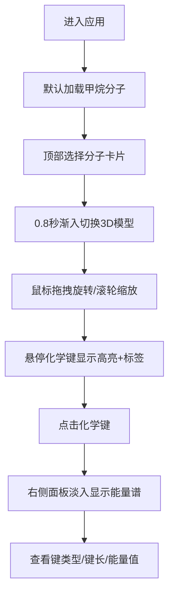

## 1. 产品概述

3D分子结构旋转查看与化学键能量谱图交互式分析应用，面向化学学习者和研究人员提供直观的分子可视化与能量谱分析工具。

- 主要目的：通过交互式3D可视化帮助理解有机分子空间结构与化学键能量特性
- 目标用户：化学学习者、研究人员、教育工作者
- 产品价值：将抽象的分子结构和化学键能量数据转化为直观可交互的可视化界面

## 2. 核心功能

### 2.1 用户角色
本应用无多角色区分，所有用户享有相同功能权限。

### 2.2 功能模块
1. **分子选择模块**：顶部控制栏展示3种预设分子卡片（甲烷、苯环、葡萄糖）
2. **3D分子场景模块**：Three.js实现的球棍模型展示，支持旋转、缩放、悬停高亮
3. **化学键能量谱模块**：右侧面板展示Chart.js能量谱线图，支持键点击查看
4. **分子信息统计模块**：左下角信息卡展示分子数据与键类型统计柱状图

### 2.3 页面详情
| 页面名称 | 模块名称 | 功能描述 |
|---------|---------|----------|
| 主页面 | 顶部控制栏 | 3个分子选择卡片，选中高亮，渐入切换动画 |
| 主页面 | 3D场景区域 | 球棍模型展示，OrbitControls拖拽旋转，滚轮缩放，悬停高亮标签，网格辅助线 |
| 主页面 | 能量谱面板 | 键类型、键长、能量值信息，三条预设能量曲线，选中键红色标记点 |
| 主页面 | 分子信息卡 | 分子名称、原子/键总数、单键/双键/三键统计柱状图 |

## 3. 核心流程

用户打开应用后默认加载甲烷分子 → 可通过顶部卡片切换分子（0.8秒渐入动画）→ 鼠标拖拽旋转3D视角，滚轮缩放 → 悬停化学键查看键类型和键长 → 点击化学键在右侧面板展示能量谱图 → 可随时重置视图。

## 4. 用户界面设计

### 4.1 设计风格
- 主色调：深色主题背景#1a1a2e，顶部控制栏#16213e，面板标题#2d3436
- 强调色：选中边框#00d2ff，高亮黄色#FFD700，标记点红色
- 原子颜色：碳灰#666666、氢白#FFFFFF、氧红#FF0000
- 键级颜色：单键蓝#3498db渐变到紫#9b59b6
- 按钮风格：圆角8px，0.2秒ease过渡
- 字体：现代无衬线字体，层级清晰
- 布局：桌面端左右分栏（75%/25%），移动端上下堆叠
- 图标风格：简洁几何风

### 4.2 页面设计概览
| 页面名称 | 模块名称 | UI元素 |
|---------|---------|--------|
| 主页面 | 顶部控制栏 | 高度60px深色背景，水平排列分子卡片间距20px，SVG结构式示意图 |
| 主页面 | 3D场景 | Canvas画布，半透明浅灰网格地面，球棍模型，悬停标签 |
| 主页面 | 能量谱面板 | 最小宽度280px，白色图表背景，折线图，顶部信息栏 |
| 主页面 | 信息卡 | 半透明rgba(30,30,30,0.85)背景，圆角8px，Canvas柱状图 |

### 4.3 响应式
- 桌面优先（>1024px）：左右布局，3D场景75%，面板25%
- 移动端（≤1024px）：面板折叠到底部横向宽条，3D场景高度60vh
- 触控优化：支持触摸拖拽旋转和双指缩放

### 4.4 3D场景指引
- 环境光强度0.6，方向光强度0.8位置(5,10,7)
- 球半径0.3单位，化学键圆柱半径0.06单位半透明
- OrbitControls旋转阻尼0.15，缩放范围0.3-4倍
- 网格辅助线12x12范围间距1单位
- 0.8秒分子切换渐入动画
