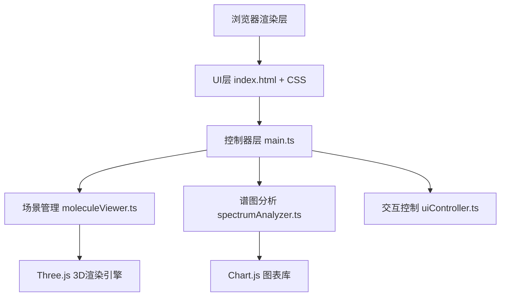

## 1. 架构设计



## 2. 技术说明

- 前端：TypeScript + Vite@5 + Three.js@0.160 + Chart.js@4 + lodash
- 构建工具：Vite@5，devServer端口3000
- 后端：无（纯前端应用）
- 数据库：无（内置预设分子数据）

## 3. 文件结构

| 文件路径 | 用途 |
|---------|------|
| package.json | 项目依赖与脚本配置 |
| vite.config.js | Vite构建配置，支持TypeScript，端口3000 |
| tsconfig.json | TypeScript严格模式，target ES2020，DOM类型 |
| index.html | 入口页面，Canvas容器、控制栏、能量谱面板 |
| src/main.ts | 程序入口，初始化场景、渲染循环、UI事件绑定 |
| src/moleculeViewer.ts | Three.js场景管理，球棍模型构建 |
| src/spectrumAnalyzer.ts | 化学键能量谱计算与Chart.js绘制 |
| src/uiController.ts | 分子切换、键选择、视图重置等交互逻辑 |
| src/types.ts | TypeScript类型定义 |
| src/moleculeData.ts | 预设分子结构数据（甲烷、苯环、葡萄糖） |
| src/style.css | 全局样式 |

## 4. 数据模型

### 4.1 分子数据结构
```typescript
interface Atom {
  element: 'C' | 'H' | 'O';
  position: { x: number; y: number; z: number };
}

interface Bond {
  from: number;  // atom index
  to: number;    // atom index
  type: 'single' | 'double' | 'triple';
  length: number; // in Angstroms
}

interface Molecule {
  name: string;
  formula: string;
  atoms: Atom[];
  bonds: Bond[];
}
```

### 4.2 化学键能量数据
```typescript
interface BondEnergyData {
  bondType: string;
  bondOrder: number;
  energy: number;  // kJ/mol
  length: number;  // Angstroms
  color: string;
}
```

## 5. 核心类与模块

### MoleculeViewer（场景管理器）
- initScene(): 初始化场景、相机、灯光、网格
- loadMolecule(mol: Molecule): 构建球棍模型
- highlightBond(bondIdx: number): 高亮化学键
- resetCamera(): 重置相机视角
- animateTransition(callback): 0.8秒渐入动画

### SpectrumAnalyzer（谱图分析器）
- initChart(canvas: HTMLCanvasElement): 初始化Chart.js
- updateForBond(bond: Bond, molecule: Molecule): 更新能量谱
- showHighlightPoint(x: number, y: number): 红色圆点标记

### UIController（交互控制器）
- bindMoleculeCards(): 绑定分子切换事件
- bindResetButton(): 绑定视图重置
- handleBondHover(): 悬停高亮与标签显示
- handleBondClick(): 点击选择并更新谱图
- handleResponsiveLayout(): 响应式布局切换
