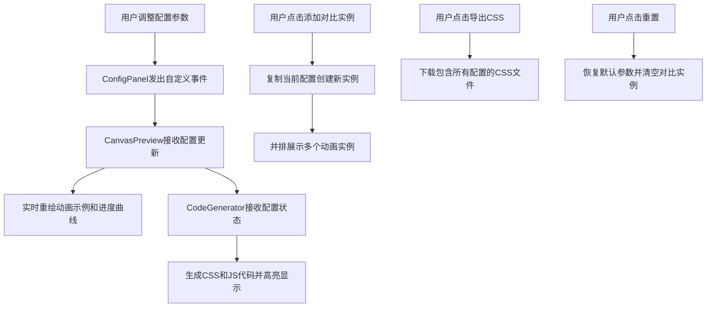

## 1. 产品概述
CSS折叠动画配置与代码生成工具，帮助前端开发者快速生成表格行和卡片列表的展开/收起动画代码，无需手动编写CSS transition和JavaScript高度计算。
- 面向人群：前端开发者
- 核心价值：通过可视化配置快速生成高质量折叠动画代码，提升开发效率
- 目标：支持多种缓动曲线、展开方向、触发方式的配置，实时预览动画效果并生成可用代码

## 2. 核心功能

### 2.1 用户角色
| 角色 | 注册方式 | 核心权限 |
|------|----------|----------|
| 前端开发者 | 无需注册 | 使用全部配置、预览、代码生成和导出功能 |

### 2.2 功能模块
1. **配置控制面板**：缓动曲线选择、展开方向选择、速度调节、触发方式选择
2. **画布实时预览**：模拟列表项动画演示、动画进度曲线绘制
3. **代码生成输出**：CSS @keyframes代码生成、JavaScript触发函数生成、语法高亮
4. **多实例对比**：支持最多4个实例并排对比不同参数效果
5. **导出与重置**：导出CSS文件、一键恢复默认配置

### 2.3 页面详情
| 页面名称 | 模块名称 | 功能描述 |
|----------|----------|----------|
| 主页面 | 顶部工具栏 | 导出CSS按钮、重置所有按钮 |
| 主页面 | 左侧控制面板 | 缓动曲线选择器、展开方向选择器、速度滑块、触发方式单选组 |
| 主页面 | 右侧画布区域 | 动画列表项预览、进度曲线图、添加对比实例按钮 |
| 主页面 | 底部代码输出框 | CSS代码展示、JS代码展示、语法高亮 |

## 3. 核心流程

## 4. 用户界面设计

### 4.1 设计风格
- 主背景色：#121212（深色主题）
- 控制面板背景：#1e1e2e（半透明深色）
- 画布背景：#0d0d0d（更深色）
- 列表项背景：#2a2a3e，文字：#e0e0e0
- 工具栏渐变：从#6C63FF到#FF6584的线性渐变
- 进度曲线颜色：慢速#6C63FF、中速#FF6584、快速#00C9A7
- 代码高亮：关键字#c678dd、数值#d19a66、选择器#e06c75
- 按钮样式：圆角、悬停放大1.05倍、点击凹陷、阴影过渡0.3秒ease-out
- 字体：代码使用Fira Code monospace字体

### 4.2 页面设计概览
| 页面名称 | 模块名称 | UI元素 |
|----------|----------|--------|
| 主页面 | 顶部工具栏 | 渐变背景、两个功能按钮（导出/重置）、悬停动效 |
| 主页面 | 控制面板 | 半透明卡片、圆角12px、内边距20px、下拉菜单、滑块、单选按钮 |
| 主页面 | 画布预览区 | 深色背景、列表项卡片、进度曲线图Canvas、添加实例按钮 |
| 主页面 | 代码输出框 | 深色背景#1e1e1e、固定高度200px、monospace字体、语法着色 |

### 4.3 响应式
- 桌面端（>768px）：左侧面板30%宽度固定，右侧画布70%
- 移动端（≤768px）：左侧面板转为顶部折叠式抽屉（带展开/收起按钮），画布区域填满剩余空间
- 移动端：代码框字体缩小至12px，高度缩减至120px
- 触摸优化：所有交互元素确保足够触摸尺寸（≥44px）

