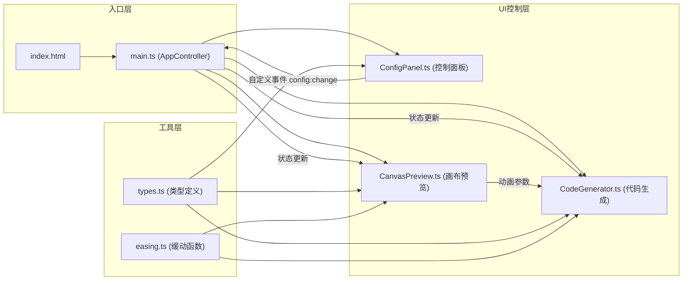

## 1. 架构设计



## 2. 技术描述
- 前端技术栈：TypeScript + Vite@5 + Canvas 2D API + CSS Animations
- 构建工具：Vite@5（devServer端口3000）
- 辅助库：lodash（工具函数）
- 纯前端项目，无后端服务

### 文件结构与职责
| 文件路径 | 职责说明 | 调用关系 |
|----------|----------|----------|
| package.json | 项目依赖和启动脚本 | npm run dev |
| vite.config.js | Vite构建配置 | 被Vite CLI调用 |
| tsconfig.json | TypeScript编译配置（严格模式、ES2020、DOM类型） | 被tsc调用 |
| index.html | 入口页面，包含画布预览区、控制面板、代码输出框DOM结构 | 引用 main.ts |
| src/main.ts | 入口文件，初始化UI，创建AppController，绑定各模块 | 调用ConfigPanel、CanvasPreview、CodeGenerator |
| src/AppController.ts | 主控制器，管理全局状态、协调各模块通信 | 被main.ts调用，管理所有子模块 |
| src/ConfigPanel.ts | 左侧控制面板渲染与交互事件管理 | 发出config:change自定义事件，被AppController监听 |
| src/CanvasPreview.ts | 画布区域渲染，60fps重绘动画和进度曲线 | 接收配置更新，输出动画参数到CodeGenerator |
| src/CodeGenerator.ts | 生成CSS关键帧和JS触发代码，语法高亮 | 接收配置状态，输出高亮代码 |
| src/types.ts | 全局TypeScript类型定义 | 被所有模块引用 |
| src/easing.ts | 缓动函数实现和曲线计算 | 被CanvasPreview和CodeGenerator引用 |
| src/styles.css | 全局样式（深色主题、响应式布局） | 被index.html引用 |

## 3. 数据模型与类型定义

```typescript
// 缓动曲线类型
type EasingType = 
  | 'ease' 
  | 'ease-in' 
  | 'ease-out' 
  | 'ease-in-out' 
  | 'cubic-bezier' 
  | 'steps';

// 展开方向
type ExpandDirection = 'down' | 'right' | 'center';

// 触发方式
type TriggerMode = 'click' | 'hover' | 'both';

// 动画配置接口
interface AnimationConfig {
  easing: EasingType;
  cubicBezierParams?: string; // 当easing为cubic-bezier时使用
  stepsParams?: string;       // 当easing为steps时使用
  direction: ExpandDirection;
  duration: number;           // 100-2000ms，步长50ms
  trigger: TriggerMode;
}

// 对比实例
interface PreviewInstance {
  id: string;
  config: AnimationConfig;
  isExpanded: boolean;
  animationProgress: number;  // 0-1
}

// 应用全局状态
interface AppState {
  activeConfig: AnimationConfig;
  instances: PreviewInstance[];
  selectedInstanceId: string | null;
}
```

## 4. 模块通信机制

### 4.1 事件流
1. **ConfigPanel → AppController**：通过 `config:change` 自定义事件传递配置变更
2. **AppController → CanvasPreview**：直接方法调用 `updateConfig(config)`
3. **AppController → CodeGenerator**：直接方法调用 `updateCode(config, instances)`
4. **CanvasPreview 内部**：requestAnimationFrame 驱动60fps渲染循环

### 4.2 默认配置
```typescript
const DEFAULT_CONFIG: AnimationConfig = {
  easing: 'ease',
  direction: 'down',
  duration: 600,
  trigger: 'click'
};
```

## 5. 性能优化策略
- **Canvas渲染优化**：使用requestAnimationFrame，仅在配置变更或动画播放时重绘
- **代码生成防抖**：使用lodash.debounce，延迟300ms生成代码避免频繁计算
- **事件节流**：滑块事件使用throttle确保16ms内完成响应
- **多实例性能**：4个实例同时播放时，共享同一个requestAnimationFrame循环，批量渲染

