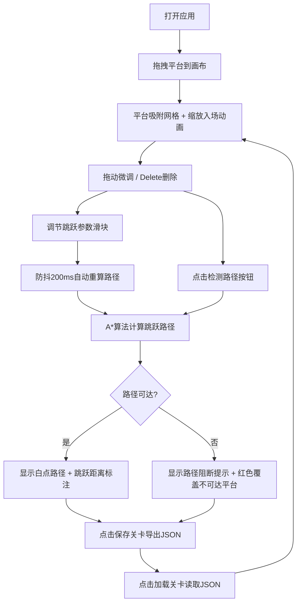

## 1. 产品概述
2D横版关卡路径检测工具，帮助游戏关卡设计师在浏览器中交互式布局和预览关卡平台，并自动检测路径连通性与跳跃可行性。解决手动配置平台位置时难以判断玩家能否从起点跳到终点、以及不同平台间距和高度组合是否形成死路的痛点。

### 目标用户
- 游戏关卡设计师
- 独立游戏开发者
- 2D平台游戏爱好者

### 产品价值
- 可视化关卡设计：拖拽式平台布局，所见即所得
- 智能路径检测：A*算法自动计算最优跳跃路径
- 实时参数调节：跳跃物理参数即时反馈
- 关卡数据持久化：JSON格式保存与加载

---

## 2. 核心功能

### 2.1 用户角色
| 角色 | 注册方式 | 核心权限 |
|------|----------|----------|
| 设计师 | 无需注册 | 完整功能使用权限 |

### 2.2 功能模块
1. **关卡画布与平台编辑**：Canvas画布、平台预设面板、拖拽放置、网格吸附、选中拖动、删除
2. **路径连通性检测**：A*路径搜索、路径可视化、跳跃标注、不可达提示
3. **跳跃参数调节**：跳跃力度滑块、水平速度滑块、重力倍数滑块、防抖实时更新
4. **关卡快照保存/加载**：JSON序列化下载、文件读取恢复、动画回放

### 2.3 页面详情
| 页面名称 | 模块名称 | 功能描述 |
|----------|----------|----------|
| 主页面 | 顶部工具栏 | 标题展示、保存关卡按钮、加载关卡按钮 |
| 主页面 | 右侧平台预设面板 | 三种尺寸平台（小40x20、中80x20、大120x20）拖拽源 |
| 主页面 | 中央关卡画布 | 800x400像素浅灰背景Canvas，起点绿色方块、终点红色星形 |
| 主页面 | 路径检测按钮 | 画布右上角绿色圆角按钮，触发路径计算 |
| 主页面 | 底部参数栏 | 60px高深色背景，三个滑块调节跳跃物理参数 |

---

## 3. 核心流程

### 主工作流程
用户打开应用 → 从右侧面板拖拽平台到画布 → 平台放置时网格吸附 + 缩放入场动画 → 点选拖动微调平台位置或Delete删除 → 调整底部跳跃参数滑块（自动重算路径）→ 点击"检测路径"按钮 → A*算法计算路径 → 显示白点路径序列与跳跃距离标注 → 或显示"路径阻断"提示 → 点击"保存关卡"导出JSON → 点击"加载关卡"读取JSON恢复

---

## 4. 用户界面设计

### 4.1 设计风格
- **主色调**：深蓝灰 #1A252C 与暖橙 #E67E22 对比配色
- **辅助色**：
  - 成功绿 #2ECC71（路径检测按钮、参数值）
  - 悬停绿 #27AE60
  - 危险红 #E74C3C（路径阻断提示）
  - 路径绿 #00FF88 半透明（路径连线）
  - 画布背景 #F0F0F0（浅灰）
  - 工具栏背景 #0D1B2A（深蓝黑）
  - 滑块栏背景 #2C3E50
- **平台颜色**：
  - 小平台 棕色 #8B5A2B
  - 中平台 灰色 #A9A9A9
  - 大平台 蓝色 #4682B4
- **按钮样式**：圆角10px，点击0.15秒微缩放 scale(0.98)，悬浮亮度提升15%
- **字体**：白色标题22px粗体，白色标签14px，绿色数字参数值，20px红色提示

### 4.2 页面设计概览
| 页面名称 | 模块名称 | UI元素 |
|----------|----------|---------|
| 主页面 | 顶部工具栏 | 深蓝黑背景 #0D1B2A，标题"关卡路径检测器"白色22px粗体居左，右侧两个浅灰按钮 |
| 主页面 | 右侧预设面板 | 三种尺寸平台预览，可拖拽，颜色区分 |
| 主页面 | 中央画布 | 浅灰#F0F0F0背景，1px白色边框，绿色起点方块，红色终点星形，半透明32x32网格虚线 |
| 主页面 | 路径检测按钮 | 画布右上角定位，绿色#2ECC71背景，白色文字，圆角10px |
| 主页面 | 底部参数栏 | 60px高深色#2C3E50背景，三个横向滑块，白色标签+绿色数值 |

### 4.3 动画与交互
- **平台入场**：0.2秒缩放入场动画（从中心放大至完整尺寸）
- **平台落位**：0.2秒弹性动画（overshoot 1.2）
- **拖拽预览**：跟随鼠标的半透明(alpha 0.5)预览方块
- **路径阻断提示**：0.3秒淡入动画
- **按钮点击**：0.15秒微缩放效果 transform: scale(0.98)
- **加载恢复**：平台逐个缩放出现，间隔100ms

### 4.4 响应式适配
- 桌面端（>960px）：画布固定800px宽度
- 平板端（600-960px）：画布缩放至80%宽度，保持比例
- 移动端（<600px）：画布自适应100%宽度，显示横向滚动条

---

## 5. 性能要求
- 画布上同时存在最多50个平台时，拖拽帧率不低于55fps
- 路径检测运算耗时不超过50ms
- 滑块调节防抖延迟200ms
