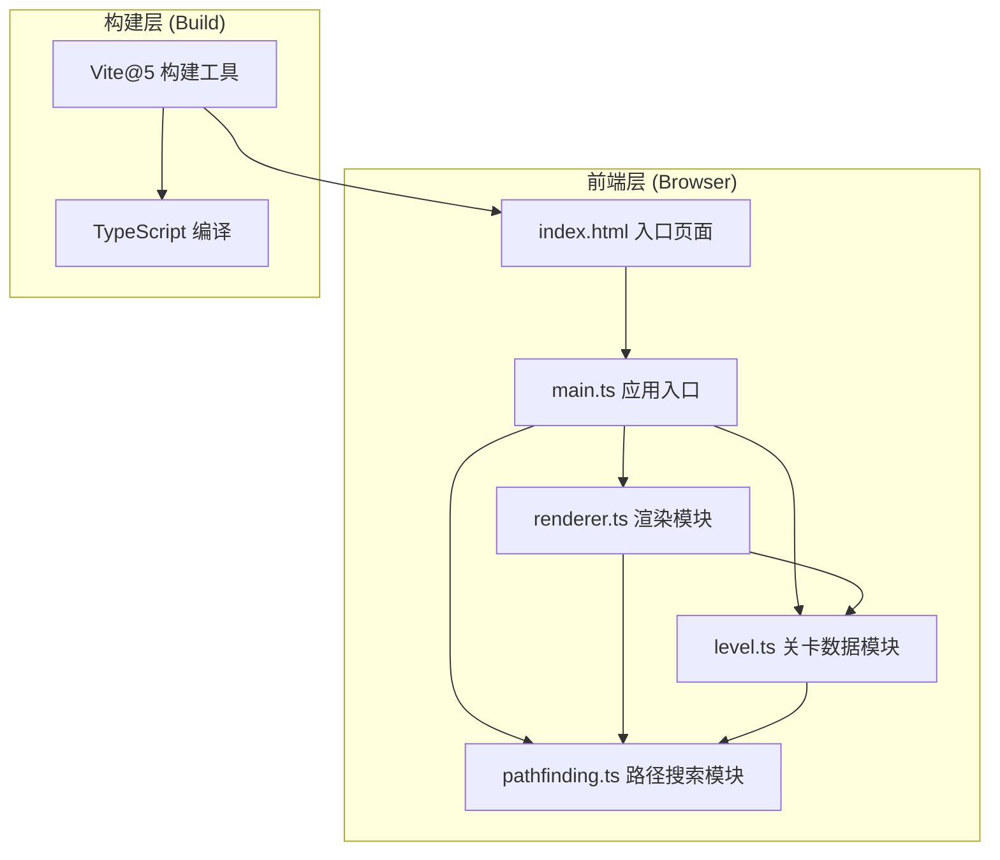

## 1. 架构设计



---

## 2. 技术选型说明

| 层级 | 技术 | 版本 | 说明 |
|------|------|------|------|
| 编程语言 | TypeScript | ~5.x | 严格模式，target ES2020，含DOM类型 |
| 构建工具 | Vite | 5.x | devServer端口3000，支持HMR |
| 渲染 | HTML5 Canvas API | - | 原生2D上下文，无游戏引擎 |
| UI交互 | 原生DOM事件 | - | 无外部UI库，手写事件绑定 |
| 状态管理 | 模块化单例 | - | level.ts维护平台数据，无需状态库 |
| 路径算法 | A*搜索 | - | 手写实现，结合跳跃物理模型 |

### 技术约束
- **不使用**任何游戏引擎（Phaser、Pixi等）
- **不使用**外部UI组件库（React、Vue、Tailwind等）
- **仅使用**Vite作为构建工具，其余代码全部手写
- 样式使用内联CSS，无CSS预处理器

---

## 3. 文件组织结构

```
auto107/
├── .trae/
│   └── documents/
│       ├── PRD.md
│       └── TECHNICAL_ARCHITECTURE.md
├── index.html              # 入口HTML，内联样式，包含完整UI结构
├── package.json            # 依赖：typescript、vite@5，脚本：dev
├── vite.config.js          # Vite基础配置，devServer:3000
├── tsconfig.json           # 严格模式，target ES2020，DOM类型
└── src/
    ├── main.ts             # 入口模块，初始化事件绑定，协调各模块
    ├── level.ts            # 平台列表数据结构、保存加载JSON、网格吸附
    ├── pathfinding.ts      # A*路径搜索、跳跃物理模型、连通性检测
    └── renderer.ts         # Canvas绘制、动画帧循环、拖拽交互处理
```

---

## 4. 核心数据模型

### 4.1 平台数据结构 (Platform)
```typescript
interface Platform {
  id: string;           // UUID唯一标识
  x: number;            // 左上角X坐标
  y: number;            // 左上角Y坐标
  width: number;        // 宽度：40 / 80 / 120
  height: number;       // 高度：固定20
  color: string;        // 颜色：#8B5A2B / #A9A9A9 / #4682B4
  size: 'small' | 'medium' | 'large';
  scale: number;        // 入场动画缩放值 0~1
  isReachable: boolean; // 路径可达标记（用于红色覆盖）
}
```

### 4.2 跳跃参数 (JumpParams)
```typescript
interface JumpParams {
  jumpPower: number;    // 跳跃力度：50-150，默认100
  horizontalSpeed: number; // 水平速度：100-300，默认200
  gravityMultiplier: number; // 重力倍数：0.5-2.0，默认1.0
}
```

### 4.3 路径点 (PathPoint)
```typescript
interface PathPoint {
  x: number;
  y: number;
  platformId: string | null; // 关联平台ID，起点/终点为null
  jumpInfo?: {
    horizontalDistance: number; // 水平跳跃距离（格数）
    verticalDrop: number;       // 垂直落差（格数，正为下降，负为上升）
  };
}
```

### 4.4 关卡存档 (LevelData)
```typescript
interface LevelData {
  version: string;
  platforms: Platform[];
  jumpParams: JumpParams;
  startPoint: { x: number; y: number };
  endPoint: { x: number; y: number };
  savedAt: string;
}
```

---

## 5. 核心模块设计

### 5.1 level.ts - 关卡数据模块
| 函数/类 | 功能 | 关键参数 | 返回值 |
|---------|------|----------|--------|
| `LevelManager` | 平台管理单例类 | - | - |
| `addPlatform(platform)` | 添加平台（含入场动画触发） | Platform对象 | void |
| `removePlatform(id)` | 删除指定平台 | platformId | void |
| `updatePlatform(id, changes)` | 更新平台位置/属性 | id, Partial<Platform> | void |
| `snapToGrid(x, y)` | 32x32网格吸附 | 坐标x,y | 吸附后{x,y} |
| `serialize()` | 序列化为JSON存档 | - | LevelData |
| `deserialize(data)` | 从JSON恢复（含逐个动画） | LevelData | Promise<void> |
| `getAllPlatforms()` | 获取全部平台列表 | - | Platform[] |
| `setPlatformReachability(ids)` | 设置可达平台标记 | 可达ID集合 | void |

### 5.2 pathfinding.ts - 路径搜索模块
| 函数/类 | 功能 | 关键参数 | 返回值 |
|---------|------|----------|--------|
| `PathFinder` | 路径搜索类 | platforms, jumpParams | - |
| `findPath(start, end)` | A*搜索最优跳跃路径 | 起点坐标, 终点坐标 | PathPoint[] \| null |
| `canJumpBetween(from, to)` | 检测两平台间跳跃可行性 | 源平台/点, 目标平台/点 | boolean |
| `calculateTrajectory(from, to)` | 计算跳跃抛物线轨迹 | 起跳点, 落地点 | 轨迹点数组 |
| `getReachablePlatforms(start)` | 计算从起点可达的所有平台 | 起点坐标 | Set<string> |
| `estimateDistance(a, b)` | A*启发函数（欧几里得距离） | 点a, 点b | number |

**A*节点状态**：
```typescript
interface AStarNode {
  platformId: string | null;
  position: { x: number; y: number };
  g: number;      // 实际代价
  h: number;      // 启发估计
  f: number;      // g + h
  parent: AStarNode | null;
  edgeFrom?: { horizontalDistance: number; verticalDrop: number };
}
```

**跳跃物理模型**：
- 最大水平跳跃距离 = (jumpPower × horizontalSpeed) / (gravity × 50)
- 最大垂直上升高度 = jumpPower² / (2 × gravity × 100)
- 最大垂直下落高度 = jumpPower × 3（容错下落）

### 5.3 renderer.ts - 渲染模块
| 函数/类 | 功能 | 关键参数 | 返回值 |
|---------|------|----------|--------|
| `Renderer` | 渲染引擎类 | canvas元素, levelManager, pathFinder | - |
| `start()` | 启动requestAnimationFrame循环 | - | void |
| `stop()` | 停止渲染循环 | - | void |
| `render()` | 单次完整渲染 | - | void |
| `drawBackground()` | 绘制背景 + 32x32网格 | - | void |
| `drawStartPoint()` | 绘制绿色30x30起点方块 | - | void |
| `drawEndPoint()` | 绘制红色星形终点（半径20） | - | void |
| `drawPlatforms()` | 绘制所有平台（含缩放动画） | - | void |
| `drawPath()` | 绘制路径白点（间距16px）+ 浅绿色折线 | - | void |
| `drawJumpLabels()` | 绘制跳跃距离/落差标注 | - | void |
| `drawBlockedHint()` | 绘制"路径阻断"提示 | - | void |
| `drawDragPreview(x, y, size)` | 绘制拖拽半透明预览方块 | 坐标, 平台尺寸 | - | void |
| `handleMouseDown(e)` | 鼠标按下（选中平台/开始拖拽） | MouseEvent | void |
| `handleMouseMove(e)` | 鼠标移动（拖动平台/预览跟随） | MouseEvent | void |
| `handleMouseUp(e)` | 鼠标释放（放置平台/吸附落位） | MouseEvent | void |
| `handleKeyDown(e)` | 键盘事件（Delete删除） | KeyboardEvent | void |
| `handlePanelDragStart(e, size)` | 平台面板拖拽开始 | event, 尺寸类型 | void |
| `easeOutElastic(t)` | 弹性缓动函数 (overshoot 1.2) | 0~1时间 | 缓动值 |
| `easeOutQuad(t)` | 二次缓入函数 | 0~1时间 | 缓动值 |

### 5.4 main.ts - 入口协调模块
| 职责 | 说明 |
|------|------|
| DOM加载完成初始化 | 获取Canvas、按钮、滑块等DOM元素 |
| 模块实例化 | 创建LevelManager、PathFinder、Renderer |
| 事件绑定 | 按钮点击、滑块input、文件选择、拖拽事件 |
| 参数同步 | 滑块值变化 → 更新JumpParams → 防抖触发路径重算 |
| 文件I/O | 保存JSON下载、加载JSON读取 |

---

## 6. 性能优化策略

### 6.1 渲染性能
- **脏矩形渲染**：仅重绘变化区域（平台拖动时）
- **对象池复用**：PathPoint对象池，避免频繁GC
- **requestAnimationFrame**：统一帧循环，避免重复setTimeout
- **离屏Canvas**：静态网格背景预渲染到离屏画布

### 6.2 路径检测性能
- **A*剪枝**：跳跃代价过高的边直接跳过，不加入OpenList
- **可达预计算**：BFS先计算可达集，过滤不可达平台
- **200ms防抖**：滑块变化合并计算，避免频繁触发
- **最大50ms约束**：超时提前返回次优解或null

### 6.3 内存管理
- 路径点数组每次计算后释放旧引用
- 平台删除时同步清理动画状态
- 事件监听器在模块销毁时解绑

---

## 7. 开发与运行

### 7.1 依赖安装
```bash
npm install
```

### 7.2 开发服务器
```bash
npm run dev
# 访问 http://localhost:3000
```

### 7.3 构建（可选）
```bash
npm run build
```

### 7.4 脚本定义
```json
{
  "scripts": {
    "dev": "vite",
    "build": "tsc && vite build",
    "typecheck": "tsc --noEmit"
  }
}
```
