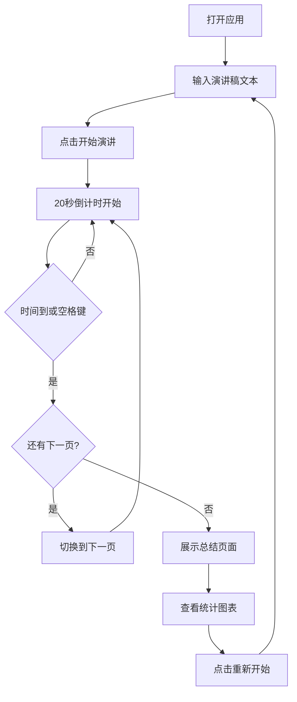

## 1. 产品概述

PechaKucha 演讲计时器是一款帮助团队进行在线1分钟创意演讲的计时与幻灯片自动切换工具，解决线下会议或远程演示时手动翻页、20秒强制换页难以精确控制、演讲节奏混乱的痛点。

- **目标用户**：需要进行Pecha Kucha风格演讲的团队成员、演讲者、会议组织者
- **核心价值**：精确的自动计时、流畅的幻灯片切换、直观的演讲数据统计
- **市场定位**：专注于20秒×20页快速创意演讲场景的轻量级Web工具

## 2. 核心功能

### 2.1 功能模块

1. **主演讲页面**：幻灯片实时预览、文本编辑器、计时控制条
2. **幻灯片编辑器**：多行文本输入、每页字数限制（50字）、最多20页、实时预览
3. **计时控制系统**：20秒倒计时、圆形进度环、剩余时间显示、自动翻页、手动翻页（空格键）、暂停（Esc键）
4. **总结统计页面**：演讲总用时、每页用时条形图（Canvas 2D）、PNG导出、重新开始

### 2.2 页面详情

| 页面名称 | 模块名称 | 功能描述 |
|-----------|-------------|---------------------|
| 主演讲页面 | 幻灯片显示区 | 深色背景模拟投影仪屏幕，白色幻灯片卡片，Fira Code等宽字体居中显示，淡入+上移动画切换 |
| 主演讲页面 | 文本编辑器 | 左侧textarea，每行一页，最多20页，每页≤50字，0.3秒防抖实时更新 |
| 主演讲页面 | 控制条 | 半透明背景，页码显示，圆形进度环，剩余秒数（<5秒红色闪烁），开始/暂停按钮 |
| 总结页面 | 统计展示 | 深绿到深蓝渐变背景，总用时显示，Canvas条形图统计每页用时 |
| 总结页面 | 操作区 | PNG导出按钮，重新开始按钮（向上卷起动画） |

## 3. 核心流程

用户打开应用 → 在编辑器输入每页演讲内容 → 点击"开始演讲"按钮 → 20秒倒计时开始 → 时间到自动翻页（或空格键手动翻页、Esc键暂停）→ 完成所有页面 → 展示总结页面与用时统计 → 点击"重新开始"重置状态

## 4. 用户界面设计

### 4.1 设计风格

- **主色调**：深色背景#1a1a2e（投影仪屏幕），强调色#0984e3（蓝色进度环），警告色#d63031（低于5秒红色），成功色#00b894（总结页）
- **字体**：Fira Code等宽字体，幻灯片内容20px深灰#2d3436
- **按钮风格**：圆角设计，半透明控制条背景rgba(0,0,0,0.6)，圆角12px
- **幻灯片样式**：纯白色底，圆角16px，轻微阴影
- **动效**：页面切换0.4秒淡入+上移10px，进度环stroke-dashoffset动画，<5秒时数字闪烁

### 4.2 页面设计概述

| 页面名称 | 模块名称 | UI元素 |
|-----------|-------------|-------------|
| 主演讲页面 | 幻灯片显示区 | 深色背景#1a1a2e占70%宽度居中，白色幻灯片卡片圆角16px，Fira Code字体20px深灰色居中 |
| 主演讲页面 | 文本编辑器 | 左侧25%宽度固定，textarea输入，每行字数计数，0.3秒防抖 |
| 主演讲页面 | 控制条 | 半透明rgba(0,0,0,0.6)背景，圆角12px，页码"3/15"，圆形进度环，剩余秒数大字显示 |
| 总结页面 | 统计区域 | #00b894→#0984e3渐变背景，总用时居中显示，Canvas条形图（黄#fdcb6e到橙#e17055渐变） |

### 4.3 响应式设计

- **大屏幕（>1024px）**：幻灯片区域70%宽度居中，左侧编辑器25%宽度靠左固定
- **平板（768-1024px）**：编辑器折叠为右上角浮动图标，点击弹出左侧抽屉面板
- **手机（<768px）**：幻灯片占满全屏，控制条底部固定80px高度，缩小字体和进度环

### 4.4 性能要求

- 切换动画帧率稳定55 FPS以上
- 计时基于requestAnimationFrame实现，误差≤50ms
