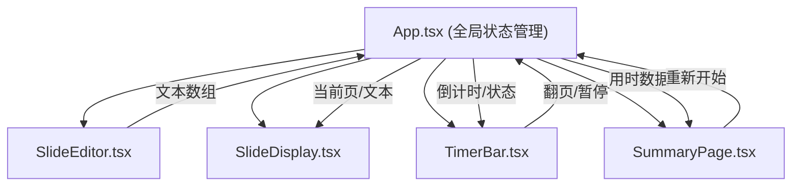

## 1. 架构设计



## 2. 技术描述

- **前端框架**：React@18 + TypeScript
- **构建工具**：Vite@5
- **UI样式**：原生CSS（响应式媒体查询）
- **图形绘制**：Canvas 2D API
- **状态管理**：React useState/useRef（父组件状态提升）
- **额外依赖**：uuid（唯一标识）、lodash（防抖debounce）
- **计时实现**：requestAnimationFrame + performance.now()

## 3. 文件结构

```
├── package.json
├── index.html
├── tsconfig.json
├── vite.config.js
└── src/
    ├── App.tsx              # 主组件，全局状态管理
    ├── main.tsx             # 入口文件
    ├── index.css            # 全局样式
    └── components/
        ├── SlideEditor.tsx  # 左侧文本编辑器
        ├── SlideDisplay.tsx # 中央幻灯片显示
        ├── TimerBar.tsx     # 底部计时控制条
        └── SummaryPage.tsx  # 总结统计页面
```

## 4. 组件接口定义

### 4.1 SlideEditor Props
```typescript
interface SlideEditorProps {
  slides: string[];
  onSlidesChange: (slides: string[]) => void;
  isMobile: boolean;
  isDrawerOpen: boolean;
  onDrawerToggle: () => void;
}
```

### 4.2 SlideDisplay Props
```typescript
interface SlideDisplayProps {
  slides: string[];
  currentIndex: number;
}
```

### 4.3 TimerBar Props
```typescript
interface TimerBarProps {
  currentIndex: number;
  totalSlides: number;
  isPlaying: boolean;
  isPaused: boolean;
  remainingTime: number;
  onStart: () => void;
  onPause: () => void;
  onResume: () => void;
  onNextSlide: () => void;
}
```

### 4.4 SummaryPage Props
```typescript
interface SummaryPageProps {
  slideTimes: number[];
  totalTime: number;
  onRestart: () => void;
}
```

## 5. 全局状态（App.tsx）

```typescript
interface AppState {
  slides: string[];           // 演讲稿文本数组
  currentIndex: number;       // 当前页码
  remainingTime: number;      // 剩余秒数（20秒倒计时）
  slideTimes: number[];       // 每页实际用时记录
  isPlaying: boolean;         // 是否正在演讲
  isPaused: boolean;          // 是否暂停
  isFinished: boolean;        // 是否演讲结束
  totalTime: number;          // 总用时（毫秒）
}
```

## 6. 核心逻辑说明

### 6.1 计时循环
- 使用 `useRef` 存储 `animationFrameId` 和 `lastTimestamp`
- 通过 `requestAnimationFrame` 驱动，每次回调使用 `performance.now()` 计算时间差
- 累积时间达到1000ms时更新剩余秒数，确保误差≤50ms

### 6.2 幻灯片切换
- 页码变化时触发 CSS `@keyframes fadeSlideUp` 动画
- 动画参数：0.4s 时长，ease-out 缓动，opacity 0→1，transform translateY(10px)→0

### 6.3 键盘事件
- 空格键：手动翻到下一页（演讲进行中）
- Esc键：暂停/继续计时

### 6.4 Canvas 统计图
- 使用 Canvas 2D 绘制条形图
- X轴：页码（1-N）
- Y轴：秒数（0-20秒）
- 条形颜色：线性渐变从 #fdcb6e 到 #e17055
- 支持 `canvas.toDataURL('image/png')` 导出
