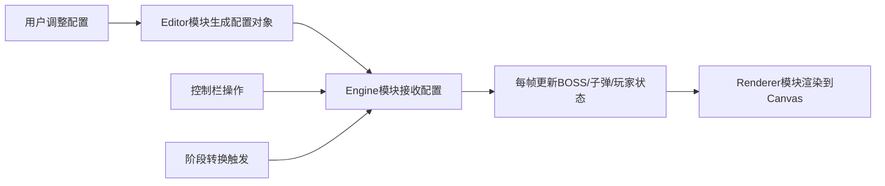

## 1. 产品概述

2D弹幕BOSS战模式编辑器与实时模拟应用，为独立游戏开发者提供可视化的BOSS弹幕设计工具，无需重新编译即可实时预览和调整BOSS的攻击模式、移动轨迹和阶段转换条件。

- 主要目的：解决游戏开发中BOSS弹幕调试效率低的问题
- 目标用户：独立游戏开发者、游戏设计师
- 产品价值：大幅缩短弹幕BOSS的设计迭代周期，提供即时可视化反馈

## 2. 核心功能

### 2.1 功能模块

1. **编辑器面板**：BOSS移动模式配置、发射模式配置、子弹参数调节、阶段转换条件管理
2. **实时模拟Canvas**：BOSS渲染、弹幕渲染、玩家标识、Ghost轨迹预视
3. **模拟控制栏**：播放/暂停、重置、速度倍率控制、实时数据统计
4. **阶段转换系统**：血量阈值触发、视觉反馈、参数自动调整

### 2.2 页面详情

| 页面名称 | 模块名称 | 功能描述 |
|---------|---------|---------|
| 主界面 | 左侧编辑器面板(260px) | BOSS移动模式下拉(水平往返/正弦波动/随机跳跃)、发射模式下拉(扇形/螺旋/追踪)、子弹速度滑块(1-10, 步长0.5)、发射间隔滑块(100-1000ms)、阶段转换条件输入与添加 |
| 主界面 | 顶部控制栏(50px) | 播放/暂停按钮、重置按钮、速度倍率下拉(0.5x/1x/2x)、实时数据展示(模拟时长/子弹总数/阶段转换次数/被击中次数) |
| 主界面 | 中央Canvas(800x600) | BOSS几何图形渲染、弹幕渲染(8px圆形，不同模式不同颜色)、玩家十字准星、Ghost半透明轨迹预视(alpha=0.3, 3秒预视)、阶段转换红色边框闪烁 |

## 3. 核心流程

用户在左侧编辑器面板调整BOSS行为参数 → 参数变更即时传递给模拟引擎 → 引擎更新BOSS状态和弹幕逻辑 → 渲染器绘制到Canvas → 用户通过控制栏控制模拟播放 → 阶段转换条件触发时自动切换配置并产生视觉反馈

## 4. 用户界面设计

### 4.1 设计风格

- 主背景色：#121212（深空黑）
- 面板背景色：#1e272e（深灰蓝）
- 控制栏背景：#2c3e50（深蓝灰）
- Canvas背景：从#0f0c29到#302b63的深空蓝渐变
- 强调色：#00b894（青绿）、#e74c3c（赤红）、#3498db（弦乐蓝）
- 子弹颜色：扇形#e74c3c（橙红）、螺旋#9b59b6（紫罗兰）、追踪#2ecc71（亮绿）
- BOSS装甲色：默认灰色，阶段转换后渐变到#b33939（暗红）

### 4.2 UI元素规范

- 按钮/下拉框：圆角6px，悬停上浮3px阴影，过渡0.2s ease-out
- 焦点状态：2px实线强调色轮廓
- 滑块/数字输入：扁平风格，值变化0.3s数值渐变动画
- 字体：等宽游戏风格字体，数字清晰可读

### 4.3 页面设计概述

| 页面名称 | 模块名称 | UI元素 |
|---------|---------|---------|
| 主界面 | 编辑器面板 | 深色固定宽度面板，分区展示配置项，标签+控件垂直排列，数值实时动画 |
| 主界面 | 控制栏 | 横向排列控制按钮和数据文本，按钮使用强调色区分功能 |
| 主界面 | Canvas区域 | 居中显示800x600画布，带渐变背景，渲染游戏元素 |

### 4.4 响应式设计

- Desktop-first设计
- 浏览器宽度小于900px时切换为上下布局：编辑器面板在上，Canvas在下，高度按比例缩放
- 所有交互元素保持可点击区域和可读性
