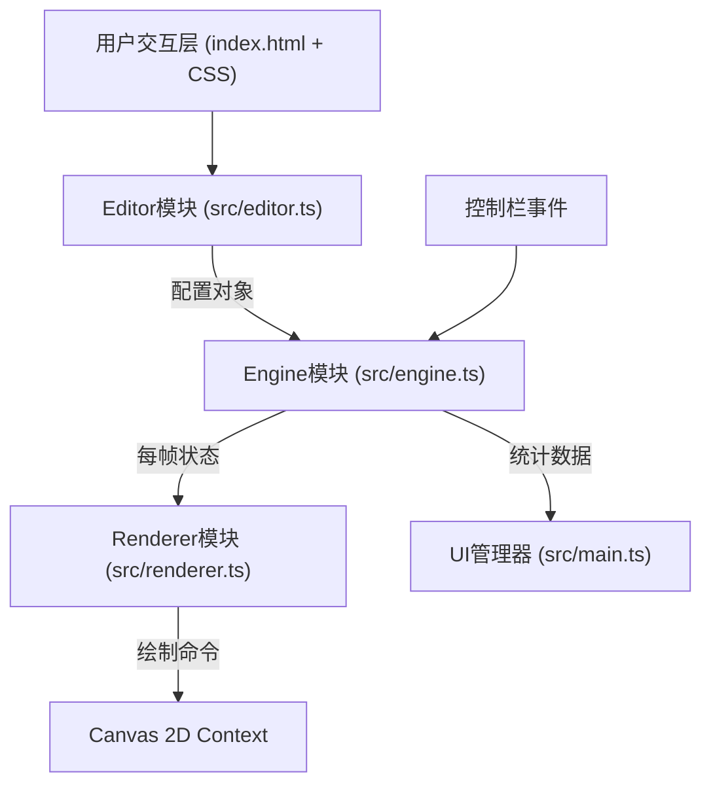

## 1. 架构设计



### 模块职责与数据流向

| 模块 | 文件 | 职责 | 输入 | 输出 |
|-----|-----|-----|-----|-----|
| 编辑器 | src/editor.ts | 管理左侧配置面板UI，读取用户输入转换为BOSS行为配置对象 | DOM事件、用户输入 | BossConfig配置对象 |
| 模拟引擎 | src/engine.ts | 接收配置，驱动BOSS移动、弹幕发射、阶段转换、碰撞检测，每帧更新状态 | BossConfig、控制事件 | FrameState每帧状态数据、Statistics统计数据 |
| 渲染器 | src/renderer.ts | 从引擎获取状态数据，执行Canvas绘制命令：BOSS、子弹、玩家、Ghost轨迹、边框效果 | FrameState | Canvas绘制结果 |
| 入口/UI管理 | src/main.ts | 应用入口，初始化Canvas、创建各模块实例、绑定事件、协调模块间通信 | DOM加载完成 | 模块实例、事件绑定 |

## 2. 技术描述

- 前端框架：纯TypeScript + 原生Canvas API（不依赖游戏引擎）
- 构建工具：Vite@5
- 工具库：lodash
- 开发语言：TypeScript（严格模式，target ES2020，含DOM类型）
- 样式：原生CSS3

## 3. 文件结构

```
项目根目录/
├── package.json              # 项目依赖与脚本配置
├── vite.config.js            # Vite构建配置(devServer端口3000)
├── tsconfig.json             # TypeScript编译配置(严格模式、ES2020、DOM)
├── index.html                # 入口HTML页面(暗色背景)
└── src/
    ├── main.ts               # 应用入口：初始化Canvas、UI管理器、事件绑定
    ├── editor.ts             # 编辑器模块：左侧面板配置UI、配置对象生成
    ├── engine.ts             # 模拟引擎：BOSS行为、弹幕逻辑、阶段转换、状态更新
    ├── renderer.ts           # 渲染器：Canvas绘制(BOSS、子弹、玩家、Ghost)
    ├── types.ts              # 类型定义：BossConfig、Bullet、Phase、FrameState等
    └── styles.css            # 样式文件：暗黑风格UI、动画、响应式布局
```

## 4. 核心数据模型定义

```typescript
// BOSS移动模式
type BossMovePattern = 'horizontal' | 'sine' | 'randomJump';

// 弹幕发射模式
type FirePattern = 'fan' | 'spiral' | 'tracking';

// 阶段转换条件
interface PhaseTransition {
  healthPercent: number;      // 触发血量百分比(0-100)
  newFirePattern: FirePattern; // 切换后的发射模式
  activated: boolean;          // 是否已触发
}

// BOSS行为配置
interface BossConfig {
  movePattern: BossMovePattern;
  firePattern: FirePattern;
  bulletSpeed: number;        // 1-10
  fireInterval: number;       // 100-1000ms
  phaseTransitions: PhaseTransition[];
}

// 子弹对象
interface Bullet {
  id: number;
  x: number;
  y: number;
  vx: number;
  vy: number;
  color: string;
  pattern: FirePattern;
  radius: number;             // 固定8px
}

// BOSS运行时状态
interface BossState {
  x: number;
  y: number;
  health: number;             // 0-100
  armorColor: string;         // 装甲颜色
  eyeFlash: boolean;          // 眼睛闪光
}

// 玩家状态
interface PlayerState {
  x: number;
  y: number;
  hitCount: number;           // 被击中次数
}

// 每帧渲染状态
interface FrameState {
  boss: BossState;
  bullets: Bullet[];
  player: PlayerState;
  ghostBullets: Bullet[];     // Ghost预视轨迹子弹
  phaseFlashActive: boolean;  // 阶段转换边框闪烁
  phaseFlashProgress: number; // 闪烁动画进度(0-1)
  time: number;               // 模拟时长(秒)
  currentPhaseIndex: number;  // 当前阶段索引
}

// 实时统计数据
interface Statistics {
  elapsedTime: number;        // 模拟时长(秒)
  totalBullets: number;       // 子弹总数
  phaseTransitions: number;   // 阶段转换次数
  playerHits: number;         // 玩家被击中次数
}

// 模拟控制状态
interface SimulationControl {
  playing: boolean;
  speedMultiplier: 0.5 | 1 | 2;
}
```

## 5. 性能优化策略

1. **渲染性能（<8ms/帧，60FPS）**
   - 使用requestAnimationFrame驱动渲染循环
   - Canvas状态缓存，减少save/restore调用
   - 子弹超过1000颗时启用缓存Canvas策略：将静态子弹图案预渲染到离屏Canvas，主循环只做贴图
   - Ghost轨迹每帧只更新位置数据，不重复绘制历史帧

2. **内存管理**
   - 子弹对象池复用，避免频繁GC
   - 超出Canvas边界的子弹及时回收
   - 限制最大子弹数量，防止内存溢出

3. **主线程非阻塞**
   - 密集计算分帧处理
   - 避免每帧创建新对象
   - 使用lodash的工具函数优化数据操作性能
