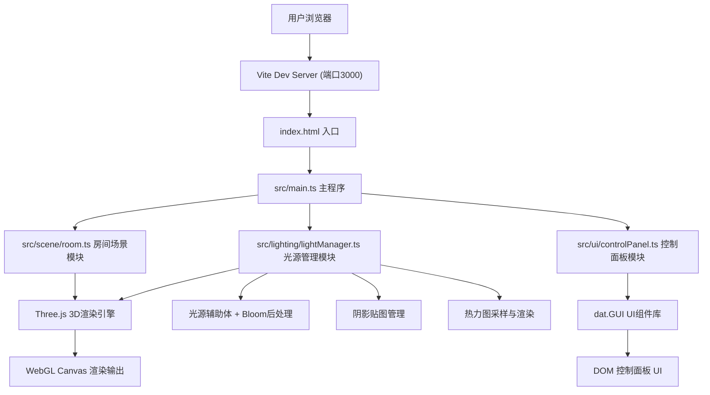
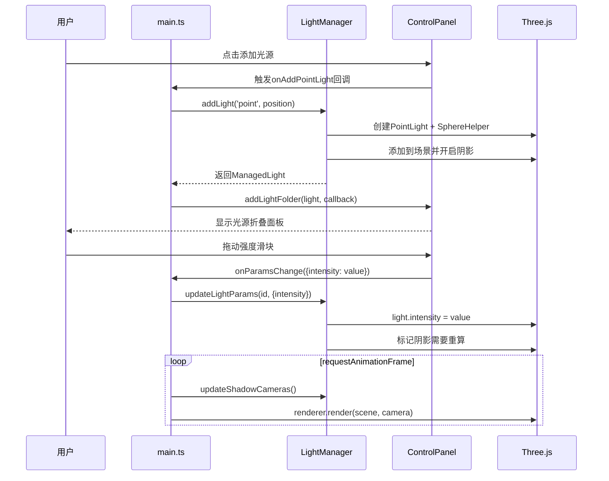
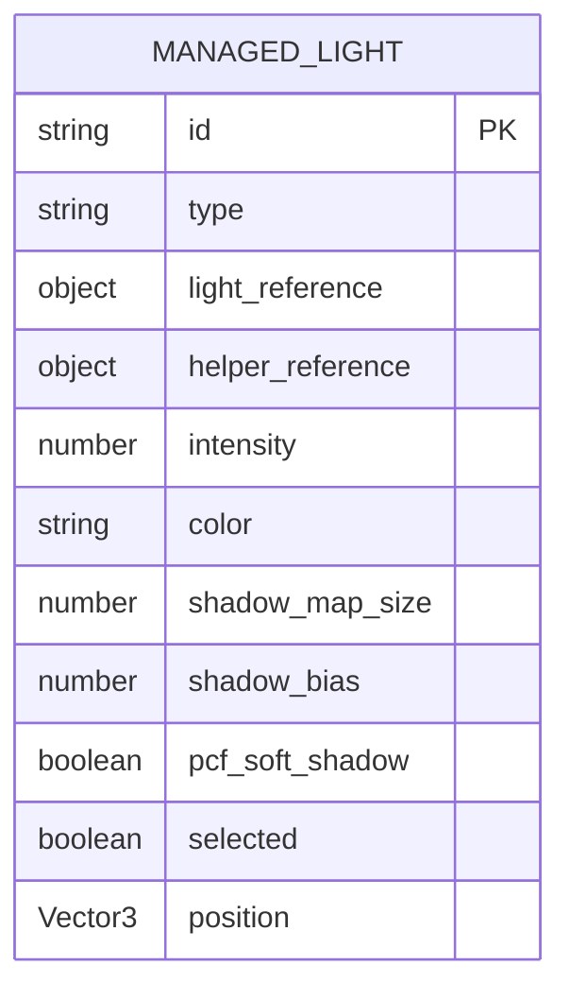

## 1. 架构设计



## 2. 技术说明

- **前端框架**：原生 TypeScript（无框架，纯Three.js渲染）
- **构建工具**：Vite 5.x（devServer端口3000，支持TypeScript HMR）
- **3D引擎**：Three.js 0.160.0（核心渲染、光照、阴影、后处理）
- **UI组件**：dat.GUI 0.7.x（参数控制面板折叠面板）
- **工具库**：lodash（防抖节流、深拷贝等工具函数）
- **语言标准**：TypeScript 严格模式，target ES2020，包含DOM类型
- **样式方案**：内联CSS + HTML style标签（无CSS框架）

## 3. 文件结构定义

```
auto111/
├── package.json              # 依赖与脚本定义
├── vite.config.js            # Vite构建配置
├── tsconfig.json             # TypeScript严格模式配置
├── index.html                # 入口HTML
└── src/
    ├── main.ts               # 主程序入口，场景初始化与渲染循环
    ├── scene/
    │   └── room.ts           # 房间场景：地板、墙壁、窗户、家具模型
    ├── lighting/
    │   └── lightManager.ts   # 光源管理：添加/删除/拖拽/参数调节
    └── ui/
        └── controlPanel.ts   # dat.GUI控制面板生成
```

## 4. 模块接口定义

### 4.1 房间场景模块 (src/scene/room.ts)

```typescript
export interface RoomConfig {
  width: number;   // 房间宽度 (X轴)
  depth: number;   // 房间深度 (Z轴)
  height: number;  // 房间高度 (Y轴)
}

export class RoomScene {
  public group: THREE.Group;
  public floor: THREE.Mesh;
  public walls: THREE.Mesh[];
  public window: THREE.Mesh;
  public furniture: THREE.Mesh[];
  
  constructor(config: RoomConfig);
  public getFloorMesh(): THREE.Mesh;
  public getWallMeshes(): THREE.Mesh[];
  public getRoomBounds(): { min: THREE.Vector3; max: THREE.Vector3 };
}
```

### 4.2 光源管理模块 (src/lighting/lightManager.ts)

```typescript
export type LightType = 'point' | 'spot' | 'area';

export interface LightParams {
  intensity: number;
  color: string;
  shadowMapSize: number;
  shadowBias: number;
  pcfSoftShadow: boolean;
}

export interface ManagedLight {
  id: string;
  type: LightType;
  light: THREE.PointLight | THREE.SpotLight | THREE.RectAreaLight;
  helper: THREE.Object3D;
  params: LightParams;
  selected: boolean;
}

export class LightManager {
  public lights: ManagedLight[];
  
  constructor(scene: THREE.Scene, camera: THREE.Camera, renderer: THREE.WebGLRenderer);
  public addLight(type: LightType, position: THREE.Vector3): ManagedLight;
  public removeLight(id: string): void;
  public selectLight(id: string | null): void;
  public updateLightParams(id: string, params: Partial<LightParams>): void;
  public updateShadowCameras(): void;
  public setDiagnosticMode(enabled: boolean): void;
  public setHeatmapMode(enabled: boolean, opacity: number): void;
  public onDragStart(callback: (light: ManagedLight) => void): void;
  public onDragEnd(callback: (light: ManagedLight) => void): void;
}
```

### 4.3 控制面板模块 (src/ui/controlPanel.ts)

```typescript
export interface ControlPanelOptions {
  onAddPointLight: () => void;
  onAddSpotLight: () => void;
  onAddAreaLight: () => void;
  onDiagnosticToggle: (enabled: boolean) => void;
  onHeatmapChange: (mode: 'off' | 'on', opacity: number) => void;
}

export class ControlPanel {
  private gui: dat.GUI;
  private lightFolders: Map<string, dat.GUI>;
  
  constructor(options: ControlPanelOptions);
  public addLightFolder(light: ManagedLight, onParamsChange: (params: Partial<LightParams>) => void, onRemove: () => void): void;
  public removeLightFolder(id: string): void;
  public updateLightFolder(id: string, params: LightParams): void;
  public dispose(): void;
}
```

## 5. 核心渲染流程



## 6. 数据模型

### 6.1 光源状态模型



### 6.2 应用状态模型

| 状态字段 | 类型 | 默认值 | 说明 |
|----------|------|--------|------|
| diagnosticMode | boolean | false | 阴影诊断覆盖层开关 |
| heatmapMode | 'off' \| 'on' | 'off' | 热力图显示模式 |
| heatmapOpacity | number | 0.6 | 热力图透明度 0-1 |
| selectedLightId | string \| null | null | 当前选中光源ID |

## 7. 性能优化策略

1. **阴影贴图复用**：光源参数不变时不重新渲染阴影贴图
2. **热力图采样缓存**：每0.5米采样点使用GPU离屏渲染一次，结果缓存为纹理
3. **拖拽防抖**：光源拖拽过程中降低阴影更新频率，松开后完整重算
4. **几何体合并**：家具模型使用BufferGeometryUtils.mergeGeometries减少draw call
5. **材质共享**：相同材质的物体共享Material实例
6. **视锥体剔除**：确保所有物体都在相机视锥体内，减少不必要渲染
7. **像素比限制**：renderer.setPixelRatio(Math.min(window.devicePixelRatio, 2))
