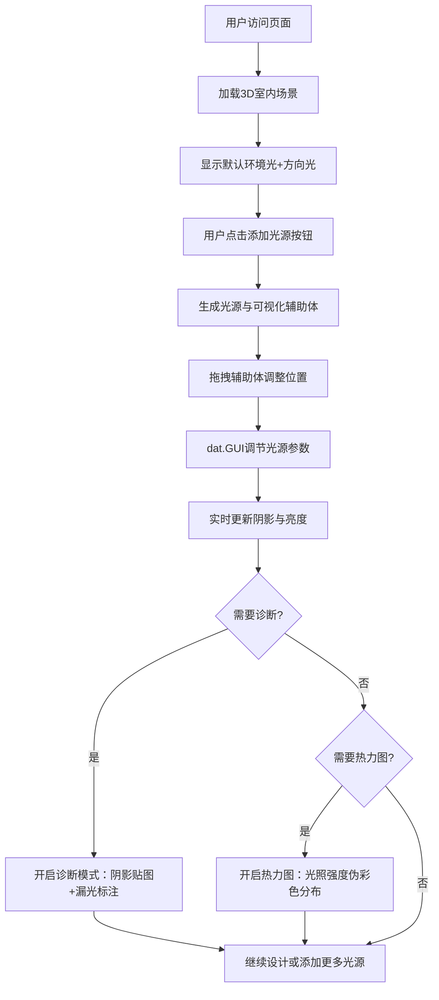

## 1. 产品概述

基于Web的3D室内光源布局与阴影质量实时评估应用，为家装设计师和3D爱好者提供浏览器端的光照设计与阴影诊断工具。用户可自由放置点光源、聚光灯和区域光，实时查看多光源叠加效果下的阴影柔和度、漏光伪影和亮度分布热力图，辅助做出专业的照明设计决策。

- 目标用户：家装设计师、3D视觉爱好者、室内装修从业者
- 核心价值：降低光照设计门槛，提供可视化的阴影质量诊断与光照均匀度分析

## 2. 核心功能

### 2.1 用户角色

| 角色 | 注册方式 | 核心权限 |
|------|----------|----------|
| 普通用户 | 无需注册，直接访问 | 使用所有光源布局与诊断功能 |

### 2.2 功能模块

1. **主场景页面**：3D室内场景渲染、视角交互控制、光源拖拽定位
2. **光源管理模块**：添加/删除/选择三种光源（点光源、聚光灯、区域光），光源辅助体可视化
3. **参数控制面板**：dat.GUI折叠面板，实时调节光源强度、颜色、阴影参数
4. **阴影诊断模块**：阴影贴图区域可视化覆盖、漏光伪影红色标注
5. **光照热力图模块**：地面墙面伪彩色光照强度分布叠加、透明度调节

### 2.3 页面详情

| 页面名称 | 模块名称 | 功能描述 |
|----------|----------|----------|
| 主场景页面 | 3D场景渲染 | 渲染8x6x3米室内房间，浅橡木色地板纹理，暖白墙壁，磨砂玻璃窗，沙发桌椅家具模型 |
| 主场景页面 | 视角控制 | OrbitControls鼠标拖拽旋转，阻尼0.1，缩放范围0.5-3倍 |
| 主场景页面 | 光源拖拽 | 鼠标拖拽辅助体在XZ平面移动，按住Shift键垂直拖动Y轴 |
| 主场景页面 | 诊断按钮 | 左上角切换开关，开启后显示阴影贴图绿色覆盖层与漏光红色标注 |
| 控制面板 | 光源添加 | 三个按钮分别添加点光源、聚光灯、区域光，默认生成在场景中心上方 |
| 控制面板 | 光源列表 | 每个光源对应一个折叠子菜单，显示名称与当前状态 |
| 控制面板 | 强度滑块 | 0-10范围，步长0.1，实时更新光源强度 |
| 控制面板 | 颜色选择器 | 光源颜色实时调整，辅助体颜色同步更新 |
| 控制面板 | 阴影贴图分辨率 | 下拉选项512/1024/2048/4096，切换后自动重算阴影 |
| 控制面板 | 阴影偏移 | 0-0.1范围，步长0.001，解决阴影失真 |
| 控制面板 | PCF软阴影开关 | 复选框控制阴影柔和度 |
| 控制面板 | 热力图模式 | 下拉菜单启用，伪彩色蓝-绿-红显示光照强度 |
| 控制面板 | 热力图透明度 | 0-1滑块调节覆盖层透明度 |

## 3. 核心流程

用户进入页面后看到预置房间场景与默认环境光+方向光。通过右侧控制面板添加光源，拖拽调整位置，实时调节参数观察阴影效果。可切换诊断模式识别阴影问题，或开启热力图评估光照均匀度。

## 4. 用户界面设计

### 4.1 设计风格

- **主色调**：深暗色背景 #1e1e24，搭配科技感的点缀色
- **强调色**：光源辅助体发光色、诊断绿色覆盖层、漏光红色标注、热力图蓝绿红渐变
- **按钮样式**：圆角设计，悬停微放大，点击弹性动画（0.2秒ease-out）
- **字体**：Inter 14px，数字与参数值使用等宽字符
- **布局风格**：固定右侧控制面板（300px宽），左侧全屏3D场景，左上角诊断按钮
- **毛玻璃效果**：控制面板背景 rgba(30,30,36,0.85)，12px圆角，backdrop-filter: blur(10px)

### 4.2 页面设计概览

| 页面名称 | 模块名称 | UI元素 |
|----------|----------|--------|
| 主场景页面 | 3D视口 | 全屏Three.js Canvas，OrbitControls交互，环境光+方向光默认照明 |
| 主场景页面 | 诊断按钮 | 左上角圆形按钮，诊断模式时图标旋转180度，0.4秒过渡动画 |
| 主场景页面 | 光源辅助体 | 点光源半透明球壳（r=0.15m，透明度0.4，发光bloom 0.3），聚光灯锥体线框，区域光矩形面片 |
| 控制面板 | 标题栏 | "光源布局与阴影评估"标题，添加光源按钮组 |
| 控制面板 | 光源折叠项 | 每个光源可展开/折叠，显示参数滑块、颜色选择器、下拉菜单、复选框 |
| 控制面板 | 显示模式区 | 诊断模式开关、热力图下拉、热力图透明度滑块 |

### 4.3 响应式设计

- **桌面端（≥1024px）**：控制面板固定右侧，宽度300px
- **移动端/窄屏（<1024px）**：控制面板折叠为底部抽屉，高度240px，可拖出展开
- **触控优化**：拖拽区域增大，按钮最小44x44px触控目标

### 4.4 3D场景指引

- **环境与氛围**：暗色调空间，默认暖色环境光，突出用户添加光源的效果对比
- **光照设置**：环境光强度0.3（#F5F5DC），方向光强度0.5（#FFF8DC）从窗口方向入射
- **相机设置**：初始位置(4, 3, 6)，看向场景中心(0, 1.5, 0)，PerspectiveCamera 60° FOV
- **构图**：房间居中，家具分布合理留有光源放置空间，窗口在后方墙面
- **交互与动画**：光源拖拽时位置平滑跟随，模式切换0.4秒过渡，辅助体选中时高亮闪烁
- **后处理效果**：UnrealBloomPass实现光源辅助体柔和发光（强度0.3）
- **性能预算**：桌面端≥40fps（1920x1080），≤6个光源，≤24个家具几何体，4096分辨率阴影重算≤200ms
