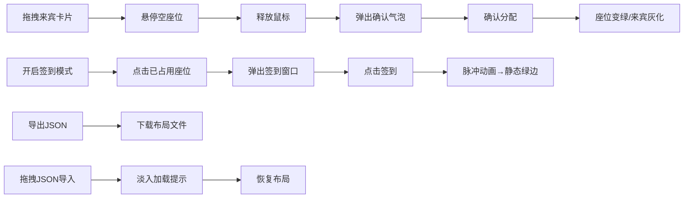

## 1. 产品概述

活动座位管家是一款帮助小型活动组织者在线创建和管理活动座位安排与签到流程的Web应用。解决办活动时手动排座位效率低、到场签到混乱，以及无法直观看到座位占用情况和剩余位置的痛点。

- 目标用户：小型活动组织者、会议筹办者、婚礼策划人
- 核心价值：直观的可视化座位管理、高效的拖拽排座、流畅的签到流程

## 2. 核心功能

### 2.1 用户角色
| 角色 | 注册方式 | 核心权限 |
|------|----------|----------|
| 活动组织者 | 无需注册，直接使用 | 创建座位布局、分配来宾、签到管理、导入导出 |

### 2.2 功能模块
1. **主界面**：座位网格、来宾列表、签到模式切换、统计栏
2. **座位管理**：拖拽分配来宾、状态颜色标识、签到脉冲动效
3. **来宾管理**：虚拟来宾卡片、搜索过滤、拖拽源
4. **签到模式**：签到确认弹窗、签到状态反馈
5. **数据导入导出**：JSON格式导出、拖拽JSON文件导入

### 2.3 页面详情
| 页面名称 | 模块名称 | 功能描述 |
|----------|----------|----------|
| 主界面 | 顶栏 | 深蓝色标题栏、签到模式切换开关、导出按钮 |
| 主界面 | 左侧来宾面板 | 来宾卡片列表、搜索框、可拖拽来宾卡片 |
| 主界面 | 中央座位网格 | 10列8行座位矩阵、拖放目标、点击签到、状态颜色 |
| 主界面 | 统计栏 | 总座位数、已占用数、已签到数统计 |
| 主界面 | 确认气泡 | 拖拽释放后确认座位分配 |
| 主界面 | 签到弹窗 | 签到模式下点击已占用座位弹出确认 |

## 3. 核心流程

### 3.1 座位分配流程
组织者从来宾列表拖拽来宾卡片 → 悬停到空座位（放大上浮动画）→ 释放鼠标 → 弹出确认气泡 → 确认后座位变为绿色、来宾列表条目灰化加删除线

### 3.2 签到流程
开启签到模式 → 点击已占用座位 → 弹出签到确认窗口（显示头像、昵称、座位坐标）→ 点击签到按钮 → 座位显示绿色脉冲圆环动画 → 动画结束后保持静态绿边

### 3.3 数据导入导出流程
点击导出按钮 → 下载JSON文件（包含来宾、座位、签到状态）；拖拽JSON文件到页面 → 淡入加载提示 → 恢复布局

## 4. 用户界面设计

### 4.1 设计风格
- 主色调：蓝色 #0984e3，浅灰背景 #dfe6e9
- 顶栏：深蓝色 #2d3436，白色标题文字
- 座位状态色：未占用浅蓝 #74b9ff，选中/悬停橙色 #fd79a8，已入座绿色 #00b894
- 卡片风格：圆角8px，白底，柔和阴影
- 按钮风格：圆角8px，主色按钮蓝色，次要按钮灰色
- 字体：现代无衬线字体，清晰可读
- 图标风格：emoji头像用于来宾卡片

### 4.2 页面设计概览
| 页面名称 | 模块名称 | UI元素 |
|----------|----------|--------|
| 主界面 | 顶栏 | 深色背景、白色标题"活动座位管家"、右侧签到开关、导出按钮 |
| 主界面 | 来宾面板 | 白色卡片、搜索框、emoji头像+昵称卡片、灰化删除线样式 |
| 主界面 | 座位网格 | 40x40px圆角方块、居中2字缩写、拖放放大1.1倍上浮0.2s动画 |
| 主界面 | 确认气泡 | 圆角8px、白底、#2d3436文字、确认/取消按钮 |
| 主界面 | 签到弹窗 | 半透明遮罩#00000066、白色圆角卡片、头像昵称坐标、绿色签到按钮 |
| 主界面 | 统计栏 | 蓝色加粗数字、显示总/占用/签到数量 |
| 主界面 | 加载提示 | 0.3s淡入动画、居中显示 |

### 4.3 响应式
桌面端优先设计，座位网格固定尺寸布局，来宾面板固定宽度。

### 4.4 动效细节
- 拖拽悬停座位：scale(1.1) + translateY(-2px)，0.2s ease-out
- 签到成功：脉冲圆环动画，0.5s重复，持续1.5s后退化为静态绿边
- 导入加载：0.3s fadeIn淡入
