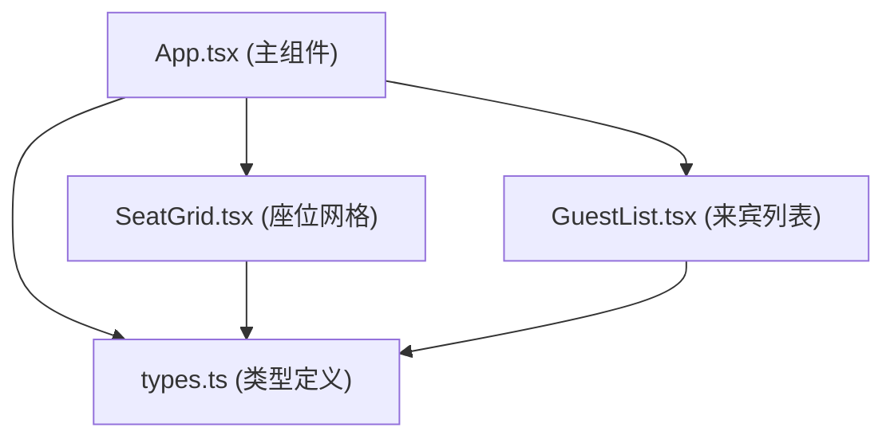
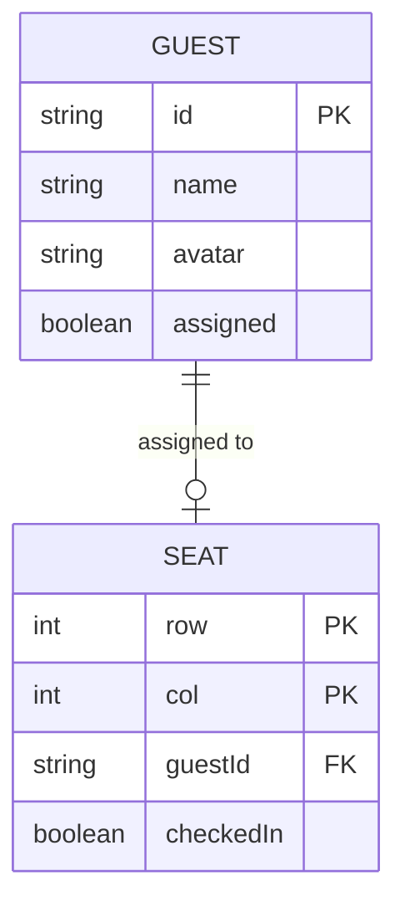

## 1. 架构设计



纯前端单页应用，无后端服务，数据通过JSON导入导出持久化。

## 2. 技术说明

- 前端框架：React@18 + TypeScript
- 构建工具：Vite@5
- 状态管理：React useState/useReducer（轻量级场景，无需额外状态库）
- 辅助库：uuid（唯一ID生成）、lodash（工具函数）
- 样式方案：原生CSS + CSS Modules（避免额外依赖，保持轻量）

## 3. 路由定义
单页应用，无需路由。

| 路由 | 用途 |
|------|------|
| / | 主界面（唯一页面） |

## 4. API定义
无后端API，所有数据操作在前端完成。

### 4.1 核心数据类型
```typescript
interface Guest {
  id: string;
  name: string;
  avatar: string;
  assigned: boolean;
}

interface Seat {
  row: number;
  col: number;
  guestId: string | null;
  checkedIn: boolean;
}

interface AppState {
  guests: Guest[];
  seats: Seat[][];
  checkInMode: boolean;
}
```

### 4.2 导出数据结构
```typescript
interface ExportData {
  version: string;
  exportedAt: string;
  guests: Guest[];
  seats: Seat[][];
  gridConfig: { rows: number; cols: number };
}
```

## 5. 数据模型

### 5.1 实体关系



### 5.2 初始数据
- 座位网格：8行 × 10列，初始全部为空
- 来宾列表：预设15-20个随机昵称和emoji头像的虚拟来宾
