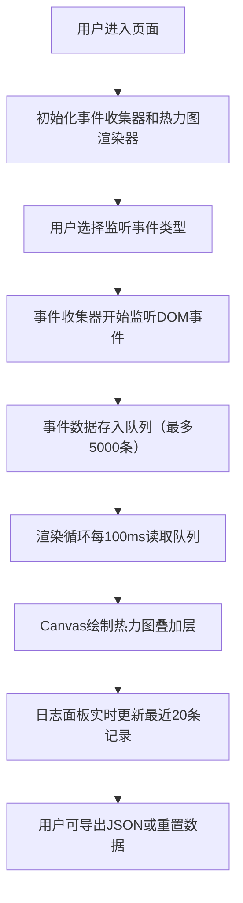

## 1. 产品概述

无侵入式用户行为监听与事件热图可视化分析应用，用于记录大型页面中用户交互（点击、滚动、悬停）的行为数据，并以热力图形式实时可视化展示。

- **核心价值**：解决手动在组件中插入日志逻辑的侵入性问题，提供一键式事件监听与可视化分析能力
- **目标用户**：前端性能优化工程师、UX 分析师、产品经理

## 2. 核心功能

### 2.1 功能模块
1. **事件监听控制模块**：支持多选事件类型（click、mousemove、scroll），实时启停
2. **热力图可视化模块**：Canvas 实时渲染事件密度热力图，支持透明度和点半径调节
3. **模拟交互区域模块**：提供滚动列表、按钮组、悬停区域三种典型交互场景
4. **数据管理模块**：事件数据导出 JSON、一键清空重置
5. **事件日志表格模块**：实时展示最近 20 条事件记录，支持折叠/展开

### 2.2 页面详情
| 页面名称 | 模块名称 | 功能描述 |
|-----------|-------------|---------------------|
| 主应用页 | 左侧控制面板 | 事件类型复选框组（带颜色标识）、透明度滑块（0~100%）、点大小滑块（20~80px）、导出按钮、重置按钮 |
| 主应用页 | 模拟页面区域 | 800x600px 容器，包含滚动列表（100行）、5个操作按钮、300x200px 悬停区域 |
| 主应用页 | 热力图覆盖层 | Canvas 半透明覆盖层（z-index:10），高斯模糊+径向渐变 |
| 主应用页 | 事件日志面板 | 可折叠/展开，展示最近20条事件（类型、坐标、选择器、时间戳） |

## 3. 核心流程

## 4. 用户界面设计

### 4.1 设计风格
- **主题**：深色专业主题
- **主色调**：深蓝 #1e3a5f、深灰 #2d3436
- **强调色**：蓝 #0984e3、红 #d63031、黄 #fdcb6e、绿 #00b894
- **文字色**：浅灰 #b2bec3
- **布局**：左右两栏（左栏260px控制面板 + 右栏主视区）
- **动效**：滑块调节0.3秒平滑过渡、日志行0.2秒淡入、按钮悬停0.2秒过渡
- **响应式**：<768px 时左栏折叠为顶部工具栏

### 4.2 页面设计概述
| 页面名称 | 模块名称 | UI Elements |
|-----------|-------------|-------------|
| 主应用页 | 控制面板 | 深蓝背景、圆角8px、轻微阴影、白色文字、复选框带彩色方块标识、滑块带数字显示 |
| 主应用页 | 模拟页面 | 深灰背景、800x600px固定尺寸、列表交替行色、按钮悬停变色、悬停区域虚线边框 |
| 主应用页 | 热力图 | 半透明Canvas、蓝色到红色径向渐变、高斯模糊效果 |
| 主应用页 | 日志面板 | 交替行背景色（#636e72/#4a4a4a）、可折叠切换、新行淡入动画 |

### 4.3 响应式
- 桌面端（≥768px）：左右两栏布局，左栏260px固定宽度
- 移动端（<768px）：左栏折叠为顶部工具栏，主视区占满宽度
