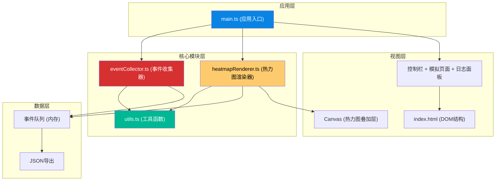
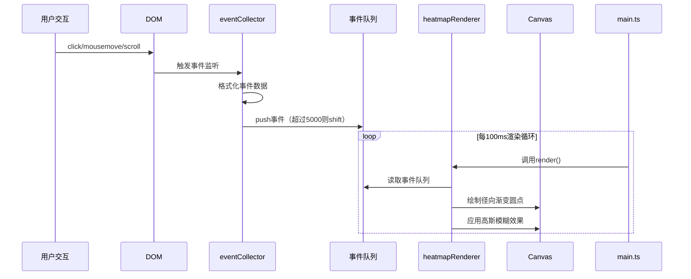

## 1. 架构设计



## 2. 技术描述

- **构建工具**：Vite@5
- **开发语言**：TypeScript（严格模式，target ES2020）
- **UI渲染**：原生 DOM + Canvas 2D API
- **工具库**：lodash
- **DevServer端口**：3000

## 3. 模块职责与数据流

| 模块 | 文件 | 职责 | 输入 | 输出 |
|------|------|------|------|------|
| 工具函数 | `src/utils.ts` | 提供 generateId、getElementPath 等通用辅助函数 | DOM元素/任意值 | ID字符串 / CSS选择器路径字符串 |
| 事件收集器 | `src/eventCollector.ts` | 监听DOM事件并缓冲到队列 | DOM事件 (click/mousemove/scroll) | 事件队列（数组，最多5000条） |
| 热力图渲染器 | `src/heatmapRenderer.ts` | 从事件队列读取数据并绘制Canvas热力图 | 事件数据 + Canvas元素 + 配置参数 | Canvas像素渲染（无返回值） |
| 应用入口 | `src/main.ts` | 初始化所有模块、搭建模拟页面、驱动渲染循环 | 用户配置 | 整个应用实例 |

### 数据流向图



## 4. 数据模型

### 4.1 事件数据结构

```typescript
interface CollectedEvent {
  id: string;
  type: 'click' | 'mousemove' | 'scroll';
  timestamp: number;
  x: number;
  y: number;
  selector: string;
  scrollTop?: number;
  scrollLeft?: number;
}
```

### 4.2 事件收集器配置

```typescript
interface EventCollectorConfig {
  targetElement: HTMLElement;
  enabledEvents: Array<'click' | 'mousemove' | 'scroll'>;
  maxQueueSize: number;
}
```

### 4.3 热力图渲染配置

```typescript
interface HeatmapRenderConfig {
  opacity: number;        // 0.3 ~ 1.0
  radius: number;         // 20 ~ 80
  colorStops: Array<{ offset: number; color: string }>;
}
```

## 5. 文件结构

```
auto114/
├── package.json
├── vite.config.js
├── tsconfig.json
├── index.html
└── src/
    ├── main.ts              # 应用入口，初始化+渲染循环
    ├── eventCollector.ts    # 事件收集器类
    ├── heatmapRenderer.ts   # 热力图渲染器类
    └── utils.ts             # 辅助工具函数
```

## 6. 性能约束方案

| 约束项 | 目标 | 实现方案 |
|--------|------|----------|
| 事件收集延迟 | ≤5ms | 使用 passive 事件监听器 + 防抖/throttle (lodash) |
| 热力图渲染帧率 | ≥30fps | 100ms渲染间隔 + Canvas离屏缓冲 + 增量绘制 |
| 滚动坐标偏移 | 自动校正 | 记录scrollTop/scrollLeft，渲染时重新计算相对坐标 |
| 事件队列上限 | 5000条 | FIFO策略，超出时丢弃最早记录 |
