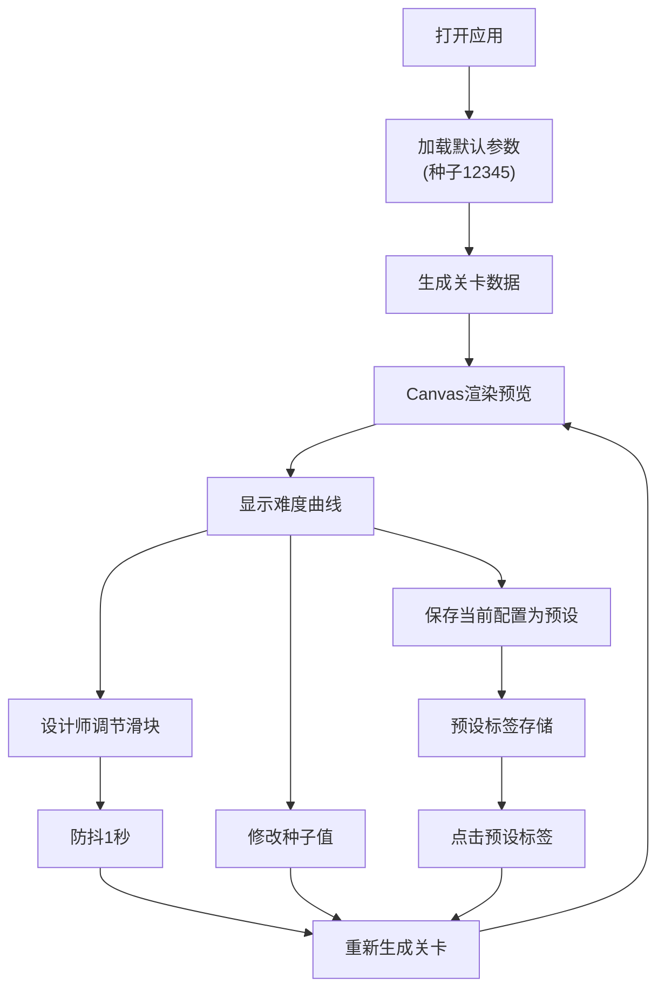

## 1. 产品概述

2D无限跑酷游戏关卡自动生成与难度曲线编辑应用，为游戏设计师提供可视化的关卡参数调节与实时预览环境。通过调整障碍物密度、平台间距、速度因子等参数，设计师可直观预览从新手到高手的难度曲线变化，并通过种子系统保存和对比不同配置。

## 2. 核心功能

### 2.1 用户角色

| 角色 | 注册方式 | 核心权限 |
|------|----------|----------|
| 游戏设计师 | 无需注册 | 调节参数、预览关卡、保存预设、对比配置 |

### 2.2 功能模块

1. **关卡预览区**：800x400px Canvas横版预览，自动滚动展示障碍物与平台布局
2. **参数控制面板**：右侧滑块调节障碍物密度、平台间距、速度因子
3. **难度曲线图表**：实时绘制三条参数对应的瞬时难度估值曲线
4. **种子与预设系统**：种子值输入、最多3组预设保存与一键切换
5. **碰撞检测可视化**：玩家角色、碰撞盒、跳跃预测线展示

### 2.3 页面详情

| 页面名称 | 模块名称 | 功能描述 |
|----------|----------|----------|
| 主应用页面 | 关卡预览Canvas | 800x400px横版Canvas，天空蓝到地平线色渐变背景，自动向左滚动，渲染障碍物、平台、玩家角色及碰撞预测线 |
| 主应用页面 | 参数控制面板 | 三个滑块（障碍物密度0.1-0.5、平台间距100-300px、速度因子0.5-3.0），参数变化1秒内自动重新生成 |
| 主应用页面 | 难度曲线图表 | 300x100px Canvas折线图，深色背景，横轴距离0-2000px，纵轴难度0-10，三色曲线实时更新 |
| 主应用页面 | 种子与预设 | 种子输入框（默认12345），3组预设保存标签，点击切换参数并重新生成 |
| 主应用页面 | 响应式布局 | 左侧Canvas占70%，右侧面板占30%，宽度<1200px时面板折叠为悬浮浮窗 |

## 3. 核心流程

设计师打开应用 → 查看默认参数生成的关卡预览 → 拖动滑块调节参数 → 系统防抖1秒后重新生成关卡 → 实时预览布局变化与难度曲线 → 输入种子值固定随机布局 → 满意后保存为预设 → 切换预设对比不同难度配置

## 4. 用户界面设计

### 4.1 设计风格

- **主色调**：天空蓝 #87CEEB、地平线绿 #98D8C8、控制面板深色 #2C3E50
- **强调色**：障碍物红 #E74C3C、平台绿 #2ECC71、滑块蓝 #3498DB、玩家紫 #9B59B6、预测线黄
- **面板风格**：深色主题 #2C3E50 底色，白色文字，半透明阴影
- **交互反馈**：滑块拖动时1.05倍放大，预设切换0.3秒淡入动画

### 4.2 页面设计概述

| 页面名称 | 模块名称 | UI元素 |
|----------|----------|--------|
| 主应用 | 关卡Canvas | 800x400px，水平渐变背景，自动滚动，障碍物（红色矩形+阴影），平台（绿色+顶部高光线），玩家（紫色方块），碰撞盒（半透明红边），预测线（黄色虚线） |
| 主应用 | 控制面板 | 深色背景，白色标签文字，三个带数值显示的滑块，种子输入框，三个预设标签按钮，300x100px难度曲线Canvas |
| 主应用 | 悬浮面板 | 小屏时右上角浮窗，#333半透明背景，可拖拽 |

### 4.3 响应式

- 桌面端优先：左侧70% Canvas + 右侧30% 控制面板
- 最小宽度1024px
- 宽度<1200px时右侧面板折叠为可拖拽悬浮浮窗，默认右上角

### 4.4 性能要求

- Canvas渲染帧率≥50fps
- 关卡生成算法耗时≤50ms
- 难度曲线刷新频率10fps，不阻塞主渲染循环
