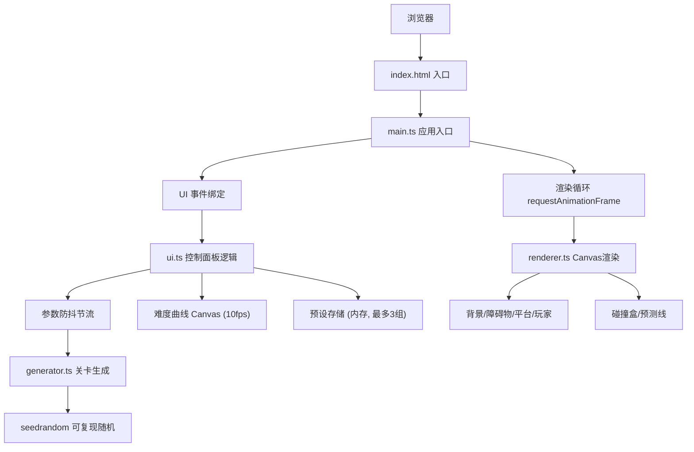

## 1. 架构设计



## 2. 技术描述

- **前端框架**：原生 TypeScript，无额外UI框架
- **构建工具**：Vite 5.x
- **核心库**：
  - `typescript`：类型安全
  - `lodash`：工具函数（防抖节流等）
  - `seedrandom`：可复现的伪随机数生成
- **渲染技术**：Canvas 2D API
- **数据存储**：内存存储预设（最多3组）

## 3. 文件结构

```
auto118/
├── package.json
├── vite.config.js
├── tsconfig.json
├── index.html
└── src/
    ├── main.ts         # 应用入口：初始化Canvas、渲染循环、UI事件绑定
    ├── generator.ts    # 关卡生成算法：参数化生成障碍物和平台
    ├── renderer.ts     # Canvas渲染：背景、障碍物、平台、玩家、碰撞盒、预测线
    └── ui.ts           # UI控制面板：滑块、输入框、难度曲线、预设管理
```

## 4. 核心数据类型

### 4.1 关卡参数
```typescript
interface LevelParams {
  obstacleDensity: number;    // 0.1-0.5，每100px障碍物出现概率
  platformSpacing: number;    // 100-300px，平台间隔因子
  speedFactor: number;        // 0.5-3.0，速度因子
  seed: number;               // 随机种子
}
```

### 4.2 障碍物
```typescript
interface Obstacle {
  x: number;
  y: number;
  width: number;
  height: number;
}
```

### 4.3 平台
```typescript
interface Platform {
  x: number;
  y: number;
  width: number;
  thickness: number;
}
```

### 4.4 预设
```typescript
interface Preset {
  id: number;
  params: LevelParams;
}
```

## 5. 核心模块设计

### 5.1 generator.ts - 关卡生成器
- `generateLevel(params: LevelParams, distance: number): { obstacles: Obstacle[], platforms: Platform[] }`
  - 基于seedrandom初始化RNG
  - 按平台间距因子生成平台序列
  - 按障碍物密度在平台附近随机生成障碍物
  - 输出0-distance范围内的所有障碍物和平台

### 5.2 renderer.ts - 渲染器
- `LevelRenderer` 类
  - `constructor(canvas: HTMLCanvasElement)`
  - `render(scrollX: number, obstacles: Obstacle[], platforms: Platform[], playerX: number, playerY: number)`
  - `drawBackground()` - 水平渐变天空背景
  - `drawObstacles(scrollX: number, obstacles: Obstacle[])` - 红色矩形+阴影
  - `drawPlatforms(scrollX: number, platforms: Platform[])` - 绿色+顶部高光线
  - `drawPlayer(x: number, y: number)` - 紫色30x30方块
  - `drawCollisionBoxes(scrollX: number, obstacles: Obstacle[], platforms: Platform[])` - 半透明红边
  - `drawPredictionLine(playerX: number, playerY: number, scrollX: number, platforms: Platform[])` - 黄色虚线

### 5.3 ui.ts - UI控制
- `UIController` 类
  - `constructor(container: HTMLElement, onChange: (params: LevelParams) => void)`
  - 三个滑块：obstacleDensity、platformSpacing、speedFactor
  - 种子输入框
  - 预设标签管理（最多3组）
  - 难度曲线Canvas渲染（10fps）
  - 响应式：<1200px时切换为悬浮面板

### 5.4 main.ts - 主入口
- 初始化Canvas和UI
- 启动requestAnimationFrame渲染循环
- 根据speedFactor更新scrollX
- 参数变化时防抖1秒后重新生成关卡
