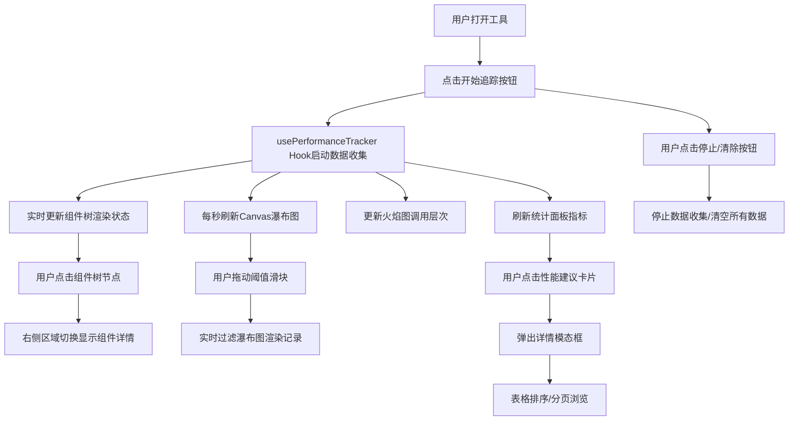

## 1. 产品概述

React组件渲染性能可视化分析工具，帮助开发者直观地追踪、分析和定位React应用中的组件非必要重渲染性能瓶颈。

- **目标用户**：React前端开发者、性能优化工程师
- **核心价值**：提供实时渲染瀑布图、组件树火焰图和性能统计，替代手动console.log和传统DevTools的低效排查方式

## 2. 核心功能

### 2.1 功能模块

1. **组件树面板**：左侧树状结构展示所有React组件及其渲染状态
2. **渲染瀑布图**：Canvas实时绘制60秒内的组件渲染时间轴
3. **火焰图面板**：可视化组件渲染的函数调用层次和耗时
4. **控制工具栏**：开始/停止追踪、清除数据、渲染阈值过滤
5. **统计面板**：总渲染次数、平均耗时、性能建议三大指标卡片
6. **详情模态框**：所有组件渲染数据的可排序、可分页表格

### 2.2 页面详情

| 页面名称 | 模块名称 | 功能描述 |
|---------|---------|---------|
| 主页面 | 组件树面板 | 280px宽，#1a1a2e深色背景，展示组件树结构，每个节点前用色块标注渲染状态（未渲染灰、渲染中黄、重渲染红、缓存命中绿），点击选中后右侧显示详情 |
| 主页面 | 渲染瀑布图 | Canvas绘制，60秒时间轴，每秒更新，蓝绿渐变色条表示渲染记录，高度与耗时成正比，支持阈值过滤 |
| 主页面 | 火焰图面板 | 200px高，Canvas绘制，暖色到冷色渐变矩形块表示函数调用层次，悬停显示tooltip |
| 主页面 | 控制工具栏 | 50px高，#2d3436背景，包含开始/停止按钮（圆形弹性动画）、清除按钮（垃圾桶图标+淡出动画）、阈值滑块（1-50ms） |
| 主页面 | 统计面板 | #f8f9fa背景，圆角8px，Grid布局三卡片（总渲染次数橙、平均耗时蓝、性能建议绿），数字递增动画 |
| 主页面 | 详情模态框 | 居中白色圆角16px，遮罩半透明黑，条纹表格，列头固定可排序，分页每页10行，ESC/遮罩关闭带缩放动效 |

## 3. 核心流程

用户打开工具 → 点击开始追踪 → 工具实时收集组件渲染数据 → 瀑布图/火焰图/统计面板实时更新 → 用户点击组件树节点查看详情 → 用户调整阈值过滤数据 → 用户点击性能建议查看完整报告 → 用户停止/清除数据

## 4. 用户界面设计

### 4.1 设计风格

- **主色调**：海军蓝#1a1a2e（左侧导航）、米白#f5f6fa（右侧内容）
- **状态色**：未渲染#555、渲染中#f1c40f（闪烁）、重渲染#e74c3c、缓存命中#2ecc71
- **渐变色**：瀑布图#00b4d8→#0077b6，火焰图#ff6b6b→#4ecdc4
- **按钮样式**：圆形弹性按钮（scale 0.9→1.1，0.2s ease过渡）
- **字体**：Inter（从Google Fonts引入）
- **布局风格**：双栏布局，左侧深色导航+右侧浅色内容，顶部工具栏+底部统计面板
- **图标风格**：内联SVG图标（垃圾桶等）
- **动效**：所有交互元素0.2s ease过渡，数字递增动画ease-out 0.5s，模态框缩放0.9→1

### 4.2 页面设计概览

| 页面名称 | 模块名称 | UI元素 |
|---------|---------|--------|
| 主页面 | 组件树面板 | 固定宽度280px、深色背景、可滚动、树形缩进、状态色块、悬停高亮、点击选中态 |
| 主页面 | 瀑布图 | Canvas元素、60秒时间刻度、色条高度映射耗时、阈值过滤效果 |
| 主页面 | 火焰图 | Canvas元素、200px固定高度、嵌套矩形块、颜色渐变映射层次、悬停tooltip |
| 主页面 | 控制工具栏 | 50px固定高度、圆形按钮带弹性动画、滑块带轨迹线、图标内联SVG |
| 主页面 | 统计面板 | Grid三列等宽布局、卡片阴影圆角、数字大字、颜色区分指标、递增动画 |
| 主页面 | 详情模态框 | 居中定位、遮罩半透明、圆角16px、表格条纹、排序箭头动画、分页控件、关闭动效 |

### 4.3 响应式

- **设计策略**：桌面端优先（Desktop-first）
- **断点**：800px宽度以下
  - 左侧组件树面板自动折叠为汉堡菜单图标
  - 点击汉堡菜单展开/收起组件树面板
  - 统计面板Grid从三列变为单列堆叠
- **触控优化**：滑块、按钮、表格行在移动端增加触控区域
