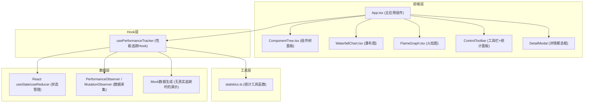

## 1. 架构设计



## 2. 技术描述

- **前端框架**：React@18 + TypeScript
- **构建工具**：Vite@5 + @vitejs/plugin-react
- **状态管理**：React useState/useReducer（不引入额外状态管理库）
- **UI渲染**：原生CSS（不引入Tailwind，按需求精确控制样式）
- **图表绘制**：HTML5 Canvas API
- **工具库**：lodash
- **数据采集**：PerformanceObserver + MutationObserver（真实场景）+ Mock数据生成器（演示场景）
- **开发服务器**：Vite devServer，端口3000

## 3. 路由定义

| 路由 | 用途 |
|-----|-----|
| / | 主页面，包含所有功能模块 |

本项目为单页应用（SPA），无需多路由配置。

## 4. 数据模型

### 4.1 类型定义

```typescript
// 组件渲染状态
type RenderStatus = 'not-rendered' | 'rendering' | 're-rendered' | 'cache-hit';

// 组件节点（树结构）
interface ComponentNode {
  id: string;
  name: string;
  status: RenderStatus;
  children: ComponentNode[];
  parentId: string | null;
}

// 单条渲染记录
interface RenderRecord {
  id: string;
  componentId: string;
  componentName: string;
  startTime: number; // 时间戳 ms
  duration: number; // 渲染耗时 ms
  isReRender: boolean;
}

// 火焰图节点（函数调用层次）
interface FlameNode {
  name: string;
  duration: number; // ms
  children: FlameNode[];
  depth: number;
}

// 组件统计数据
interface ComponentStats {
  componentId: string;
  componentName: string;
  renderCount: number;
  avgDuration: number;
  maxDuration: number;
}

// 性能建议
interface PerformanceTip {
  componentId: string;
  componentName: string;
  message: string;
  severity: 'info' | 'warning' | 'error';
}

// 全局追踪状态
interface TrackerState {
  isTracking: boolean;
  componentTree: ComponentNode[];
  renderRecords: RenderRecord[]; // 最多保留5000条
  selectedComponentId: string | null;
  threshold: number; // ms
  stats: {
    totalRenders: number;
    avgDuration: number;
    tips: PerformanceTip[];
  };
}
```

### 4.2 数据约束

- **渲染记录上限**：5000条，超出后按先进先出（FIFO）淘汰旧数据
- **瀑布图时间窗口**：最近60秒内的数据
- **帧率目标**：瀑布图实时更新≥30FPS

## 5. 文件组织结构

```
.
├── package.json
├── vite.config.js
├── tsconfig.json
├── index.html
└── src/
    ├── App.tsx                  # 主应用组件，全局状态管理
    ├── components/
    │   ├── ComponentTree.tsx    # 组件树面板
    │   ├── WaterfallChart.tsx   # Canvas瀑布图
    │   └── FlameGraph.tsx       # Canvas火焰图
    ├── hooks/
    │   └── usePerformanceTracker.ts  # 性能追踪Hook
    └── utils/
        └── statistics.ts        # 统计计算工具函数
```

## 6. 核心实现要点

### 6.1 性能追踪（usePerformanceTracker）
- 使用`setInterval`模拟每秒数据更新（演示场景）
- 可选接入`PerformanceObserver`监听'react-measure'等标记
- 可选接入`MutationObserver`监听DOM变化辅助推断
- 使用`useReducer`管理复杂状态更新
- 渲染记录数组采用环形缓冲区策略，超过5000条自动移除最早记录

### 6.2 瀑布图渲染（WaterfallChart）
- 使用`useRef`持有Canvas DOM引用
- 使用`requestAnimationFrame`保证渲染帧率
- 时间轴映射：60秒 → Canvas宽度像素
- 色条高度映射：耗时ms → 像素高度（带最大阈值截断）
- 蓝绿渐变使用Canvas `LinearGradient`
- 实时过滤：只绘制耗时≥阈值的记录

### 6.3 火焰图渲染（FlameGraph）
- 递归绘制嵌套矩形
- 颜色根据深度从暖色(#ff6b6b)到冷色(#4ecdc4)插值
- 使用`getBoundingClientRect`检测鼠标位置
- 自定义Tooltip组件跟随鼠标显示

### 6.4 统计面板动画
- 使用`requestAnimationFrame`实现数字从旧值递增到新值的ease-out动画
- 每个指标卡片独立管理动画进度

### 6.5 详情模态框
- 表格列头点击切换排序方向（升序/降序）
- 排序箭头使用CSS transform旋转动画
- 分页逻辑：每页10行，支持上下页跳转
- 关闭动效：ESC键监听 + 遮罩点击 + scale(0.9→1)过渡
