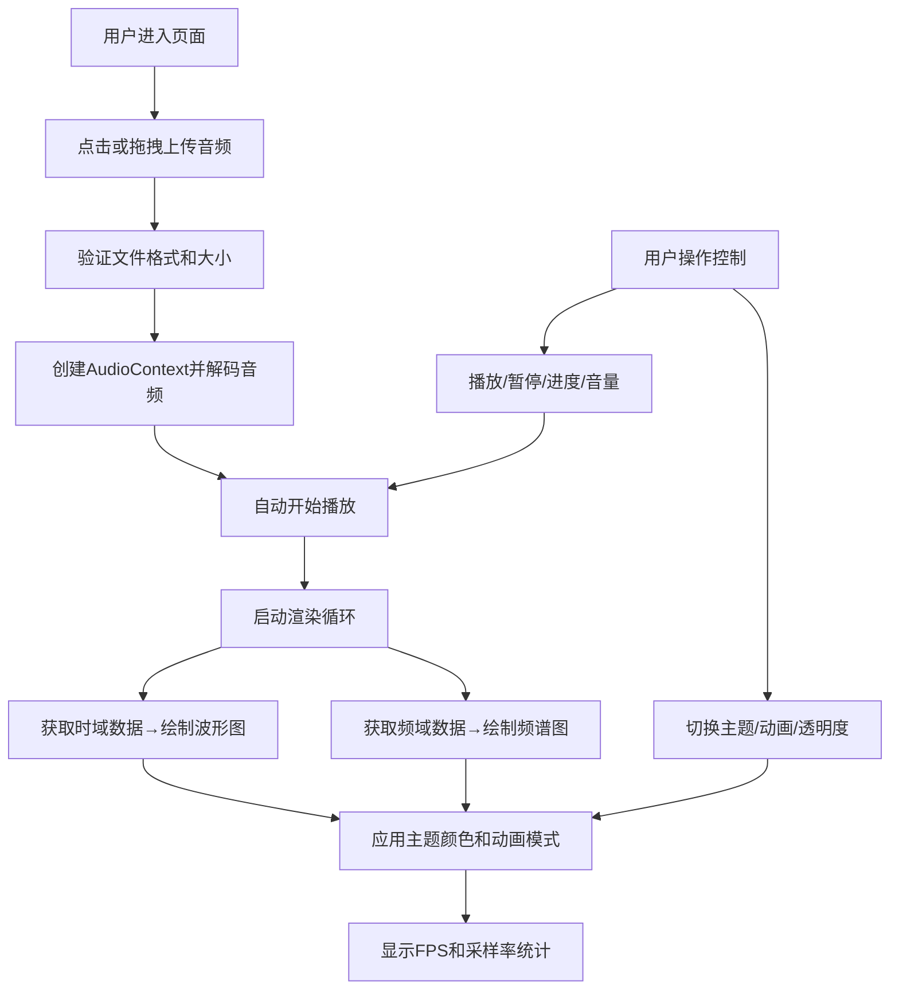

## 1. 产品概述
交互式音频频谱可视化播放器，帮助独立音乐人或播客创作者在浏览器中快速生成具有视觉吸引力的音频播放体验。
- 解决普通播放器界面缺乏视觉吸引力、无法根据音乐风格调整频谱色彩和动画模式的问题
- 目标用户为独立音乐人、播客创作者、音频爱好者

## 2. 核心特性

### 2.1 功能模块
1. **主播放页面**：音频上传、播放控制、波形图、频谱图、主题设置、性能统计

### 2.2 页面详情
| 页面名称 | 模块名称 | 功能描述 |
|---------|---------|---------|
| 主播放页面 | 音频上传区 | 支持点击上传或拖拽上传，支持.mp3/.wav格式，≤10MB，带拖拽高亮反馈 |
| 主播放页面 | 播放控制区 | 播放/暂停按钮、可拖拽进度条、音量滑块、时间显示 |
| 主播放页面 | 波形图区域 | Canvas绘制时域波形，中心线对称，动态颜色跟随主色调，≥30FPS，500×150px |
| 主播放页面 | 频谱柱状图 | 64根垂直柱，20Hz-20kHz映射，彩虹渐变，柱顶圆角，高度0-200px |
| 主播放页面 | 主题控制面板 | 4种颜色主题（霓虹幻彩、海洋迷雾、火焰熔岩、极光星云）、4种动画模式（经典柱状、脉冲扩散、光晕效果、粒子雨）、透明度滑块（0.2-1.0） |
| 主播放页面 | 性能统计区 | 实时FPS（颜色分级）、音频采样率显示，右下角固定 |

## 3. 核心流程

用户上传音频文件 → 自动创建AudioContext并解码播放 → 实时获取频域/时域数据 → Canvas渲染波形与频谱（应用主题和动画模式） → 用户可调整播放控制/主题设置 → 实时反馈到可视化效果

## 4. 用户界面设计

### 4.1 设计风格
- **整体风格**：深色科幻风格
- **主色调**：背景 #0a0a1a，控件底色 #1a1a2e，文字 #e0e0e0
- **强调色**：亮蓝色 #00bfff，按钮悬停 #2d2d44
- **按钮样式**：圆角8px，点击缩放0.95倍（0.15s），悬停背景过渡0.5s
- **字体**：等宽字体 Fira Code（FPS显示），系统默认字体（正文）
- **布局**：桌面端波形与频谱并排，移动端上下堆叠
- **动效**：拖拽上传时页面边框亮蓝色闪烁2次，频谱柱子动画流畅

### 4.2 页面设计概述
| 页面名称 | 模块名称 | UI元素 |
|---------|---------|--------|
| 主播放页面 | 音频上传区 | 虚线边框，拖拽提示文字，拖拽高亮闪烁 |
| 主播放页面 | 播放控制区 | 圆形播放按钮，自定义渐变进度条，圆形滑块音量控制，时间显示 |
| 主播放页面 | 波形图区域 | 渐变边框（#1a1a2e→#2d2d44），圆角8px，500×150px |
| 主播放页面 | 频谱柱状图 | 渐变边框，圆角8px，64根柱子，彩虹渐变，柱顶2px圆角 |
| 主播放页面 | 主题控制面板 | 下拉菜单、单选按钮组、滑块控件，右侧排列 |
| 主播放页面 | 性能统计区 | 右下角固定，等宽字体14px，FPS颜色动态变化 |

### 4.3 响应式适配
- 桌面端优先，整体宽度自适应 600px-1200px
- 视口 ≤768px 时：波形图与频谱图改为上下堆叠排列，按钮字号缩小至14px
- 触控设备优化：按钮尺寸加大，滑块触控区域扩大

## 5. 性能要求
- 频谱和波形图渲染帧率稳定 ≥55FPS
- 音频播放与可视化同步延迟 ≤50ms
- FPS <50 时显示红色警告
