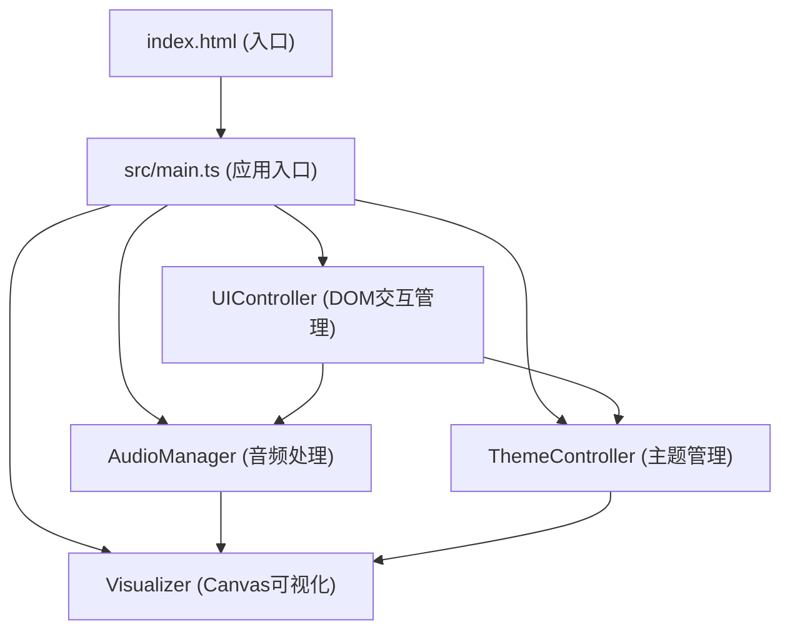

## 1. 架构设计



## 2. 技术描述
- **前端框架**：原生 TypeScript（无第三方UI框架）
- **构建工具**：Vite@5
- **音频处理**：Web Audio API（AudioContext、AnalyserNode、AudioBufferSourceNode）
- **可视化**：Canvas 2D API（原生实现，无第三方可视化库）
- **编程语言**：TypeScript（严格模式，target ES2020，模块 ESNext）

## 3. 文件组织

| 文件路径 | 职责描述 |
|---------|---------|
| `package.json` | 项目依赖与脚本配置 |
| `vite.config.js` | Vite 构建配置（devServer端口3000，TypeScript支持） |
| `tsconfig.json` | TypeScript 编译配置（严格模式，ES2020） |
| `index.html` | 入口页面（深色背景基础样式，引入main.ts） |
| `src/main.ts` | 应用入口（初始化各模块，协调调用） |
| `src/audioManager.ts` | 音频管理类（解码、播放控制、实时数据提供） |
| `src/visualizer.ts` | 可视化类（波形图、频谱图Canvas渲染） |
| `src/themeController.ts` | 主题管理类（颜色主题、动画模式预设） |
| `src/uiController.ts` | UI控制类（DOM事件绑定与交互处理） |

## 4. 类设计

### 4.1 AudioManager
```typescript
class AudioManager {
  audioContext: AudioContext | null;
  analyser: AnalyserNode | null;
  source: AudioBufferSourceNode | null;
  gainNode: GainNode | null;
  audioBuffer: AudioBuffer | null;
  isPlaying: boolean;
  currentTime: number;
  duration: number;
  sampleRate: number;

  async loadFile(file: File): Promise<void>;        // 加载并解码音频文件
  play(): void;                                       // 开始播放
  pause(): void;                                      // 暂停播放
  seek(time: number): void;                           // 跳转到指定时间
  setVolume(value: number): void;                     // 设置音量 (0-1)
  getTimeDomainData(): Uint8Array;                    // 获取时域波形数据
  getFrequencyData(): Uint8Array;                     // 获取频域频谱数据
  destroy(): void;                                    // 清理资源
}
```

### 4.2 Visualizer
```typescript
class Visualizer {
  waveformCanvas: HTMLCanvasElement;
  spectrumCanvas: HTMLCanvasElement;
  waveCtx: CanvasRenderingContext2D;
  specCtx: CanvasRenderingContext2D;
  audioManager: AudioManager;
  themeController: ThemeController;
  opacity: number;
  animationId: number;
  fps: number;
  private frameCount: number;
  private lastFpsUpdate: number;

  drawWaveform(data: Uint8Array): void;              // 绘制时域波形图
  drawSpectrum(data: Uint8Array): void;              // 绘制频域频谱图
  drawPulseGlow(x: number, y: number, energy: number): void;  // 脉冲扩散光晕
  drawParticles(data: Uint8Array): void;             // 粒子雨效果
  drawGlow(data: Uint8Array): void;                  // 光晕效果
  setOpacity(value: number): void;                   // 设置整体透明度
  getFps(): number;                                   // 获取当前FPS
  start(): void;                                      // 启动渲染循环
  stop(): void;                                       // 停止渲染循环
}
```

### 4.3 ThemeController
```typescript
type ThemeName = 'neon' | 'ocean' | 'fire' | 'aurora';
type AnimationMode = 'bars' | 'pulse' | 'glow' | 'particles';

interface ThemeColors {
  startColor: string;
  endColor: string;
  waveColor: string;
  name: string;
}

class ThemeController {
  currentTheme: ThemeName;
  currentAnimation: AnimationMode;
  themes: Record<ThemeName, ThemeColors>;

  setTheme(name: ThemeName): void;                   // 切换颜色主题
  setAnimationMode(mode: AnimationMode): void;       // 切换动画模式
  getGradientColors(): { start: string; end: string }; // 获取渐变颜色
  getWaveColor(): string;                             // 获取波形颜色
  getAnimationMode(): AnimationMode;                  // 获取当前动画模式
}
```

### 4.4 UIController
```typescript
class UIController {
  audioManager: AudioManager;
  visualizer: Visualizer;
  themeController: ThemeController;

  init(): void;                                       // 初始化所有事件绑定
  bindUploadEvents(): void;                          // 绑定上传事件（点击+拖拽）
  bindPlaybackControls(): void;                      // 绑定播放控制事件
  bindThemeControls(): void;                         // 绑定主题控制事件
  updateTimeDisplay(current: number, total: number): void;  // 更新时间显示
  updateFpsDisplay(fps: number, sampleRate: number): void;  // 更新FPS显示
  showUploadError(message: string): void;            // 显示上传错误提示
  triggerDragFlash(): void;                          // 触发拖拽边框闪烁
}
```

## 5. 核心数据配置

### 5.1 预设主题配色
| 主题名称 | startColor | endColor | waveColor |
|---------|-----------|----------|-----------|
| 霓虹幻彩 (neon) | #00BFFF | #FF1493 | #00FFFF |
| 海洋迷雾 (ocean) | #00CED1 | #1E90FF | #4169E1 |
| 火焰熔岩 (fire) | #FF4500 | #FF0000 | #FF6347 |
| 极光星云 (aurora) | #00FF7F | #9370DB | #7FFFD4 |

### 5.2 可视化参数
- 频谱柱数量：64
- 波形图尺寸：500px × 150px
- 频谱柱最大高度：200px
- 柱顶圆角：2px
- FFT大小：128（对应64个频域数据点）
- 时域数据采样：2048点
