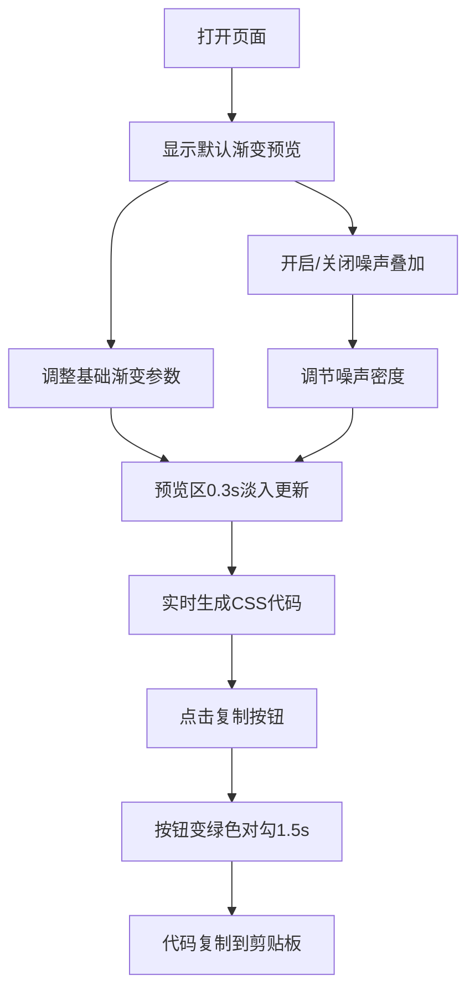

## 1. 产品概述

CSS渐变背景纹理生成器是一款帮助前端设计师在浏览器中快速创建、预览和导出CSS渐变背景的在线工具。用户可以通过可视化界面调节渐变参数，实时预览效果，并一键复制可直接使用的CSS代码。

- 目标用户：前端设计师、Web开发者
- 核心价值：省去在开发者工具中反复调试渐变参数的繁琐流程，提供直观的实时预览和多纹理叠加效果
- 市场定位：轻量级、专注的CSS渐变调试工具

## 2. 核心功能

### 2.1 功能模块

1. **实时预览区**：400x300像素预览画布，带圆角和边框，支持0.3秒淡入过渡动画
2. **基础渐变控制面板**：颜色拾取器（起始色/中间色/终止色）、渐变角度滑块、渐变类型选择
3. **噪声叠加层控制**：开关切换、密度滑块调节、透明度控制
4. **CSS代码导出区**：实时生成完整CSS代码、一键复制功能、复制成功反馈动画

### 2.2 页面详情

| 页面名称 | 模块名称 | 功能描述 |
|-----------|-------------|---------------------|
| 主页面 | 实时预览区 | 400x300px画布，圆角12px，1px #ddd边框，默认显示三色水平渐变，支持0.3s淡入过渡 |
| 主页面 | 基础渐变参数 | 三个颜色拾取器（起始#0f2027、中间#203a43、终止#2c5364），角度滑块0-360°步长1°，渐变类型下拉（linear/radial/conic） |
| 主页面 | 噪声叠加层 | 开关控件，开启后叠加默认透明度0.15的黑白噪点，密度滑块0-1调节 |
| 主页面 | CSS代码导出区 | 实时显示完整CSS代码（含background属性和fallback颜色），复制按钮带成功反馈 |

## 3. 核心流程

用户打开页面 → 查看默认渐变预览 → 调整颜色/角度/渐变类型 → 预览区平滑更新 → 可选开启噪声叠加并调节密度 → 实时查看生成的CSS代码 → 点击复制按钮获取代码 → 粘贴到项目中使用

## 4. 用户界面设计

### 4.1 设计风格

- **主色调**：深色主题，背景#1a1a2e，控制面板#16213e，文字#e0e0e0
- **按钮风格**：扁平化设计，圆角按钮，悬停有微妙高亮
- **字体**：现代无衬线字体，标题与正文有明确层级
- **布局风格**：双栏布局（控制面板左固定320px，预览区右自适应）
- **交互反馈**：滑块拖动、颜色拾取、复制按钮均有即时视觉反馈

### 4.2 页面设计概述

| 页面名称 | 模块名称 | UI元素 |
|-----------|-------------|-------------|
| 主页面 | 实时预览区 | 400x300px卡片、圆角12px、1px浅灰边框、居中显示、淡入过渡 |
| 主页面 | 控制面板 | 320px宽、深色背景、三个折叠区域（手风琴样式）、标签页切换 |
| 主页面 | 颜色拾取器 | 原生input[type=color] + 十六进制值显示 |
| 主页面 | 滑块控件 | 自定义样式滑块、实时数值显示 |
| 主页面 | 复制按钮 | 矩形按钮、点击后绿色对勾动画反馈 |

### 4.3 响应式

- 桌面端（>700px）：双栏布局，控制面板左固定320px，预览区居右自适应
- 移动端（≤700px）：控制面板折叠到顶部横向排列，预览区占满全宽，高度缩小至250px
- 触屏优化：所有控件在移动端保持可用，滑块和按钮有足够触控区域

### 4.4 性能要求

- 滑块和颜色拾取器松手后30ms内更新预览
- 噪声叠加层使用离屏Canvas预渲染缓存，二次调整直接读取缓存
- 避免不必要的DOM重绘和重排
