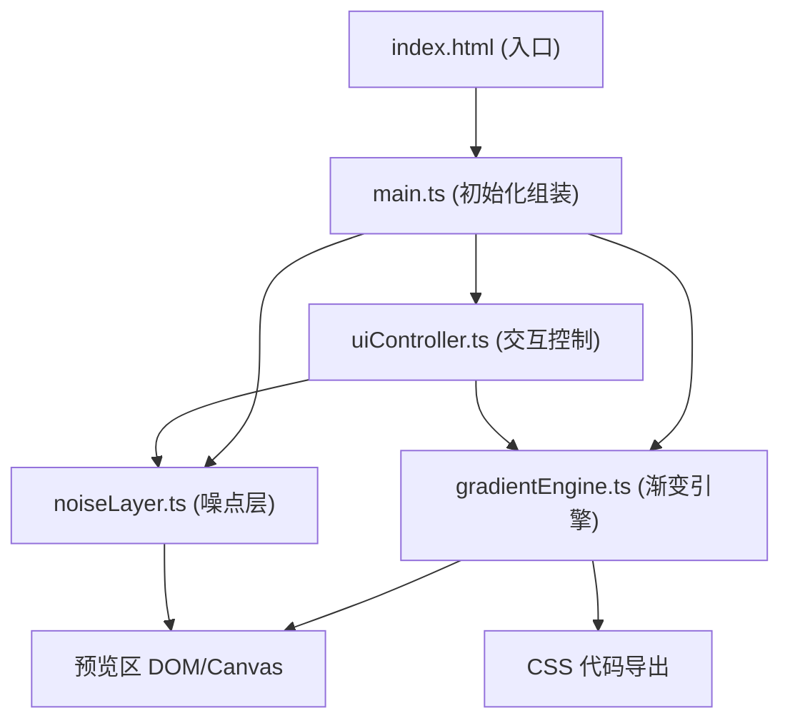

## 1. 架构设计



## 2. 技术描述

- **前端框架**：原生 TypeScript（无框架），轻量直接操作 DOM
- **构建工具**：Vite 5.x，开发服务器端口 3000
- **语言版本**：TypeScript 严格模式，target ES2020
- **工具库**：lodash（debounce/throttle 等工具函数）
- **渲染方式**：CSS 渐变 + Canvas 2D API（噪点层）

## 3. 文件结构

```
.
├── package.json          # 项目依赖和脚本配置
├── vite.config.js        # Vite 构建配置
├── tsconfig.json         # TypeScript 编译配置
├── index.html            # 入口 HTML 页面
└── src/
    ├── main.ts           # 入口脚本，初始化 UI 和事件绑定
    ├── gradientEngine.ts # 渐变 CSS 生成和 Canvas 渲染逻辑
    ├── noiseLayer.ts     # 离屏 Canvas 噪点纹理生成
    └── uiController.ts   # 控制面板交互和响应式切换
```

## 4. 核心模块设计

### 4.1 gradientEngine.ts

**功能**：生成渐变 CSS 字符串，提供 Canvas 渲染能力

**导出接口**：
```typescript
export interface GradientConfig {
  type: 'linear' | 'radial' | 'conic';
  angle: number;
  colors: string[]; // 十六进制颜色数组
}

export function generateGradientCSS(config: GradientConfig): string;
export function generateFallbackColor(config: GradientConfig): string;
export function renderGradientToCanvas(
  canvas: HTMLCanvasElement,
  config: GradientConfig
): void;
```

### 4.2 noiseLayer.ts

**功能**：使用离屏 Canvas 生成噪点纹理，支持缓存

**导出接口**：
```typescript
export interface NoiseConfig {
  enabled: boolean;
  density: number;   // 0-1
  opacity: number;   // 默认 0.15
}

export class NoiseLayer {
  constructor(width: number, height: number);
  generate(config: NoiseConfig): ImageData | null;
  clearCache(): void;
}
```

**缓存策略**：以 density 为 key 缓存生成的 ImageData，相同密度直接返回缓存。

### 4.3 uiController.ts

**功能**：管理控制面板所有交互组件

**导出接口**：
```typescript
export interface UIState {
  gradient: GradientConfig;
  noise: NoiseConfig;
}

export class UIController {
  constructor(container: HTMLElement, onChange: (state: UIState) => void);
  getState(): UIState;
  setState(state: Partial<UIState>): void;
  setupResponsiveLayout(): void;
}
```

**包含组件**：
- 颜色拾取器组（3个）
- 角度滑块
- 渐变类型下拉选择
- 噪声开关
- 噪声密度滑块
- CSS 代码显示区
- 复制按钮
- 折叠面板（手风琴）
- 响应式断点监听

### 4.4 main.ts

**功能**：应用入口，组装各模块

**职责**：
- 初始化预览区 DOM
- 创建 UIController 实例
- 订阅状态变化，更新预览和导出代码
- 绑定复制按钮反馈动画

## 5. 性能优化策略

1. **防抖处理**：滑块拖动使用 lodash.debounce（30ms）确保松手后快速响应
2. **噪点缓存**：NoiseLayer 内部使用 Map<number, ImageData> 缓存已生成的噪点纹理
3. **离屏渲染**：噪点使用 OffscreenCanvas（或后备的内存 Canvas）预渲染
4. **CSS 过渡**：预览区使用 opacity 过渡（0.3s）而非重绘实现淡入效果
5. **最小化 DOM 操作**：仅更新必要的 style 属性和 textContent

## 6. 响应式断点

| 断点 | 布局行为 |
|-------|---------|
| > 700px | 左侧控制面板 320px 固定，右侧预览区自适应 |
| ≤ 700px | 控制面板横向排列于顶部，预览区全宽 250px 高度 |
