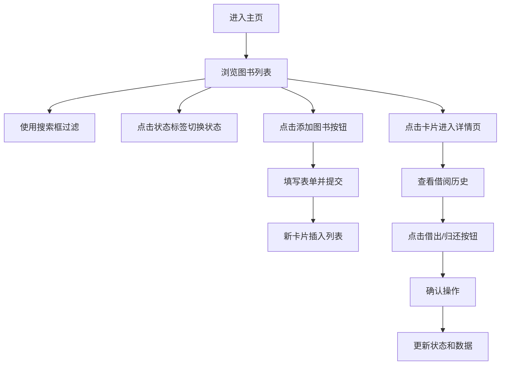

## 1. 产品概述

本应用是面向独立书店店主的在线图书库存和借阅管理Web应用，解决纸质书库存整理繁琐、借还登记易出错、借阅历史和热门书籍难以追踪的痛点。

- 目标用户：独立书店店主、小型图书馆管理员
- 核心价值：高效管理图书库存、简化借还流程、可视化借阅数据

## 2. 核心功能

### 2.1 功能模块

1. **图书列表主页**：卡片式图书展示、实时搜索过滤、状态快速切换
2. **添加图书**：模态框表单、字段校验、颜色拾取
3. **图书详情页**：完整信息展示、借阅历史表格、借还操作
4. **统计面板**：实时库存统计、计数动画、可收起展开

### 2.2 页面详情

| 页面名称 | 模块名称 | 功能描述 |
|-----------|-------------|---------------------|
| 图书列表主页 | 顶栏搜索框 | 宽度40%，放大镜图标，实时过滤，匹配淡入动画0.3s，不匹配缩小消失0.2s |
| 图书列表主页 | 图书卡片 | 宽260px，圆角12px，浅灰阴影，展示书名/作者/ISBN/封面色块/状态标签，点击状态切换 |
| 图书列表主页 | 添加图书按钮 | 弹出模态框，新卡缩放+透明度入场动画 |
| 图书列表主页 | 统计面板 | 固定右下角，半透明白底圆角8px，总库存/已借出/本月借阅，计数动画0.5s |
| 添加图书模态框 | 表单 | 书名、作者、ISBN(XXX-XX-XXXXX格式校验)、颜色拾取、库存数量(1-99步进器) |
| 图书详情页 | 信息展示 | 完整图书信息、借阅历史表格(未还行浅红#ffcdd2背景) |
| 图书详情页 | 操作按钮 | 借出/归还按钮，确认对话框，更新状态和数据 |

## 3. 核心流程

## 4. 用户界面设计

### 4.1 设计风格

- **主色调**：莫兰迪色系
  - 主背景：暖灰 #f5f0eb
  - 卡片背景：纯白 #ffffff
  - 按钮颜色：柔和棕 #bcaaa4
  - 文字颜色：深灰 #4e4e4e
  - 强调色：暗红 #c0392b、暗绿 #27ae60
- **状态标签色**：
  - 可借：绿色 #8bc34a
  - 已借出：红色 #e57373
  - 预约中：橙色 #ffb74d
- **封面色块**：浅蓝 #a0d2eb、暖橙 #ffd3b4 等随机柔和色
- **按钮/卡片交互**：悬停上移2px+加深阴影，点击缩放0.95
- **字体**：采用简洁现代无衬线字体，保证可读性

### 4.2 页面设计概览

| 页面名称 | 模块名称 | UI元素 |
|-----------|-------------|-------------|
| 主页 | 顶栏 | Logo、搜索框(40%宽)、添加图书按钮 |
| 主页 | 卡片网格 | 响应式网格布局，卡片260px宽 |
| 主页 | 统计面板 | 固定右下角，可收起/展开，计数动画 |
| 模态框 | 添加图书 | 居中白色圆角16px，半透明黑0.5覆盖层 |
| 详情页 | 借阅表格 | 斑马纹，未还行浅红背景 |

### 4.3 响应式设计

桌面端优先设计，卡片网格自适应排列；在移动端自动调整为单列布局。
