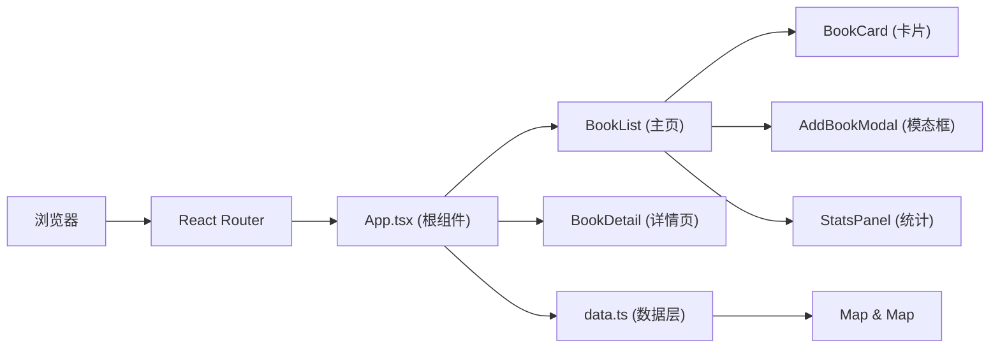
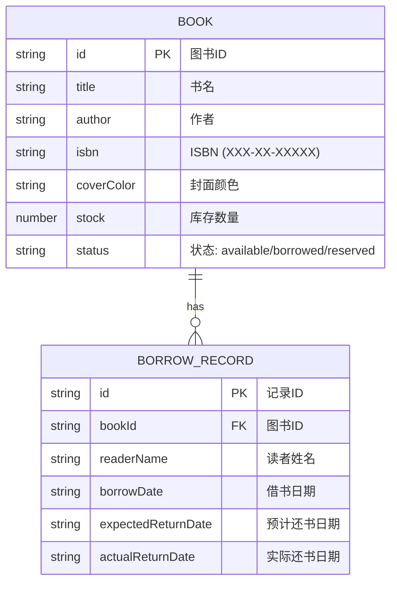

## 1. 架构设计



## 2. 技术说明

- **前端框架**：React 18 + TypeScript
- **构建工具**：Vite 5
- **路由**：React Router DOM 6
- **状态管理**：自定义 Hook (useBookStore)，使用 Map 数据结构
- **工具库**：uuid (生成ID)、lodash (工具函数)
- **开发端口**：3000

## 3. 路由定义

| 路由 | 用途 |
|-------|---------|
| / | 图书列表主页 |
| /book/:id | 图书详情页 |

## 4. 数据模型

### 4.1 数据模型定义



### 4.2 TypeScript 类型定义

```typescript
type BookStatus = 'available' | 'borrowed' | 'reserved';

interface Book {
  id: string;
  title: string;
  author: string;
  isbn: string;
  coverColor: string;
  stock: number;
  status: BookStatus;
}

interface BorrowRecord {
  id: string;
  bookId: string;
  readerName: string;
  borrowDate: string;
  expectedReturnDate: string;
  actualReturnDate?: string;
}
```

## 5. 文件结构

```
/
├── package.json
├── vite.config.js
├── tsconfig.json
├── index.html
└── src/
    ├── App.tsx          # 根组件，路由布局
    ├── data.ts          # 数据层 CRUD
    ├── BookCard.tsx     # 图书卡片
    ├── BookDetail.tsx   # 图书详情页
    └── AddBookModal.tsx # 添加图书模态框
```
