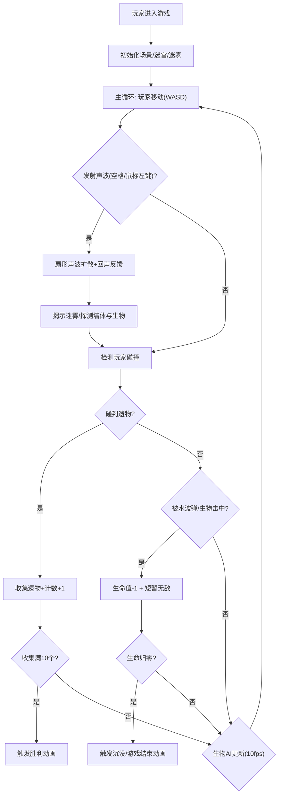

## 1. 产品概述

深海声波迷宫探险游戏 - 玩家在迷雾笼罩的深海遗迹中操控潜水器，通过声波探测逐步揭开沉没城市的秘密，同时躲避潜伏的深渊生物。

- 目标用户：喜欢探索类、策略类小游戏的玩家
- 产品价值：提供沉浸式的深海探索体验，结合声波探测解谜与躲避敌人的紧张刺激感

## 2. 核心功能

### 2.1 功能模块

1. **游戏主场景**：Canvas全屏渲染，包含迷雾层、遗迹墙体、玩家潜水器、敌人AI、收藏品
2. **声波探测系统**：扇形声波发射、缓动扩散、回声强度反馈、迷雾揭示
3. **动态迷雾系统**：径向渐变消散、水底光照模拟、流动扭曲动画
4. **战斗与AI系统**：腐朽木箱掩体、巡逻类鱼生物、状态机AI（游荡-追踪-攻击）、水波弹攻击
5. **收藏品系统**：古代遗物随机生成、自动收集、计数显示、胜利动画
6. **生命值系统**：3格水晶生命、受击闪烁无敌、生命归零沉没动画
7. **UI界面**：生命水晶、遗物计数、声波冷却条、收集提示、受击特效

### 2.2 页面详情

| 页面名称 | 模块名称 | 功能描述 |
|-----------|-------------|---------------------|
| 游戏主界面 | Canvas游戏场景 | 全屏Canvas渲染游戏世界，处理所有游戏逻辑与视觉效果 |
| 游戏主界面 | 顶部UI层 | 左上角生命水晶、右上角遗物计数 |
| 游戏主界面 | 底部UI层 | 声波冷却条，随时间自动恢复 |
| 游戏主界面 | 特效层 | 发射声波屏幕光晕、收集遗物提示动画、受击血色波纹 |
| 游戏主界面 | 结束层 | 胜利/失败动画与信息显示 |

## 3. 核心流程

玩家进入游戏后，操控潜水器在深海遗迹迷宫中探索。通过发射声波揭示迷雾中的通道和敌人位置，收集10个古代遗物。躲避或利用掩体应对深渊生物的攻击，在生命值耗尽前完成收集任务。

## 4. 用户界面设计

### 4.1 设计风格

- **主色调**：深海蓝 (#0a1628) → 墨绿渐变 (#0d2818)，营造深海压迫感
- **强调色**：发光青蓝色 (#00f0ff)，用于UI元素和声波效果
- **危险色**：血红色 (#ff3355)，用于受击特效
- **收集色**：金橙色 (#ffaa00)，用于遗物效果
- **字体**：使用像素风或未来感等宽字体，营造科技深海探险氛围
- **视觉效果**：全屏噪点纹理模拟水底颗粒、辉光发光效果、径向渐变光照

### 4.2 页面设计概述

| 页面名称 | 模块名称 | UI元素 |
|-----------|-------------|-------------|
| 游戏主界面 | 背景层 | 深海蓝→墨绿垂直渐变、半透明噪点纹理叠加 |
| 游戏主界面 | 迷雾层 | 径向渐变围绕玩家消散、边缘流动扭曲动画 |
| 游戏主界面 | 遗迹层 | 墙体纹理、腐朽木箱（可破坏）、古代遗物（发光图标） |
| 游戏主界面 | 实体层 | 玩家潜水器（发光核心）、深渊生物（生物发光）、水波弹 |
| 游戏主界面 | 声波层 | 扇形声波扩散动画、回声强度颜色变化 |
| 游戏主界面 | 生命UI | 左上角3个脉动水晶图标（青蓝色发光） |
| 游戏主界面 | 遗物UI | 右上角遗物计数（发光图标 + 数字） |
| 游戏主界面 | 冷却UI | 底部中央横向声波冷却槽（带辉光动画） |
| 游戏主界面 | 特效层 | 屏幕边缘蓝白光晕脉冲、遗物收集放大动画、血色受击波纹 |

### 4.3 响应式

- Desktop优先，Canvas始终填充浏览器视口 (100vw × 100vh)
- UI元素使用rem单位，根字体大小基于视口最小边计算
- 宽高比变化时保持布局比例不变，使用viewport单位确保游戏世界不变形

### 4.4 性能约束

- 游戏主循环稳定运行在30FPS以上
- 迷雾层每帧只更新玩家周围600px半径区域，不进行全屏重绘
- 生物AI更新频率限制为每秒10次
- 声波粒子数量不超过50个
- 总内存占用不超过150MB
