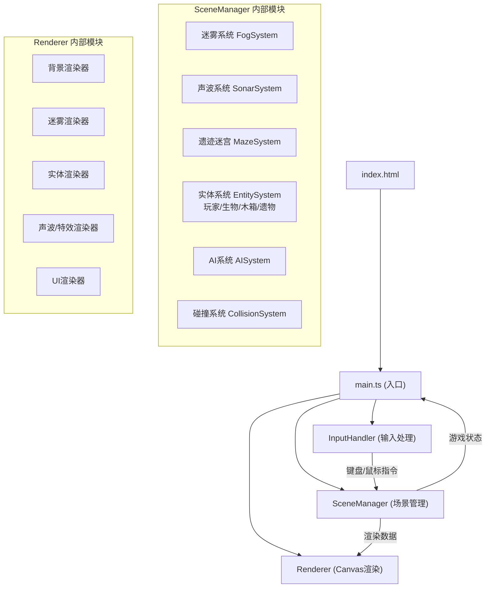

## 1. 架构设计



## 2. 技术描述

- **前端框架**：纯 TypeScript + Canvas 2D API（无React/Vue，按用户需求使用原生Canvas）
- **构建工具**：Vite 5.x，开发服务器端口3000
- **语言**：TypeScript 5.x，严格模式，target ES2020，包含DOM类型
- **无后端**：纯前端游戏，所有逻辑在浏览器端运行
- **无数据库**：游戏状态存储在内存中

## 3. 文件结构与调用关系

```
project-root/
├── package.json              # 依赖: typescript, vite; 脚本: npm run dev
├── vite.config.js            # Vite配置, 端口3000
├── tsconfig.json             # 严格模式, ES2020, DOM
├── index.html                # 入口页面, 游戏标题 + Canvas容器
└── src/
    ├── main.ts               # [入口] 初始化引擎 → 加载资源 → 启动主循环
    │                         # 调用: SceneManager, InputHandler, Renderer
    │
    ├── SceneManager.ts       # [核心] 管理所有游戏场景状态
    │                         # 接收: InputHandler的玩家指令
    │                         # 输出: 渲染数据到Renderer
    │                         # 内部: 迷雾/声波/迷宫/实体/AI/碰撞
    │
    ├── InputHandler.ts       # [输入] 处理键盘WASD + 鼠标点击/空格
    │                         # 输出: 移动指令 + 声波发射指令到SceneManager
    │
    └── Renderer.ts           # [渲染] Canvas 2D绘制
                              # 接收: SceneManager的渲染数据
                              # 绘制: 迷雾/声波/遗迹纹理/生物发光/UI
```

**数据流向：**
```
用户操作 → InputHandler → {moveDir, fireSonar} → SceneManager
                                                     ↓
                                          更新游戏状态(位置/迷雾/AI/碰撞)
                                                     ↓
                                          {renderData} → Renderer → Canvas屏幕
```

## 4. 核心数据结构

### 4.1 玩家状态
```typescript
interface Player {
  x: number; y: number;           // 像素坐标
  vx: number; vy: number;         // 速度
  radius: number;                 // 碰撞半径
  health: number;                 // 0-3
  invincibleTime: number;         // 无敌剩余时间(ms)
  sonarCooldown: number;          // 声波冷却剩余(ms)
  sonarCooldownMax: number;       // 声波冷却最大值
  lastSonarPositions: {x:number,y:number}[]; // 最近2次声波发射点
}
```

### 4.2 声波
```typescript
interface SonarPulse {
  x: number; y: number;           // 发射点
  angle: number;                   // 发射方向(弧度)
  spreadAngle: number;             // 扇形张角
  radius: number;                  // 当前扩散半径
  maxRadius: number;               // 最大半径
  speed: number;                   // 扩散速度
  alpha: number;                   // 透明度
  echoes: SonarEcho[];             // 回声点
  active: boolean;
}

interface SonarEcho {
  x: number; y: number;
  intensity: number;               // 回声强度 0-1 (越近越强)
  type: 'wall' | 'creature' | 'crate' | 'relic';
  life: number;                    // 剩余显示时间
}
```

### 4.3 迷雾
```typescript
interface FogCell {
  x: number; y: number;            // 网格坐标
  revealed: number;                // 揭示程度 0-1 (0=完全迷雾, 1=完全可见)
  noiseOffset: number;             // 噪点偏移(用于流动动画)
}
```

### 4.4 生物AI
```typescript
type CreatureState = 'wander' | 'chase' | 'attack';

interface Creature {
  x: number; y: number;
  vx: number; vy: number;
  radius: number;
  state: CreatureState;
  stateTimer: number;
  wanderAngle: number;
  targetSonarIndex: number;        // 追踪哪个声波点(0或1)
  attackCooldown: number;
  glowPhase: number;               // 发光动画相位
}

interface WaterBullet {
  x: number; y: number;
  vx: number; vy: number;
  radius: number;
  life: number;
  targetPlayer: boolean;           // 是否追踪玩家
}
```

### 4.5 遗迹实体
```typescript
interface Wall {
  x: number; y: number; w: number; h: number;
}

interface Crate {
  x: number; y: number;
  radius: number;
  health: number;                  // 受声波击打次数
  destroyed: boolean;
}

interface Relic {
  x: number; y: number;
  radius: number;
  collected: boolean;
  glowPhase: number;
  id: number;
}
```

## 5. 性能优化策略

| 优化项 | 实现方式 |
|-------|---------|
| 迷雾局部更新 | 每帧仅更新玩家周围600px半径内的FogCell，使用离屏Canvas缓存已揭示区域 |
| AI频率限制 | 生物AI逻辑使用独立计时器，每100ms更新一次(10fps)，渲染每帧执行 |
| 声波数量限制 | 维护声波池，最多50个同时存在，超出时回收最旧的声波 |
| 渲染分层 | 背景/迷雾/实体/特效使用独立绘制策略，避免不必要的重绘 |
| 对象池 | 水波弹、声波回声等频繁创建/销毁的对象使用对象池复用 |
| 内存控制 | 纹理缓存限制，状态数据精简表示，避免内存泄漏 |
