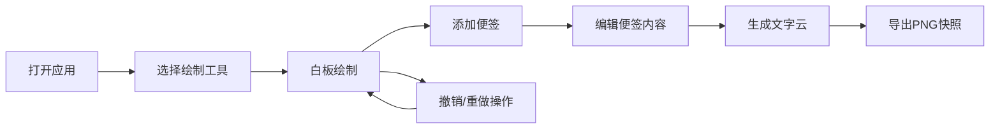

## 1. 产品概述
一款面向远程团队的实时协作白板Web应用，支持自由绘制、便签管理、文字云生成，解决线上讨论中想法碎片难以汇总、讨论焦点难以快速识别的问题。

- **目标用户**：远程办公团队、产品经理、设计师、敏捷开发团队
- **核心价值**：让头脑风暴可视化、数字化，实时同步团队想法，自动提炼高频词汇

## 2. 核心功能

### 2.1 用户角色
| 角色 | 注册方式 | 核心权限 |
|------|---------|---------|
| 协作用户 | 无需注册，直接访问 | 白板绘制、便签管理、文字云生成、导出 |

### 2.2 功能模块
1. **白板协作**：无边界自由绘制、多工具支持、实时同步模拟
2. **便签管理**：添加/编辑/移动/删除便签
3. **文字云生成**：词频统计、可视化展示
4. **撤销重做**：无限步操作历史
5. **导出功能**：PNG图片导出

### 2.3 页面详情
| 页面名称 | 模块名称 | 功能描述 |
|---------|---------|---------|
| 主界面 | 左侧工具栏 | 画笔/荧光笔/橡皮擦切换、颜色选择、粗细调节 |
| 主界面 | 中央白板区 | 自由绘制、便签展示、缩放平移 |
| 主界面 | 顶部操作栏 | 添加便签按钮、导出按钮 |
| 主界面 | 底部状态栏 | 当前工具状态、便签数量显示 |
| 文字云弹窗 | 模态窗口 | 全屏展示词云、颜色渐变显示 |

## 3. 核心流程
用户打开应用 → 选择工具在白板上绘制 → 点击添加便签记录想法 → 双击便签编辑内容 → 多次操作后可撤销/重做 → 点击生成文字云提炼关键词 → 导出白板快照保存

## 4. 用户界面设计

### 4.1 设计风格
- **主色调**：浅米色#fdf6e3（白板背景）、深蓝色#2c3e50（工具栏）
- **强调色**：蓝色#1976d2到橙色#ff6f00渐变（文字云）
- **便签色**：黄色#fff9c4背景、#fbc02d虚线边框
- **按钮风格**：圆角、悬停微动效、深色主题工具栏白色图标
- **字体**：Arial, sans-serif
- **布局风格**：左侧固定工具栏 + 中央弹性白板区 + 底部状态栏

### 4.2 页面设计概览
| 页面名称 | 模块名称 | UI元素 |
|---------|---------|--------|
| 主界面 | 工具栏 | 深色背景、竖向排列、SVG白色图标、悬停高亮 |
| 主界面 | 白板区 | 浅米色背景、无边、支持缩放平移、鼠标光标跟随工具变化 |
| 主界面 | 便签 | 黄色圆角矩形、虚线边框、可拖动、双击进入编辑 |
| 主界面 | 状态栏 | 灰色背景、显示画笔颜色/粗细/便签数量 |
| 文字云弹窗 | 模态层 | 半透明黑色背景、居中词云、词汇大小随词频变化 |

### 4.3 响应式设计
- 桌面端优先设计
- 白板区域占视口75%以上宽度
- 支持触控笔和鼠标操作
- 工具栏图标大小不随缩放改变
