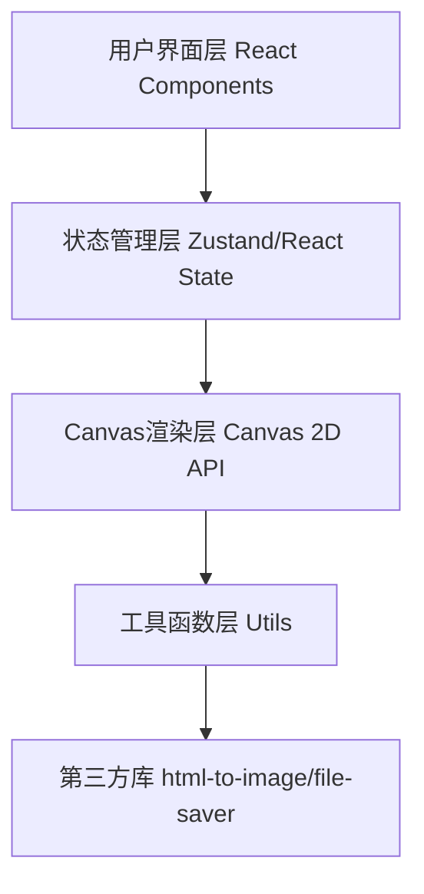

## 1. 架构设计
纯前端单页应用，无后端服务，使用WebSocket模拟实时协作。



## 2. 技术描述
- **前端框架**：React@18 + TypeScript
- **构建工具**：Vite@5（端口3000，HMR开启）
- **状态管理**：React useState/useRef（局部状态）
- **样式方案**：原生CSS（组件内联+全局样式）
- **导出依赖**：html-to-image、file-saver
- **工具库**：uuid、lodash
- **协作模拟**：本地WebSocket模拟+Promise.all并发用户

## 3. 文件结构
```
├── package.json
├── vite.config.js
├── tsconfig.json
├── index.html
└── src/
    ├── App.tsx              # 主组件，状态管理中心
    ├── components/
    │   ├── CanvasDraw.tsx   # 白板绘制组件
    │   └── Toolbar.tsx      # 左侧工具栏组件
    └── utils/
        ├── wordCloud.ts     # 文字云生成工具
        └── export.ts        # 导出工具函数
```

## 4. 数据模型

### 4.1 核心类型定义
```typescript
// 工具类型
type ToolType = 'pen' | 'highlighter' | 'eraser';

// 笔划数据
interface Stroke {
  id: string;
  tool: ToolType;
  color: string;
  width: number;
  points: { x: number; y: number }[];
}

// 便签数据
interface StickyNote {
  id: string;
  x: number;
  y: number;
  text: string;
}

// 操作历史（用于撤销/重做）
interface HistoryAction {
  type: 'stroke' | 'add_note' | 'move_note' | 'delete_note' | 'edit_note';
  data: any;
  previous?: any;
}

// 文字云词项
interface WordItem {
  word: string;
  count: number;
  x: number;
  y: number;
  fontSize: number;
  color: string;
  fontWeight: number;
}
```

## 5. 关键实现要点

### 5.1 白板绘制
- 使用双层Canvas：底层显示历史笔划，顶层绘制当前笔划
- PointerEvents统一处理鼠标和触控
- requestAnimationFrame保证55fps以上帧率
- lodash.throttle处理高频操作节流

### 5.2 撤销重做
- 维护undoStack和redoStack两个数组
- 每次操作push到undoStack，redoStack清空
- Ctrl+Z弹出undoStack并反向执行
- Ctrl+Y弹出redoStack并正向执行

### 5.3 缩放平移
- Canvas context使用translate和scale实现视口变换
- 便签使用CSS transform保持固定像素尺寸
- 滚轮缩放范围0.3x~3.0x

### 5.4 文字云算法
- 正则提取中英文词汇
- 螺旋布局算法：从中心向外，检查碰撞后放置词汇
- 词频映射字体大小，线性插值蓝橙渐变

### 5.5 导出功能
- 离屏Canvas渲染白板+便签
- 最大边限制2000px
- file-saver触发PNG下载
