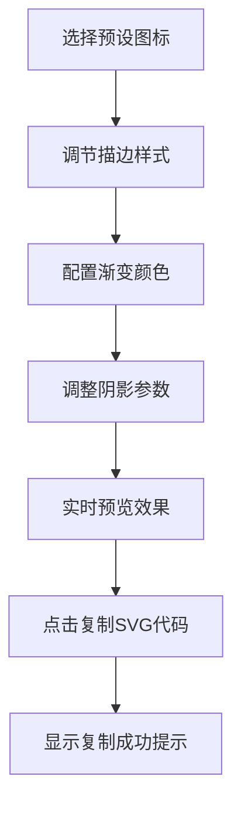

## 1. 产品概述

SVG图标样式实时调优与代码导出应用，专为设计师和前端开发者打造。提供直观的可视化控制面板，让用户实时预览SVG图标在不同描边、渐变、阴影等参数下的视觉效果，并一键导出可用的SVG代码。

- 目标用户：设计师、前端开发者、需要快速验证SVG样式的创意工作者
- 核心价值：消除手动编辑SVG代码或在设计软件间切换的低效流程

## 2. 核心功能

### 2.1 功能模块

1. **图标预览区**：实时渲染SVG图标，展示当前样式参数效果
2. **样式控制面板**：提供描边、颜色渐变、阴影等参数调节控件
3. **代码导出模块**：生成完整SVG代码并支持一键复制到剪贴板

### 2.2 页面详情

| 页面名称 | 模块名称 | 功能描述 |
|-----------|-------------|---------------------|
| 主页面 | 顶部工具栏 | 图标选择下拉菜单（6个预设图标） |
| 主页面 | 图标预览区 | SVG实时渲染、居中显示、平滑过渡动画 |
| 主页面 | 样式控制面板 | 描边、渐变、阴影分组调节卡片 |
| 主页面 | 导出按钮 | 复制SVG代码按钮 + 复制成功提示 |

## 3. 核心流程

用户选择预设图标 → 调节描边宽度/端点/连接方式 → 配置渐变颜色与方向 → 调整阴影偏移与模糊 → 实时预览所有变化 → 点击复制按钮导出SVG代码

## 4. 用户界面设计

### 4.1 设计风格

- **深色主题**：主背景#1e1e2e，卡片背景#2a2a3e，分组卡片背景#33334a
- **文字颜色**：浅灰#cdd6f4，分组标题浅蓝#89b4fa
- **强调色**：#89b4fa（滑块、交互元素）
- **圆角**：卡片圆角8px
- **字体**：现代无衬线字体，保持清晰可读性

### 4.2 页面设计概述

| 页面名称 | 模块名称 | UI元素 |
|-----------|-------------|-------------|
| 主页面 | 顶部工具栏 | 下拉选择器、标题文字 |
| 主页面 | 图标预览区 | SVG容器、居中图标、过渡动画 |
| 主页面 | 样式控制面板 | 分组卡片、滑块、颜色拾取器、下拉菜单、开关 |
| 主页面 | 导出区 | 复制按钮、2秒成功提示 |

### 4.3 响应式设计

- **桌面端**（≥800px）：左侧预览区65%宽度，右侧控制面板固定320px宽度
- **移动端**（<800px）：上下堆叠布局，预览区100%宽度，面板100%宽度固定350px高度可纵向滚动

### 4.4 性能要求

- 所有样式参数变化必须在60fps下实时响应
- 连续快速拖动滑块时渲染更新延迟不超过16ms
- SVG路径属性变化使用CSS transition实现200ms平滑过渡
