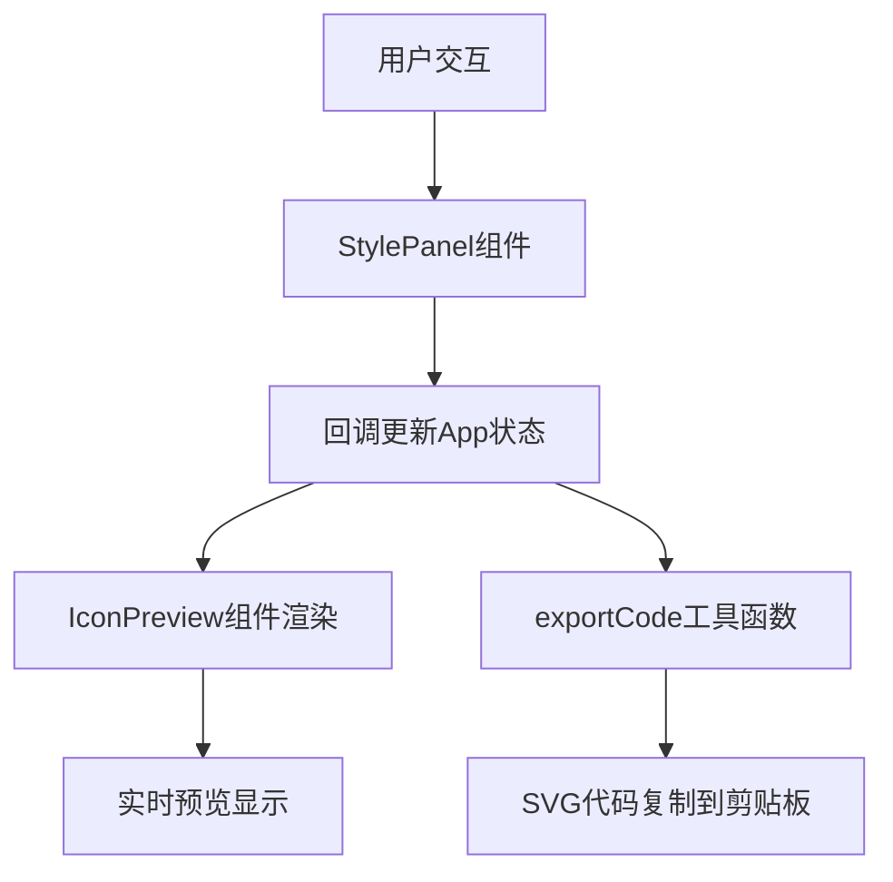

## 1. 架构设计



## 2. 技术描述

- **前端框架**：React@18 + TypeScript
- **构建工具**：Vite@5 + @vitejs/plugin-react
- **工具库**：lodash（用于防抖优化性能）
- **状态管理**：React useState（轻量级，无需外部状态管理库）
- **样式方案**：纯CSS（深色主题，自定义滑块样式）

## 3. 文件结构与调用关系

```
e:\solo\VersionFast\tasks\auto132
├── package.json              # 项目依赖与脚本配置
├── vite.config.js            # Vite构建配置（React+TS支持）
├── tsconfig.json             # TypeScript严格模式配置
├── index.html                # 应用入口HTML
└── src/
    ├── App.tsx               # 主应用组件（状态管理中心）
    │   ├── 导入: IconPreview, StylePanel, icons数据, exportCode
    │   └── 导出: 默认App组件
    ├── components/
    │   ├── IconPreview.tsx   # 图标预览组件（SVG渲染）
    │   │   └── 接收props: iconPath, styleParams
    │   └── StylePanel.tsx    # 样式控制面板组件
    │       └── 回调: onStyleChange(partialParams)
    └── utils/
        └── exportCode.ts     # SVG代码生成与导出工具
            └── 导出: generateSVGCode(), copyToClipboard()
```

### 数据流方向

1. **StylePanel** → 用户操作触发 → **onStyleChange回调** → **App.tsx更新状态**
2. **App.tsx状态** → 作为props传递 → **IconPreview组件实时渲染**
3. **用户点击复制** → **App.tsx调用exportCode** → **生成SVG字符串** → **复制到剪贴板**

## 4. 类型定义

```typescript
// 样式参数类型
interface StyleParams {
  strokeWidth: number;        // 描边宽度 1-12
  strokeLinecap: 'butt' | 'round' | 'square';
  strokeLinejoin: 'miter' | 'round' | 'bevel';
  gradientStart: string;      // 渐变起始色
  gradientEnd: string;        // 渐变终止色
  gradientDirection: 'horizontal' | 'vertical' | 'diagonal';
  innerGlow: boolean;         // 内发光开关
  shadowOffsetX: number;      // 阴影X偏移 -10~10
  shadowOffsetY: number;      // 阴影Y偏移 -10~10
  shadowBlur: number;         // 阴影模糊 0-20
}

// 图标数据类型
interface IconData {
  id: string;
  name: string;
  path: string;               // SVG路径数据 M...Z
  viewBox: string;
}
```

## 5. 性能优化策略

1. **使用lodash.debounce**：快速拖动滑块时防抖处理，避免过度渲染
2. **CSS Transition优化**：SVG属性变化使用GPU加速的transition
3. **React.memo**：IconPreview和StylePanel使用memo避免不必要重渲染
4. **局部状态更新**：使用函数式setState确保状态更新正确性

## 6. 预设图标数据

| 图标ID | 名称 | 路径数据 |
|--------|------|---------|
| star | 五角星 | M12 2l3.09 6.26L22 9.27l-5 4.87 1.18 6.88L12 17.77l-6.18 3.25L7 14.14 2 9.27l6.91-1.01L12 2z |
| heart | 心形 | M12 21.35l-1.45-1.32C5.4 15.36 2 12.28 2 8.5 2 5.42 4.42 3 7.5 3c1.74 0 3.41.81 4.5 2.09C13.09 3.81 14.76 3 16.5 3 19.58 3 22 5.42 22 8.5c0 3.78-3.4 6.86-8.55 11.54L12 21.35z |
| arrow | 箭头 | M12 4l-1.41 1.41L16.17 11H4v2h12.17l-5.58 5.59L12 20l8-8z |
| circle | 圆形 | M12 2C6.48 2 2 6.48 2 12s4.48 10 10 10 10-4.48 10-10S17.52 2 12 2z |
| triangle | 三角形 | M12 2L2 22h20L12 2z |
| diamond | 菱形 | M12 2L2 12l10 10 10-10L12 2z |
