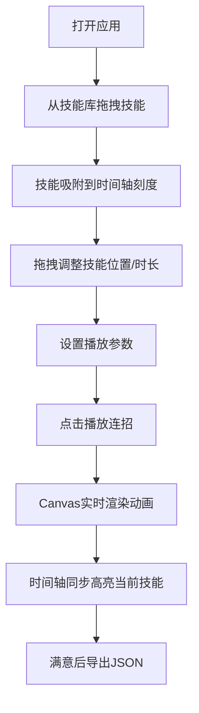

## 1. 产品概述

2D角色技能连招编辑与动画预览工具，面向游戏设计师，在浏览器中快速创建、编排和预览技能连招效果，解决策划阶段需运行完整游戏才能验证连招流畅度的痛点。

- 目标用户：游戏策划、技能设计师、动作设计师
- 核心价值：降低连招调试成本，提高设计迭代效率

## 2. 核心功能

### 2.1 用户角色

| 角色 | 注册方式 | 核心权限 |
|------|---------|---------|
| 设计师 | 无需注册，本地使用 | 全部功能使用权限 |

### 2.2 功能模块

1. **技能库面板**：预置6种技能卡片，支持拖拽到时间轴
2. **时间轴编辑器**：技能编排、刻度显示、拖拽移动、右键菜单
3. **动画预览区**：Canvas 2D火柴人角色，实时播放技能动画
4. **参数调节面板**：播放速度、缓动强度、角色尺寸
5. **数据导出模块**：导出连招JSON数据

### 2.3 页面详情

| 页面名称 | 模块名称 | 功能描述 |
|---------|---------|---------|
| 主编辑页 | 技能库面板 | 展示6个预置技能卡片（攻击/防御/辅助），支持拖拽 |
| 主编辑页 | 时间轴编辑器 | 10秒时间轴，0.5秒刻度吸附，拖拽移动，右键菜单（删除/调整帧数） |
| 主编辑页 | 动画预览区 | 320x320 Canvas，火柴人角色动画，技能高亮同步 |
| 主编辑页 | 参数滑块区 | 播放速度(0.5x-2.5x)、缓动强度(0-1)、角色尺寸(60-120px) |
| 主编辑页 | 数据导出区 | 导出连招JSON，文本框展示，支持复制 |

## 3. 核心流程

用户从技能库拖拽技能卡片到时间轴 → 调整技能位置和持续时间 → 设置播放参数 → 点击播放预览连招动画 → 导出JSON数据供游戏使用。

## 4. 用户界面设计

### 4.1 设计风格

- **主背景**：#1e272e（深灰黑）
- **卡片区域**：#2d3436（深灰）
- **文字主色**：#dfe6e9（浅灰白）
- **分隔线**：#636e72（中灰）
- **攻击技能**：#e74c3c（红色）
- **防御技能**：#3498db（蓝色）
- **辅助技能**：#2ecc71（绿色）
- **播放按钮**：#00b894（青绿）
- **高亮边框**：#f1c40f（金色）
- **圆角**：统一12px，卡片8px
- **按钮反馈**：scale 0.95→1.0，0.15s
- **拖拽过渡**：transform 0.2s ease

### 4.2 页面设计概述

| 页面名称 | 模块名称 | UI元素 |
|---------|---------|---------|
| 主编辑页 | 技能库面板 | 6张彩色卡片，emoji图标，技能名，冷却时间 |
| 主编辑页 | 时间轴 | 10秒刻度标尺，虚线网格轨道，连招连接线 |
| 主编辑页 | 预览区 | 深色背景Canvas，手绘火柴人，技能特效 |
| 主编辑页 | 参数区 | 自定义样式滑块，实时预览 |
| 主编辑页 | 导出区 | 深灰按钮，monospace文本框 |

### 4.3 响应式

- Desktop-first设计
- 视口宽度 < 800px 时，右侧技能库和下方时间轴改为上下堆叠布局
- 预览区保持320x320固定尺寸
