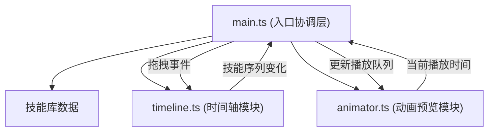

## 1. 架构设计



## 2. 技术描述

- **前端**：TypeScript + Vite@5 + Canvas 2D + lodash
- **初始化工具**：Vite vanilla-ts 模板
- **后端**：无（纯前端应用）
- **数据库**：无（本地运行，数据导出为JSON）

## 3. 项目结构

```
├── package.json
├── vite.config.js
├── tsconfig.json
├── index.html
└── src/
    ├── main.ts          # 入口，事件绑定，模块协调
    ├── timeline.ts      # 时间轴模块
    ├── animator.ts      # 动画预览模块
    └── types.ts         # 类型定义（如需要）
```

## 4. 核心模块接口

### 4.1 Timeline 模块

```typescript
interface TimelineSkill {
  id: string;
  skillId: string;
  name: string;
  type: 'attack' | 'defense' | 'support';
  icon: string;
  cooldown: number;
  startTime: number;   // 秒
  duration: number;    // 秒（1/2/3）
}

class Timeline {
  addSkill(skill: Omit<TimelineSkill, 'startTime' | 'duration'>, x: number): void;
  removeSkill(id: string): void;
  moveSkill(id: string, startTime: number): void;
  getSequence(): TimelineSkill[];
  onSequenceChange(callback: (seq: TimelineSkill[]) => void): void;
  highlightSkill(id: string | null): void;
}
```

### 4.2 Animator 模块

```typescript
interface AnimatorParams {
  speed: number;      // 0.5 - 2.5
  easing: number;     // 0 - 1
  charSize: number;   // 60 - 120
}

interface PlaybackSkill {
  skillId: string;
  type: 'attack' | 'defense' | 'support';
  startTime: number;
  duration: number;
}

class Animator {
  play(sequence: PlaybackSkill[]): void;
  stop(): void;
  updateParams(params: Partial<AnimatorParams>): void;
  onTimeUpdate(callback: (time: number, currentSkillId: string | null) => void): void;
}
```

## 5. 性能要求

- 拖拽帧率 ≥ 55fps
- 动画播放主线程无卡顿（60fps requestAnimationFrame）
- 单帧动画计算耗时 ≤ 1ms
- 使用节流/防抖处理高频事件
