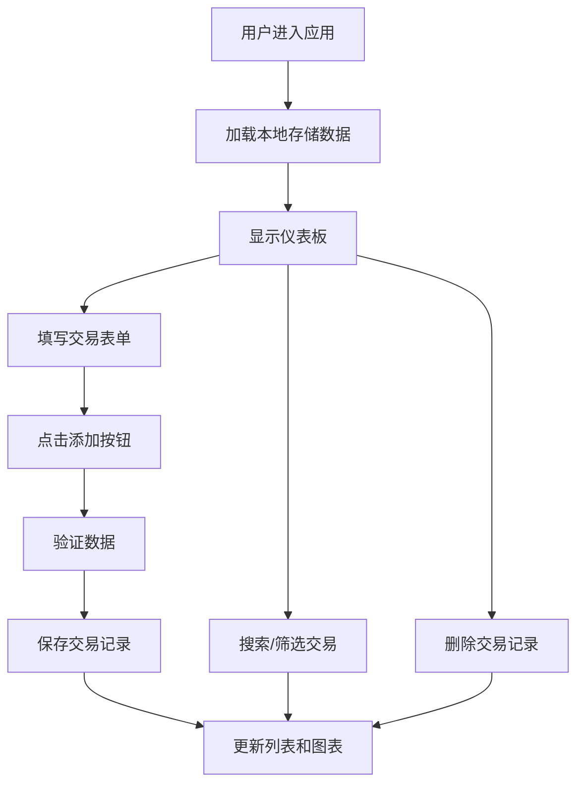

## 1. 产品概述
个人财务仪表板是一款面向个人用户的在线财务管理应用，帮助用户记录日常收支、查看消费分类统计和月度收支趋势。
- 解决个人用户日常记账繁琐、消费习惯不清晰的问题
- 通过可视化图表让用户直观了解自身财务状况

## 2. 核心功能

### 2.1 功能模块
1. **主仪表板页面**：导航栏、交易表单、月度趋势图、分类饼图、交易列表、搜索筛选

### 2.2 页面详情
| 页面名称 | 模块名称 | 功能描述 |
|---------|----------|---------|
| 主仪表板 | 导航栏 | 显示应用标题，提供刷新数据按钮 |
| 主仪表板 | 交易表单 | 输入金额、选择类别、日期、备注、收支类型，添加交易记录 |
| 主仪表板 | 月度收支趋势图 | 柱状+折线混合图展示当年各月收支累计 |
| 主仪表板 | 分类消费饼图 | 按月份筛选，展示各支出类别占比 |
| 主仪表板 | 交易列表 | 卡片式展示交易记录，支持删除 |
| 主仪表板 | 搜索与筛选 | 关键字搜索备注/类别，按收支类型筛选 |

## 3. 核心流程
用户进入应用后，可直接在表单填写交易信息并添加，新增记录立即出现在列表和图表中。用户可通过搜索框和筛选按钮快速定位交易记录，或通过月份下拉查看不同月份的分类消费统计。数据自动保存到本地存储，刷新页面不丢失。

## 4. 用户界面设计

### 4.1 设计风格
- 主色调：#3498db（蓝色）、#2c3e50（深蓝导航）
- 辅助色：#27ae60（收入绿）、#e74c3c（支出红）、#2ecc71、#f39c12、#9b59b6、#1abc9c、#95a5a6
- 背景色：#f5f6fa（浅灰）、#fff（白色卡片）
- 圆角：卡片10px、表单12px、图表8px、搜索框20px
- 阴影：1px 2px 6px rgba(0,0,0,0.1)
- 过渡动画：所有输入框和按钮hover时亮度变化0.3秒

### 4.2 页面设计概述
| 页面名称 | 模块名称 | UI元素 |
|---------|----------|--------|
| 主仪表板 | 导航栏 | 高度56px，背景#2c3e50，白色文字，右侧刷新按钮 |
| 主仪表板 | 布局 | 左右两列（左70%右30%），<768px时右侧移至下方 |
| 主仪表板 | 交易卡片 | 100%宽度，白色背景，左侧4px色条，右对齐金额（￥，两位小数），右侧×删除按钮 |
| 主仪表板 | 搜索框 | 宽度50%，背景#f0f0f0，圆角20px，带搜索图标 |
| 主仪表板 | 筛选按钮 | 全部/收入/支出三按钮，主色高亮 |

### 4.3 响应式设计
- 桌面端：左右两列布局（左70%右30%）
- 移动端（<768px）：单列布局，右侧饼图和交易列表移至下方
