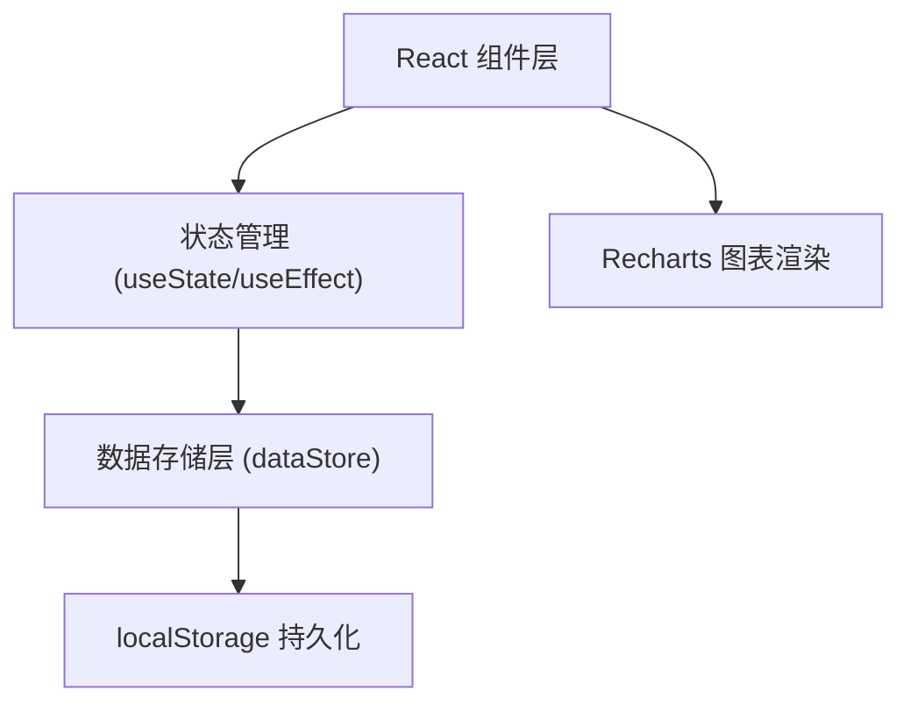

## 1. 架构设计



## 2. 技术描述
- 前端框架：React@18 + TypeScript
- 构建工具：Vite@5 + @vitejs/plugin-react
- 图表库：Recharts@2
- 工具库：lodash、uuid
- 数据存储：浏览器localStorage（模拟持久化）

## 3. 文件结构
| 文件路径 | 用途 |
|---------|------|
| package.json | 项目依赖配置 |
| vite.config.js | Vite构建配置 |
| tsconfig.json | TypeScript编译配置 |
| index.html | 入口HTML |
| src/types.ts | Transaction类型定义 |
| src/dataStore.ts | 本地数据存储模块 |
| src/components/Dashboard.tsx | 主仪表板组件 |
| src/components/TransactionForm.tsx | 交易表单组件 |
| src/components/TransactionList.tsx | 交易列表组件 |
| src/components/ChartPanel.tsx | 统计图表组件 |

## 4. 数据模型

### 4.1 Transaction 类型定义

```typescript
interface Transaction {
  id: string;
  amount: number;
  category: string;
  date: string;
  note: string;
  type: 'income' | 'expense';
  currency: string;
}
```

### 4.2 类别枚举
- 支出类别：餐饮、交通、购物、娱乐、医疗、教育、其他
- 收入类别：工资、奖金、投资、兼职、其他

## 5. 组件职责

### Dashboard.tsx
- 组合所有子组件
- 管理全局交易数据状态
- 处理搜索和筛选逻辑

### TransactionForm.tsx
- 表单输入：金额、类别、日期、备注、类型
- 表单验证
- 提交新增交易

### TransactionList.tsx
- 渲染交易卡片列表
- 处理删除操作
- 搜索框和筛选按钮

### ChartPanel.tsx
- 月度收支趋势图（柱+折线混合）
- 分类消费饼图
- 月份选择器
