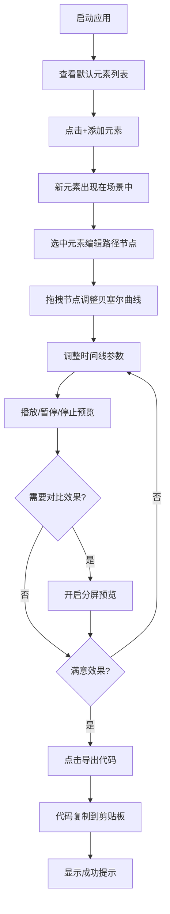

## 1. 产品概述

CSS动画关键帧编辑器是一款面向Web设计师的专业动画调试工具，解决在CSS动画开发过程中反复修改文件、刷新预览的效率痛点。

- 核心目标：提供可视化的动画创建、参数调试、多组对比和代码导出一站式工作流
- 目标用户：Web前端设计师、动效设计师、前端开发工程师
- 产品价值：将CSS @keyframes动画调试效率提升80%以上

## 2. 核心功能

### 2.1 用户角色

| 角色 | 注册方式 | 核心权限 |
|------|----------|----------|
| 普通用户 | 无需注册 | 创建动画元素、编辑路径、调整参数、导出代码 |

### 2.2 功能模块

1. **元素管理面板**：动画元素列表展示、状态指示、添加/删除元素
2. **关键帧路径编辑器**：可视化拖拽路径节点、贝塞尔曲线连接、节点增删
3. **时间线与参数调整**：动画时长/延迟/循环次数滑块、缓动函数选择、播放控制
4. **分屏预览对比**：主编辑区与只读预览区并列展示，对比不同参数效果
5. **代码导出**：一键生成标准CSS @keyframes代码并复制到剪贴板

### 2.3 页面详情

| 页面名称 | 模块名称 | 功能描述 |
|----------|----------|----------|
| 主编辑页 | 元素管理面板 | 左侧280px深色面板，展示所有动画元素，显示播放状态（绿/灰/红圆点），支持添加和删除元素 |
| 主编辑页 | 场景预览区 | 中央750x450px画布，带网格和坐标轴，高亮选中元素，显示可拖拽路径节点和贝塞尔曲线 |
| 主编辑页 | 时间线面板 | 底部200px时间线，包含三组滑块（时长/延迟/循环）、缓动选择下拉框、全局播放控制按钮和红色进度指示线 |
| 主编辑页 | 分屏预览切换 | 右上角切换按钮，点击后场景区分左右两半，右侧为只读预览区 |
| 主编辑页 | 代码导出按钮 | 右下角固定按钮，生成CSS代码并复制，显示加载动画和成功提示 |

## 3. 核心流程

用户打开编辑器 → 添加动画元素 → 选中元素编辑路径节点 → 调整时间线参数（时长、延迟、循环、缓动）→ 播放预览 → 可选开启分屏对比 → 导出CSS代码

## 4. 用户界面设计

### 4.1 设计风格

- **主题**：深色科技风，主背景#1a1a2e，卡片背景#16213e
- **主色**：强调色#e94560（品牌红）、#3498db（交互蓝）、#2ecc71（成功绿）
- **文字**：主色#eaeaea（浅灰白），次级#95a5a6（灰）
- **按钮**：圆角6-8px，hover时scale(1.05) 200ms平滑过渡
- **布局**：左列表 + 中场景 + 右控制的三栏式结构
- **动画**：所有交互带平滑过渡（200-300ms），元素添加删除淡入淡出

### 4.2 页面设计概览

| 页面名称 | 模块名称 | UI元素 |
|----------|----------|--------|
| 主编辑页 | 元素列表 | 深色卡片、状态圆点、删除按钮、添加按钮（#3498db蓝） |
| 主编辑页 | 场景区 | 浅灰背景#f0f0f0、1px虚线网格#ccc、坐标轴、白色路径节点、选中#e74c3c放大、蓝色贝塞尔曲线 |
| 主编辑页 | 时间线 | #2c3e50深蓝背景、圆角12px、红色#e74c3c进度线、圆形控制按钮（播放绿/暂停黄/停止红） |
| 主编辑页 | 分屏预览 | #8e44ad紫色切换按钮、中间2px #bdc3c7分隔线 |
| 主编辑页 | 导出按钮 | #27ae60绿色按钮、加载旋转动画、半透明黑底提示框 |

### 4.3 响应式

- 桌面优先设计，800px以下自动切换为上下滚动布局
- 左侧列表变为顶部导航栏，场景区全宽，时间线和控制区在底部
- 触控设备优化拖拽操作区域

### 4.4 性能要求

- 动画帧率稳定60fps
- 6个以上元素+分屏预览时帧率不低于55fps
- 使用CSS transforms和requestAnimationFrame优化渲染
