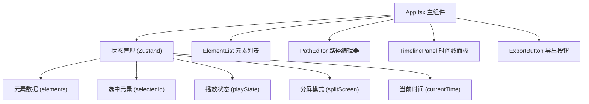

## 1. 架构设计



## 2. 技术说明

- **前端框架**：React@18 + TypeScript@5
- **构建工具**：Vite@5 + @vitejs/plugin-react
- **状态管理**：Zustand (轻量级状态管理，替代Redux)
- **辅助工具库**：uuid@9 (生成唯一ID)、lodash@4 (工具函数)
- **样式方案**：原生CSS + CSS Modules（全局变量 + 组件级样式）
- **动画引擎**：CSS @keyframes + requestAnimationFrame

## 3. 文件组织

```
├── package.json
├── vite.config.js
├── tsconfig.json
├── index.html
└── src/
    ├── App.tsx              # 主组件，布局和状态协调
    ├── types.ts             # 全局TypeScript类型定义
    ├── store.ts             # Zustand全局状态管理
    ├── styles/
    │   └── global.css       # 全局样式、CSS变量、响应式
    ├── components/
    │   ├── ElementList.tsx  # 左侧元素管理面板
    │   ├── PathEditor.tsx   # 中央场景+路径编辑器
    │   ├── TimelinePanel.tsx # 底部时间线与参数控制
    │   └── ExportButton.tsx # 右下角代码导出按钮
    └── utils/
        ├── cssGenerator.ts  # CSS @keyframes代码生成工具
        └── easing.ts        # 缓动函数相关工具
```

## 4. 数据模型

### 4.1 核心类型定义

```typescript
// 动画元素状态
type AnimationStatus = 'playing' | 'paused' | 'stopped'

// 缓动函数类型
type EasingType = 
  | 'linear'
  | 'ease'
  | 'ease-in'
  | 'ease-out'
  | 'ease-in-out'
  | 'cubic-bezier(0.68,-0.55,0.27,1.55)'

// 路径节点坐标
interface PathNode {
  id: string
  x: number  // 0-750 场景宽度坐标
  y: number  // 0-450 场景高度坐标
}

// 动画元素
interface AnimationElement {
  id: string
  name: string
  color: string       // 随机柔和背景色
  pathNodes: PathNode[]  // 2-8个节点
  duration: number    // 0.5-10秒
  delay: number       // 0-5秒
  iterationCount: number | 'infinite'  // 1或无限
  easing: EasingType
  status: AnimationStatus
}

// 全局应用状态
interface AppState {
  elements: AnimationElement[]
  selectedElementId: string | null
  splitScreen: boolean
  isPlaying: boolean
  currentTime: number  // 0-总时长，用于时间线指示
}
```

### 4.2 状态管理 (Zustand Store)

```typescript
// Actions:
- addElement()          // 添加新元素，随机颜色，默认2节点路径
- removeElement(id)     // 删除指定元素
- selectElement(id)     // 选中元素
- updateElement(id, patch) // 更新元素部分属性
- addPathNode(elementId)    // 添加路径节点（最多8个）
- removePathNode(elementId) // 删除路径节点（最少2个）
- updatePathNode(elementId, nodeId, x, y) // 更新节点坐标
- togglePlay()          // 播放/暂停
- stopAnimation()       // 停止所有动画
- resetAnimation()      // 重置到初始状态
- toggleSplitScreen()   // 切换分屏模式
- setCurrentTime(t)     // 更新当前播放时间
```

## 5. 关键实现方案

### 5.1 路径编辑与贝塞尔曲线

- 使用SVG `<path>` 绘制贝塞尔曲线（三次贝塞尔 `C` 命令）
- 节点拖拽通过React状态更新坐标，限制在场景区边界内 (0 ≤ x ≤ 750, 0 ≤ y ≤ 450)
- 选中节点高亮为红色#e74c3c并放大，其余为白色12px圆点

### 5.2 动画播放引擎

- 使用CSS `@keyframes`动态生成动画样式（通过style标签注入）
- 播放进度通过requestAnimationFrame驱动时间线红色指示线
- 分屏模式下克隆元素状态到右侧预览区独立播放

### 5.3 CSS代码导出

- 遍历所有元素，将路径节点转换为@keyframes的百分比关键帧
- 生成包含animation属性和@keyframes定义的完整CSS代码
- 使用navigator.clipboard.writeText()复制到剪贴板

### 5.4 性能优化

- 使用CSS transforms（translate）而非left/top定位，触发GPU加速
- 元素列表使用React.memo避免不必要重渲染
- requestAnimationFrame统一驱动动画帧，避免抖动
- 路径节点拖拽使用useRef + 原生事件监听，减少React渲染开销
