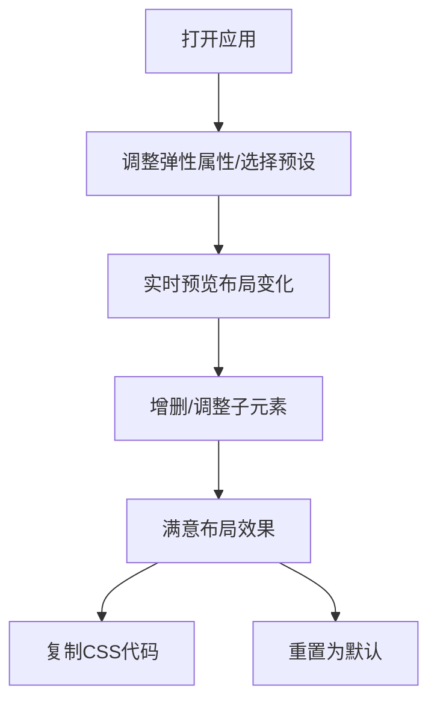

## 1. 产品概述

CSS Flexbox 交互式沙盒是一个帮助前端开发者快速测试和比较不同弹性布局属性组合效果的可视化工具。通过直观的控制面板，开发者可以实时调整 flex-direction、justify-content、align-items 等属性，观察子元素布局变化，并一键导出对应的 CSS 代码片段。

- **主要目的**：解决设计页面布局时需要反复在开发者工具中修改 CSS 属性对比方案的效率问题
- **目标用户**：前端开发者、UI 设计师
- **市场价值**：提升 CSS 布局调试效率，降低学习 Flexbox 的门槛

## 2. 核心功能

### 2.1 功能模块

1. **布局容器与子元素管理**：可视化弹性容器，支持动态增删子元素（最多8个）
2. **弹性属性控制面板**：实时调整 flex-direction、flex-wrap、justify-content、align-items、align-content、gap 等属性
3. **子元素尺寸和顺序调整**：拖拽调整子元素宽高，一键反转排列顺序
4. **预设布局方案与对比**：预置居中对齐、两端对齐、网格排列三套常用方案
5. **代码导出与重置**：一键复制带注释的 CSS 代码，重置所有设置为默认值

### 2.2 页面详情

| 页面名称 | 模块名称 | 功能描述 |
|----------|----------|----------|
| 主页面 | 弹性容器 | 600×400px 灰色容器，展示子元素布局效果 |
| 主页面 | 子元素 | 默认4个不同渐变色的方块，可拖拽调整尺寸和删除 |
| 主页面 | 控制面板 | 320px 深色侧边栏，包含所有属性控件、预设按钮、导出和重置按钮 |

## 3. 核心流程

用户打开应用 → 通过控制面板调整弹性属性或选择预设 → 实时观察容器内子元素布局变化 → 可增删/调整子元素 → 满意后点击复制 CSS 代码 → 或点击重置恢复初始状态

## 4. 用户界面设计

### 4.1 设计风格

- **主题**：深色主题（主背景 #1a1a2e）
- **主色**：控制面板背景 #2c3e50，按钮蓝色 #3498db
- **强调色**：删除按钮红色 #e74c3c，复制按钮绿色 #27ae60，翻转按钮紫色 #9b59b6，拖拽手柄橙色 #e67e22
- **按钮样式**：圆角按钮，悬停时上浮 translateY(-2px) 和阴影变化
- **布局**：左右两栏结构，左栏弹性容器，右栏控制面板
- **圆角**：容器 12px，按钮 6-8px，子元素 8px

### 4.2 页面设计概述

| 页面名称 | 模块名称 | UI 元素 |
|----------|----------|----------|
| 主页面 | 弹性容器 | 600×400px，背景 #f0f0f0，圆角 12px，边框 #ccc |
| 主页面 | 子元素 | 不同柔和渐变色，圆角 8px，编号文字居中，右上角删除按钮 ×，右下角调节手柄 |
| 主页面 | 控制面板 | 320px 宽，背景 #2c3e50，顶部标题"弹性布局实验室"，分隔线 |
| 主页面 | 控件组 | flex-direction、flex-wrap、justify-content、align-items、align-content（wrap时激活）下拉选择，gap 滑块（0-40px，步长4px） |
| 主页面 | 预设按钮 | 3个 120×40px 按钮，悬停变亮 |
| 主页面 | 操作按钮 | 添加子元素、翻转排列顺序、复制CSS代码、重置为默认 |

### 4.3 响应式

- **桌面端**（≥900px）：左右两栏布局，右栏固定 320px 宽
- **移动端**（<900px）：控制面板转为底部固定 300px 高横向滚动面板，弹性容器宽高自适应缩小

### 4.4 动画效果

- 布局变化：300ms 平滑过渡，缓动 cubic-bezier(0.4, 0, 0.2, 1)
- 预设切换：缩放动画 0.95 → 1.0，400ms 缓出
- 按钮悬停：上浮 translateY(-2px)，阴影变化
- 删除按钮悬停：放大 1.1 倍
- 子元素拖拽时：橙色虚线边框和阴影
