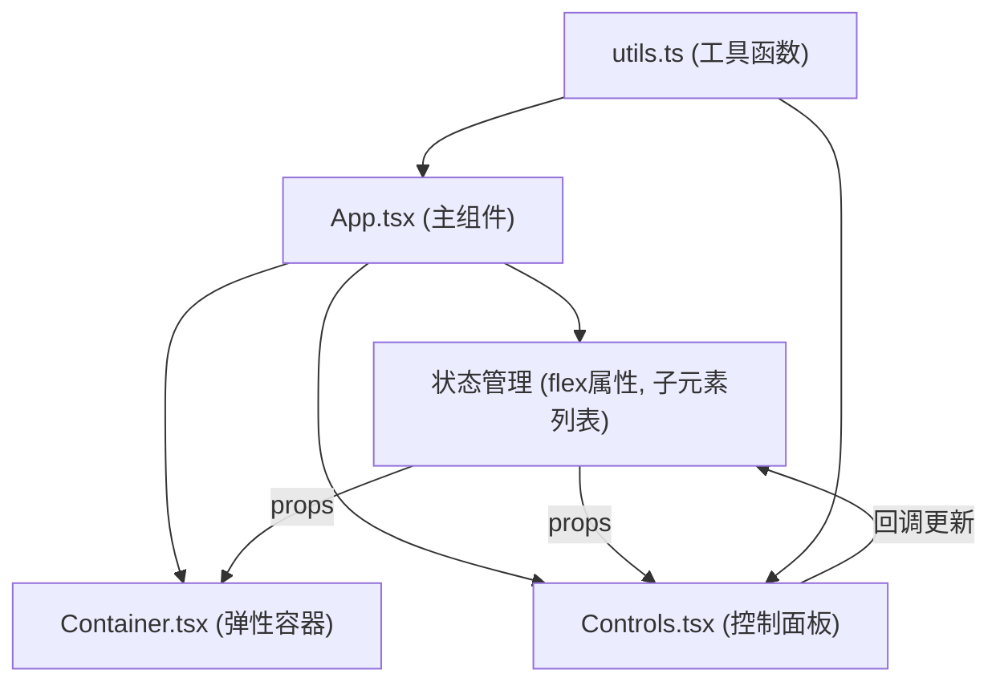

## 1. 架构设计



## 2. 技术描述

- **前端框架**：React@18 + TypeScript
- **构建工具**：Vite@5 + @vitejs/plugin-react
- **语言目标**：ES2020，TypeScript 严格模式
- **样式方案**：原生 CSS（内联样式 + CSS-in-JS style 对象）
- **开发服务器**：Vite devServer，端口 3000
- **工具库**：uuid（生成唯一ID）、lodash（工具函数）

## 3. 目录结构

```
auto139/
├── .trae/documents/
│   ├── PRD.md
│   └── TechnicalArchitecture.md
├── src/
│   ├── App.tsx          # 主组件，布局和状态管理
│   ├── Container.tsx    # 弹性容器组件
│   ├── Controls.tsx     # 控制面板组件
│   ├── utils.ts         # 工具函数
│   └── main.tsx         # 入口文件
├── index.html           # HTML 入口
├── package.json         # 依赖配置
├── vite.config.js       # Vite 配置
└── tsconfig.json        # TypeScript 配置
```

## 4. 核心类型定义

### 4.1 Flex 属性类型

```typescript
type FlexDirection = 'row' | 'row-reverse' | 'column' | 'column-reverse';
type FlexWrap = 'nowrap' | 'wrap' | 'wrap-reverse';
type JustifyContent = 'flex-start' | 'center' | 'flex-end' | 'space-between' | 'space-around' | 'space-evenly';
type AlignItems = 'stretch' | 'center' | 'flex-start' | 'flex-end' | 'baseline';
type AlignContent = JustifyContent;

interface FlexProperties {
  flexDirection: FlexDirection;
  flexWrap: FlexWrap;
  justifyContent: JustifyContent;
  alignItems: AlignItems;
  alignContent: AlignContent;
  gap: number;
}
```

### 4.2 子元素类型

```typescript
interface FlexChild {
  id: string;
  width: number;
  height: number;
  color: string;
  label: number;
}
```

### 4.3 预设布局类型

```typescript
interface PresetLayout {
  name: string;
  properties: Partial<FlexProperties>;
}
```

## 5. 组件职责划分

### 5.1 App.tsx
- 左右两栏布局结构
- 管理所有 flex 属性状态
- 管理子元素列表状态
- 响应式布局媒体查询
- 提供增删子元素、翻转顺序、应用预设、重置等回调函数

### 5.2 Container.tsx
- 渲染弹性容器和子元素
- 子元素删除按钮
- 子元素拖拽调整尺寸（右下角手柄）
- 子元素过渡动画
- 预设切换缩放动画

### 5.3 Controls.tsx
- 所有 flex 属性下拉选择控件
- gap 滑块控件
- 预设布局按钮组
- 操作按钮（添加子元素、翻转顺序、复制CSS、重置）
- 复制成功提示 Toast

### 5.4 utils.ts
- `generateCSSCode(flexProps: FlexProperties): string` 生成带注释的 CSS 代码
- `generateChildColors(): string[]` 生成子元素柔和渐变色
- `createInitialChildren(): FlexChild[]` 创建初始4个子元素
- `DEFAULT_FLEX_PROPS: FlexProperties` 默认 flex 属性值
- `PRESET_LAYOUTS: PresetLayout[]` 预设布局方案
