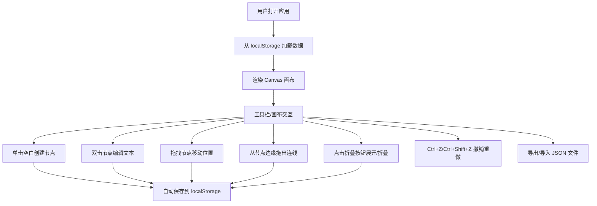

## 1. 产品概述

在线协作思维导图编辑器，支持用户创建、编辑和分享结构化的思维导图。解决个人和团队在头脑风暴、知识整理、项目规划过程中对可视化思维工具的需求，面向知识工作者、学生和团队协作者。

产品核心价值：轻量、高效、美观的纯前端思维导图工具，无需安装即可使用，数据本地保存，支持导入导出。

## 2. 核心功能

### 2.1 功能模块

1. **主编辑器页面**：Canvas 画布、工具栏、节点操作、连线操作
2. **数据管理**：localStorage 持久化、JSON 导入导出
3. **交互系统**：拖拽移动、连线创建、缩放平移、撤销重做

### 2.2 功能详情

| 功能 | 子模块 | 功能描述 |
|------|--------|----------|
| 节点创建与编辑 | 节点创建 | 单击空白区域创建新节点（圆形或矩形） |
| 节点创建与编辑 | 文本编辑 | 双击节点进入文本编辑模式，支持中英文数字输入 |
| 节点创建与编辑 | 自动保存 | 节点内容实时保存到 localStorage |
| 拖拽与连线 | 节点拖拽 | 节点支持鼠标拖拽自由移动，位置实时更新存储 |
| 拖拽与连线 | 贝塞尔连线 | 从节点边缘拖出连线到另一节点，自动吸附生成带箭头贝塞尔曲线 |
| 分支折叠展开 | 折叠/展开 | 每个节点子分支一键折叠或展开，带平滑缩放动画（300ms ease） |
| 撤销重做 | 撤销/重做 | 最多20步撤销重做（创建/移动/删除/文本/连线），支持 Ctrl+Z/Ctrl+Shift+Z |
| 导入导出 | JSON 导出 | 将思维导图导出为 JSON 文件下载 |
| 导入导出 | JSON 导入 | 从本地 JSON 文件导入覆盖当前导图 |
| 画布操作 | 缩放平移 | 滚轮缩放（0.5x-3x）、拖拽平移、requestAnimationFrame 流畅动画 |
| 响应式布局 | 移动端适配 | <768px 工具栏变左侧垂直侧栏（60px），节点编辑区域≥44px |

## 3. 核心流程

### 3.1 主要用户流程

用户打开应用 → 从 localStorage 加载已保存数据（或空画布）→ 通过工具栏/快捷键操作 → 单击空白创建节点 → 双击编辑文本 → 拖拽节点调整位置 → 从节点边缘拖拽连线到其他节点 → 折叠/展开分支 → 撤销/重做操作 → 导出 JSON 或自动保存。

## 4. 用户界面设计

### 4.1 设计风格

- **主色调**：蓝色系 #4A90D9（激活/高亮），浅灰蓝 #8899aa（连线默认）
- **背景**：柔和渐变 #f0f4ff → #e8f0fe
- **节点样式**：白色卡片，阴影 0 2px 8px rgba(0,0,0,0.08)，激活时加深阴影 + 2px #4A90D9 边框
- **按钮**：工具栏半透明毛玻璃（backdrop-filter: blur(6px)），悬停放大 1.1 倍 + 背景色变化
- **连线**：贝塞尔曲线，默认 #8899aa，悬停 #4A90D9 并加粗
- **动画**：折叠展开 300ms ease 过渡，缩放 requestAnimationFrame 驱动

### 4.2 页面设计概览

| 页面区域 | 模块 | UI 元素 |
|----------|------|---------|
| 顶部工具栏 | 操作按钮 | 创建节点、撤销、重做、导出、导入（毛玻璃半透明） |
| 中心画布 | Canvas | 渐变背景、节点卡片、贝塞尔连线、折叠按钮 |
| 节点编辑 | 输入框 | 双击激活，支持中英文，自适应宽度 |
| 移动端 | 侧栏工具栏 | 左侧垂直侧栏 60px，图标垂直排列 |

### 4.3 响应式设计

- Desktop-first 设计，断点 768px
- ≥768px：顶部水平工具栏
- <768px：左侧垂直侧栏（宽度 60px），节点触控区域≥44px
- 画布始终全屏铺满可用区域
