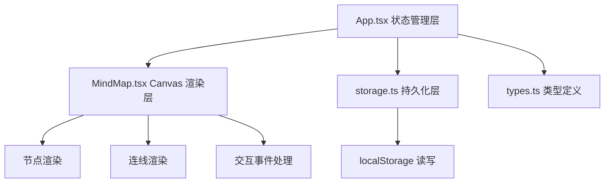

## 1. 架构设计



纯前端单页应用，无后端服务。数据通过 localStorage 本地持久化，支持 JSON 文件导入导出。

## 2. 技术选型

- **前端框架**：React 18 + TypeScript
- **构建工具**：Vite（devServer 端口 3000）
- **渲染技术**：HTML5 Canvas 2D
- **状态管理**：React useState/useReducer（内置撤销重做栈）
- **数据持久化**：localStorage
- **ID 生成**：uuid
- **样式方案**：原生 CSS（内联样式 + style 标签）

## 3. 目录结构

```
.
├── package.json
├── vite.config.js
├── tsconfig.json
├── index.html
└── src/
    ├── main.tsx          # 应用入口
    ├── App.tsx           # 主组件 & 状态管理
    ├── types.ts          # 类型定义
    ├── components/
    │   └── MindMap.tsx   # 核心 Canvas 组件
    └── utils/
        └── storage.ts    # localStorage 工具
```

## 4. 核心数据模型

### 4.1 类型定义

```typescript
interface MindMapNode {
  id: string;
  text: string;
  x: number;
  y: number;
  width: number;
  height: number;
  shape: 'circle' | 'rect';
  collapsed: boolean;
  parentId: string | null;
}

interface MindMapEdge {
  id: string;
  sourceId: string;
  targetId: string;
}

interface MindMapData {
  nodes: MindMapNode[];
  edges: MindMapEdge[];
}

interface CanvasState {
  scale: number;
  offsetX: number;
  offsetY: number;
}
```

### 4.2 撤销重做栈

- 使用内存中的 `history` 数组存储状态快照
- `historyIndex` 指向当前状态
- 最大历史长度：20
- 每次状态变更（创建/移动/删除/编辑/连线）推入新快照

## 5. 核心交互实现

### 5.1 节点交互
- 单击空白：计算 Canvas 坐标 → 创建节点 → 推入历史栈
- 双击节点：激活编辑模式 → 渲染 input 覆盖层 → 失焦保存
- 节点拖拽：mousedown 记录起点 → mousemove 更新坐标（requestAnimationFrame 节流）→ mouseup 保存
- 折叠按钮：点击切换 collapsed 字段 → 递归隐藏/显示子节点 → CSS transition 动画

### 5.2 连线交互
- 节点边缘 mousedown：开始连线模式 → 记录 sourceId
- mousemove：渲染临时贝塞尔曲线跟随鼠标
- mouseup 命中目标节点：创建 Edge → 推入历史栈；否则取消

### 5.3 画布操作
- 滚轮：scale *= delta，clamp [0.5, 3.0] → requestAnimationFrame 渲染
- 空白拖拽：更新 offsetX/offsetY → 实时平移

### 5.4 性能优化
- Canvas 脏矩形渲染：仅重绘变化区域
- 拖拽事件节流：requestAnimationFrame 合并多帧移动
- 100 节点以内保证 ≥30fps
