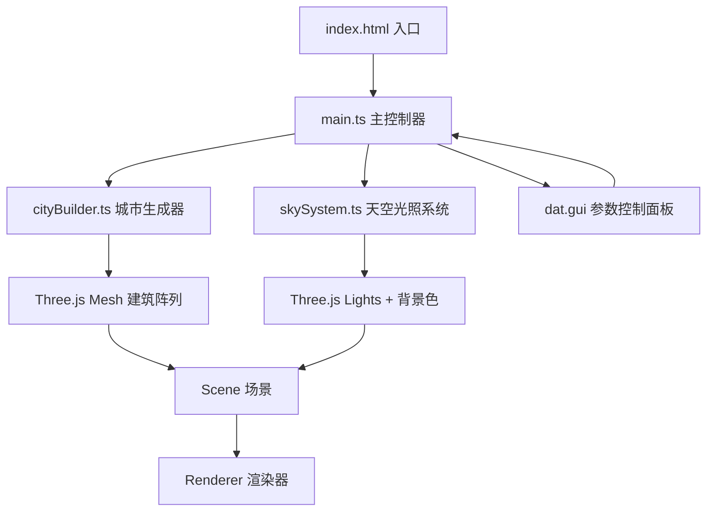

## 1. 架构设计



## 2. 技术说明

- **前端框架**：纯TypeScript（无UI框架），原生DOM操作
- **3D引擎**：Three.js@0.160
- **构建工具**：Vite@5
- **参数UI**：dat.gui
- **工具库**：lodash
- **类型支持**：@types/three

## 3. 文件结构

| 文件路径 | 职责描述 |
|----------|----------|
| package.json | 依赖与脚本声明 |
| vite.config.js | Vite构建配置（端口3000，TS支持） |
| tsconfig.json | TypeScript严格模式配置（target ES2020） |
| index.html | 入口HTML，全屏挂载Canvas |
| src/main.ts | 场景初始化：Scene/Camera/Renderer，整合建筑、天空、UI控制器 |
| src/cityBuilder.ts | 城市生成器：根据参数生成不重叠的随机建筑Mesh数组 |
| src/skySystem.ts | 天空与光照：管理HemisphereLight、DirectionalLight、太阳位置、天空渐变 |

## 4. 核心数据模型

```typescript
interface CityParams {
  density: number;          // 5-50 建筑数量
  minHeight: number;        // 10-100 最小高度
  maxHeight: number;        // 10-100 最大高度
  spacing: number;          // 1-5 建筑间距
  rotationSpeed: number;    // 0-0.02 弧度/帧
  hue: number;              // 0-360 色相
  saturation: number;       // 0-1.0 饱和度
}

interface SunParams {
  angle: number;   // 0-360 水平方位角
  elevation: number; // 10-80 仰角
}
```

## 5. 关键实现要点

1. **建筑防重叠**：网格划分或圆形碰撞检测，确保生成位置互不重叠
2. **资源清理**：重建城市前对旧Mesh调用geometry.dispose()和material.dispose()
3. **阴影性能**：ShadowMap分辨率2048（可降为1024），只让建筑投射阴影、地面接收阴影
4. **天空渐变**：根据太阳高度在#ff7f50→#1a1a2e与#4facfe→#00f2fe之间插值
5. **建筑装饰**：30%概率在顶部添加小方块或尖顶（ConeGeometry）
