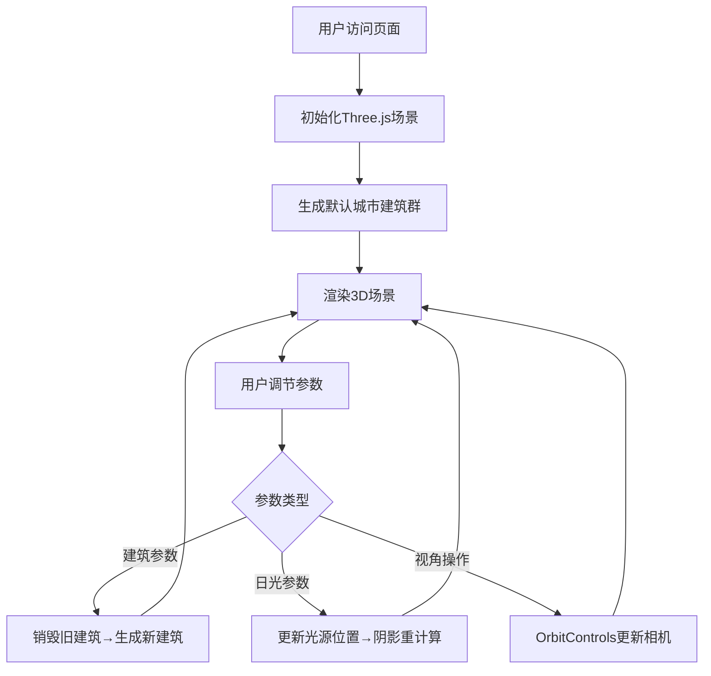

## 1. 产品概述

3D城市天际线动态生成与参数调节Web应用，允许用户通过交互式控制面板实时调整城市建筑群的各项参数，并观察日光角度变化对城市阴影投射的影响。

- 主要用途：城市可视化、建筑设计参数探索、3D图形教学演示
- 目标用户：建筑设计师、3D图形爱好者、教育工作者
- 产品价值：提供直观的参数化城市生成体验，帮助用户理解建筑布局与光照效果的关系

## 2. 核心功能

### 2.1 功能模块

1. **3D城市场景**：实时渲染的Three.js城市天际线
2. **建筑参数控制**：密度、高度范围、间距、旋转速度、颜色调节
3. **日光照系统**：太阳角度、高度调节，动态阴影投射
4. **视角控制**：OrbitControls鼠标交互（旋转、缩放、平移）
5. **响应式UI**：右侧控制面板（桌面）/底部折叠面板（移动端）

### 2.2 页面详情

| 页面名称 | 模块名称 | 功能描述 |
|----------|----------|----------|
| 主页面 | 3D渲染区 | 全屏Three.js场景，展示城市建筑群、地面、天空背景 |
| 主页面 | 控制面板 | 所有参数滑块和数值显示，实时更新场景 |

## 3. 核心流程

用户打开页面 → 初始化默认城市场景 → 调节建筑参数（密度/高度/间距/颜色/旋转）→ 实时重建城市 → 调节日光参数（角度/高度）→ 观察阴影变化 → 通过鼠标交互探索场景

## 4. 用户界面设计

### 4.1 设计风格

- 主背景色：#1a1a2e（深紫蓝）
- 控制面板背景：#2c3e50（深蓝灰），半透明毛玻璃效果（backdrop-filter: blur(10px)）
- 滑块轨道：#34495e，滑块按钮：#e67e22（橙色强调色）
- 按钮：圆角矩形，统一8px圆角
- 字体：现代无衬线字体，数值变化0.3秒淡入淡出动画

### 4.2 页面设计概述

| 页面名称 | 模块名称 | UI元素 |
|----------|----------|--------|
| 主页面 | 3D渲染区 | 全屏Canvas，无遮挡 |
| 主页面 | 控制面板（右） | 320px宽度，垂直排列的参数滑块组，每个滑块含标签和当前数值 |

### 4.3 响应式设计

- 桌面端（>768px）：控制面板固定在右侧，320px宽度
- 移动端（≤768px）：控制面板折叠至底部，支持拖拽展开

### 4.4 3D场景指引

- **环境**：根据太阳高度动态渐变天空颜色（日出橙红→正午蓝色）
- **光照**：半球光（环境）+方向光（太阳），开启ShadowMap（2048分辨率）
- **相机**：默认位于城市前方45度俯角，距离中心30单位，OrbitControls围绕城市中心
- **动画**：建筑以设定速度绕Y轴旋转，60fps目标帧率
- **性能**：50栋建筑≥25fps，旧geometry/material及时dispose()释放内存
