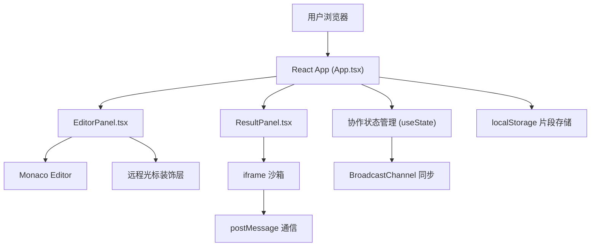
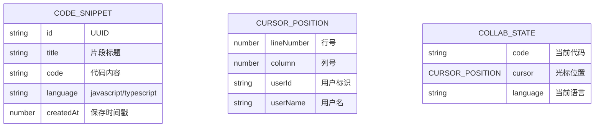

## 1. 架构设计



**数据流向：**
1. `App.tsx` → `EditorPanel.tsx`：传入 `code`、`cursorPosition`、`language`、`theme`
2. `EditorPanel.tsx` → `App.tsx`：通过 `onCodeChange`、`onCursorChange` 回调更新状态
3. `App.tsx` → `ResultPanel.tsx`：传入 `code`、`language`、`theme`
4. `ResultPanel.tsx` → iframe：通过 `postMessage` 发送代码执行指令
5. iframe → `ResultPanel.tsx`：通过 `postMessage` 返回 console 输出和错误
6. 协作同步：`App.tsx` 通过 `BroadcastChannel` 在多标签页间同步状态

## 2. 技术描述

- **前端框架**：React@18 + TypeScript
- **构建工具**：Vite@5 + @vitejs/plugin-react
- **代码编辑器**：monaco-editor
- **工具库**：uuid（生成片段 ID）、lodash（防抖/节流）
- **协作机制**：BroadcastChannel API（模拟多用户同步）
- **存储**：localStorage（代码片段持久化）
- **代码执行**：iframe 沙箱 + postMessage 通信

## 3. 路由定义

| 路由 | 用途 |
|------|------|
| / | 主编辑器页面（单页应用，无其他路由） |

## 4. 数据模型

### 4.1 数据模型定义



### 4.2 核心类型定义

```typescript
interface CodeSnippet {
  id: string;
  title: string;
  code: string;
  language: 'javascript' | 'typescript';
  createdAt: number;
}

interface CursorPosition {
  lineNumber: number;
  column: number;
  userId: string;
  userName: string;
}

interface ConsoleOutput {
  type: 'log' | 'error' | 'warn' | 'info';
  content: string;
  timestamp: number;
}

type Theme = 'light' | 'dark';
type Language = 'javascript' | 'typescript';
```

## 5. 文件结构与调用关系

```
src/
├── App.tsx              # 主组件，状态管理中枢
│   ├── EditorPanel.tsx  # 编辑器面板（被 App 调用）
│   └── ResultPanel.tsx  # 结果预览面板（被 App 调用）
├── main.tsx             # React 入口
└── index.css            # 全局样式
```

**调用关系：**
- `main.tsx` → 渲染 `App.tsx`
- `App.tsx` → 渲染 `EditorPanel` 和 `ResultPanel`
- `EditorPanel.tsx` → 内部使用 `monaco-editor`，暴露 `onCodeChange`、`onCursorChange` 回调
- `ResultPanel.tsx` → 内部创建 iframe，通过 `postMessage` 双向通信
