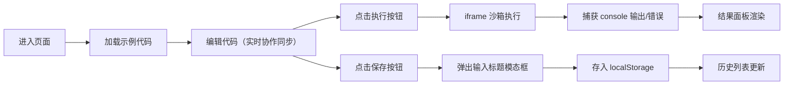

## 1. 产品概述

CodeCollab 是一款面向前端开发者的在线实时协作代码片段编辑与执行预览平台，支持两位用户同时编辑 JavaScript/TypeScript 代码片段，实时查看对方的光标位置和编辑操作，适用于技术面试、结对编程练习等场景。

- 核心目标：提供流畅、低延迟的协作编码体验，内置代码执行与结果预览
- 目标用户：前端开发者、技术面试官、编程学习者
- 产品价值：无需安装环境即可协作编写、运行、保存代码片段

## 2. 核心功能

### 2.1 用户角色

| 角色 | 注册方式 | 核心权限 |
|------|----------|----------|
| 协作用户 | 匿名进入会话 | 编辑代码、执行代码、保存片段、切换主题 |

### 2.2 功能模块

1. **主编辑页面**：Monaco 代码编辑器、语言切换、主题切换、执行按钮、保存按钮
2. **实时协作模块**：远程光标显示、编辑内容同步
3. **结果预览模块**：iframe 沙箱执行、console 捕获、错误高亮
4. **片段历史模块**：保存代码片段、历史列表展示、一键加载

### 2.3 页面详情

| 页面名称 | 模块名称 | 功能描述 |
|----------|----------|----------|
| 主页面 | 顶部导航栏 | 语言下拉切换、主题切换按钮、保存按钮 |
| 主页面 | 代码编辑器 | Monaco Editor，支持语法高亮、自动补全、行号显示 |
| 主页面 | 协作光标 | 显示远程用户光标位置，带用户名标签的半透明蓝色标记 |
| 主页面 | 执行按钮 | 绿色圆角按钮，点击后在 iframe 中执行代码 |
| 主页面 | 结果预览面板 | 右侧深色终端风格面板，显示执行结果与错误 |
| 主页面 | 片段历史列表 | 底部展示最近5个保存的代码片段，点击可重新加载 |
| 主页面 | 保存模态框 | 输入片段标题，保存到 localStorage |

## 3. 核心流程

用户进入页面 → 默认加载示例代码 → 编辑代码（协作同步） → 点击执行按钮 → iframe 执行代码 → 显示 console 输出/错误 → 点击保存 → 输入标题 → 片段存入 localStorage → 底部历史列表更新

## 4. 用户界面设计

### 4.1 设计风格

- 主色调：深灰蓝背景 `#1a1a2e`，顶部栏 `#16213e`，文字 `#eaf0f1`
- 强调色：执行按钮 `#27ae60`，协作光标 `#3498db`，错误文本 `#e74c3c`
- 按钮风格：圆角 8px，hover 时亮度提升 15% 并上移 2px，带阴影上浮效果
- 字体：等宽字体，编辑器默认 14px
- 布局：左右分栏（70% / 30%），顶部 50px 导航栏
- 过渡动画：0.3s ease 主题切换，0.2s ease 交互元素

### 4.2 页面设计概览

| 页面名称 | 模块名称 | UI 元素 |
|----------|----------|---------|
| 主页面 | 顶部导航栏 | 深色背景、白色文字、下拉菜单、图标按钮 |
| 主页面 | 编辑器区 | Monaco Editor、行号、语法高亮、协作光标装饰 |
| 主页面 | 执行按钮 | 绿色圆角按钮、hover 动画、阴影效果 |
| 主页面 | 结果面板 | 深色终端风格、白色等宽文本、红色错误信息 |
| 主页面 | 分割线 | 1px `#2c3e50` 分割线，可拖拽调节宽度 |
| 主页面 | 保存模态框 | 半透明遮罩、居中卡片、输入框、确认/取消按钮 |
| 主页面 | 历史列表 | 底部横向卡片列表、标题、保存时间、点击高亮 |

### 4.3 响应式

- 桌面端优先：左右分栏布局（70% / 30%）
- 移动端（<768px）：结果面板折叠到底部，高度占 40%，上下布局
- 触摸优化：按钮最小 44px 点击区域

### 4.4 性能约束

- 编辑器输入响应延迟 ≤ 50ms
- 代码执行到结果显示 ≤ 500ms
- 协作同步延迟 ≤ 1s
