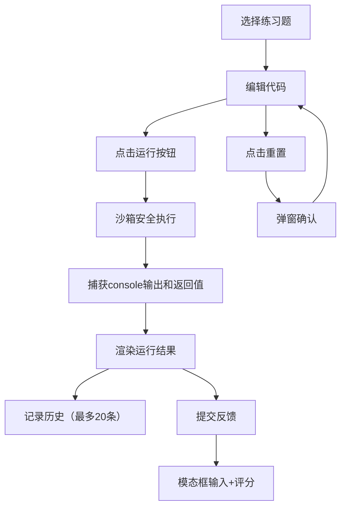

## 1. 产品概述

在线代码练习提交与运行结果可视化应用，为在线教育平台学员提供即时反馈的编程练习环境，解决传统批改方式无法直观展示代码运行效果和隐藏Bug的痛点。

- 核心目标：提供即时、可视化的代码运行反馈，提升编程学习效率
- 目标用户：编程学习者、在线教育平台学员
- 核心价值：实时代码执行、运行结果可视化、历史记录追踪

## 2. 核心功能

### 2.1 功能模块
1. **练习题侧边栏**：展示练习题目列表，支持切换题目
2. **代码编辑器**：基于 Monaco 的代码编辑环境，支持语法高亮、错误提示
3. **运行结果预览**：沙箱执行代码，安全显示运行输出和执行耗时
4. **运行历史记录**：自动记录每次运行结果，最多保留20条
5. **重置与反馈**：代码重置、提交反馈功能

### 2.2 页面详情
| 模块名称 | 功能描述 |
|-----------|-------------|
| 练习题列表 | 左侧280px侧边栏，显示练习卡片，支持点击切换，当前题目紫色高亮边框 |
| 代码编辑器 | Monaco编辑器，支持JS/TS语言，语法错误下划线标红，底部显示光标位置和语言选择 |
| 运行按钮 | #8b5cf6紫色按钮，宽130px，点击执行代码，脉冲缩放动画 |
| 结果预览区 | 等宽字体展示console输出，绿色标签显示执行耗时 |
| 历史记录卡片 | 每条运行记录含时间戳、耗时、测试用例通过状态（✅/❌） |
| 重置按钮 | #ef4444红色按钮，弹窗确认后恢复默认模板 |
| 反馈按钮 | #22c55e绿色按钮，弹出模态框输入反馈和难易度评分 |

## 3. 核心流程

用户选择练习题 → 在编辑器中编写代码 → 点击运行按钮 → 沙箱安全执行代码 → 捕获输出和返回值 → 渲染结果并记录历史 → 可选提交反馈或重置代码

## 4. 用户界面设计

### 4.1 设计风格
- **主题**：深色科技风
- **主背景色**：#0f0f23
- **面板分层色**：#1e1e2e（侧边栏/面板）、#2d2d3d（卡片/次级面板）
- **文字主色**：#e2e8f0
- **强调色**：#8b5cf6（紫色-主交互）、#4ade80（绿色-成功/耗时）
- **分隔线**：1px实线 #3b3b4c
- **统一圆角**：8px

### 4.2 UI 元素细节
| 元素 | 样式规格 |
|-----------|-------------|
| 练习卡片 | 240×70px，圆角8px，渐变#2b2b3c→#3b3b4c，悬停上移5px+阴影0 8px 20px rgba(0,0,0,0.3) |
| 难度标签 | 简单#4ade80、中等#facc15、困难#f87171 |
| 运行按钮 | #8b5cf6背景，130px宽，圆角8px，悬停#7c3aed，点击缩放0.95倍（0.1s过渡） |
| 结果输出框 | 背景#1a1a2e，圆角8px，内边距12px，等宽字体 |
| 历史记录卡片 | 100%宽×40px高，背景#2d2d3d，圆角6px |
| 侧边栏滚动条 | 6px宽，#8b5cf6色 |

### 4.3 响应式设计
- **桌面端**（≥768px）：左侧固定280px侧边栏 + 右侧主区域
- **移动端**（<768px）：侧边栏收缩为顶部导航小图标，点击展开抽屉式面板
- 编辑器占60%高度，结果区占35%高度

### 4.4 性能要求
- 编辑器输入延迟 < 50ms
- 代码运行结果展示 < 2秒
- 历史记录列表使用 React.memo 和 key 优化，避免过度重排
