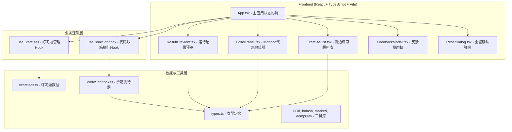

## 1. 架构设计



## 2. 技术描述

- **前端框架**：React@18 + TypeScript
- **构建工具**：Vite@5 + @vitejs/plugin-react
- **代码编辑器**：monaco-editor
- **工具库**：uuid、lodash、marked、dompurify
- **状态管理**：React useState/useCallback（轻量场景，无需额外状态库）
- **样式方案**：内联样式 + CSS-in-JS（styled-components style inline objects）
- **代码执行**：浏览器端安全沙箱（Function 构造器 + 作用域隔离）

## 3. 文件结构与职责

| 文件路径 | 职责说明 |
|----------|----------|
| `package.json` | 项目依赖管理（react@18、react-dom、typescript、vite@5、@vitejs/plugin-react、uuid、lodash、monaco-editor、marked、dompurify） |
| `vite.config.js` | Vite构建配置，支持React+TS，devServer端口3000 |
| `tsconfig.json` | TypeScript严格模式配置，target ES2020，moduleResolution bundler |
| `index.html` | 入口HTML，挂载点#root，全屏viewport |
| `src/App.tsx` | 主应用：组合侧边栏、编辑器、结果区；协调状态：代码→沙箱→输出渲染 |
| `src/EditorPanel.tsx` | Monaco编辑器组件：语法高亮、暗色主题、实时同步代码到App状态 |
| `src/ResultPreview.tsx` | 结果预览组件：安全渲染输出、统计执行用时、展示历史记录 |
| `src/ExerciseList.tsx` | 侧边栏组件：渲染练习卡片列表、点击切换题目事件 |
| `src/FeedbackModal.tsx` | 反馈模态框：输入文字、选择难易度评分 |
| `src/ResetDialog.tsx` | 重置确认弹窗：二次确认后恢复默认代码模板 |
| `src/types.ts` | TypeScript类型定义：Exercise、RunRecord、Feedback等 |
| `src/data/exercises.ts` | 预定义练习题数据（含测试用例） |
| `src/utils/codeSandbox.ts` | 代码沙箱执行器：安全执行用户代码、捕获console输出 |

## 4. 数据模型定义

### 4.1 核心类型

```typescript
// 题目难度
type Difficulty = 'easy' | 'medium' | 'hard';

// 练习题
interface Exercise {
  id: string;
  number: number;       // 题目编号，如 #01
  title: string;        // 题目标题
  difficulty: Difficulty;
  description: string;  // 题目描述（markdown）
  template: string;     // 默认代码模板
  testCases: TestCase[];
}

// 测试用例
interface TestCase {
  input: any[];
  expected: any;
}

// 运行记录
interface RunRecord {
  id: string;
  timestamp: number;
  executionTime: number;  // 毫秒
  passed: boolean;        // 是否通过测试用例
  output: string;
  exerciseId: string;
}

// 代码执行结果
interface ExecutionResult {
  output: string;
  returnValue: any;
  executionTime: number;
  error: string | null;
  passed: boolean;
}

// 反馈数据
interface Feedback {
  exerciseId: string;
  content: string;
  difficultyRating: number;  // 1-5
}

// 光标位置
interface CursorPosition {
  line: number;
  column: number;
}
```

### 4.2 数据流向

```
ExerciseList (点击题目) → App [currentExercise] → EditorPanel (加载模板)
                                                      ↓
EditorPanel (用户输入) → App [code] → 点击运行 → codeSandbox.execute() → ExecutionResult
                                                                              ↓
                                                              App [runResult, runRecords] → ResultPreview
```

## 5. 性能优化策略

1. **编辑器性能**：Monaco 原生优化，代码变更通过 debounce（lodash）同步，延迟 < 50ms
2. **历史记录渲染**：使用 React.memo 包装 RunRecordCard 组件，使用 uuid 作为稳定 key
3. **代码执行**：使用 setTimeout 模拟异步执行，避免阻塞UI，设置 2s 超时保护
4. **沙箱安全**：使用 Function 构造器 + 独立作用域，禁止访问 window/document，捕获所有异常
5. **响应式布局**：CSS Flexbox + Media Queries，避免 JS 计算布局
