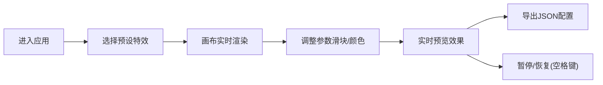

## 1. 产品概述

2D粒子系统编辑器——帮助游戏特效设计师在浏览器中快速创建、预览和导出2D粒子系统参数配置的Web应用，解决游戏开发中手动调整粒子参数需要反复编译运行才能查看效果的痛点。

- 目标用户：游戏特效设计师、游戏开发者
- 核心价值：实时预览粒子效果，直观对比参数调整，快速导出可复用的JSON配置

## 2. 核心功能

### 2.1 功能模块

1. **特效预览画布**：500x500黑色画布，实时渲染粒子动画，显示FPS和粒子总数
2. **预设特效切换**：火焰、烟雾、爆炸三种预设，一键切换
3. **参数控制面板**：8个滑块 + 4个颜色选择器，实时驱动粒子系统
4. **参数导入导出**：导出JSON配置，支持导入恢复配置
5. **发射器控制**：可拖动的发射器位置指示器，实时调整发射位置和方向

### 2.3 页面详情

| 页面名称 | 模块名称 | 功能描述 |
|-----------|-------------|---------------------|
| 主页面 | 预设切换按钮 | 三个圆形按钮，分别对应火焰、烟雾、爆炸特效 |
| 主页面 | 粒子预览画布 | 500x500黑色背景画布，实时渲染粒子动画 |
| 主页面 | FPS/粒子计数显示 | 画布左上角显示当前FPS和粒子总数 |
| 主页面 | 发射器位置指示器 | 画布底部可拖动的白色圆点，控制发射位置 |
| 主页面 | 参数控制面板 | 280px宽的侧栏，包含滑块、颜色选择器、导入导出按钮 |

## 3. 核心流程

用户进入应用 → 选择预设特效 → 画布实时播放粒子动画 → 调整参数（滑块/颜色）→ 实时预览效果变化 → 导出JSON配置 → 后续在游戏引擎中使用

## 4. 用户界面设计

### 4.1 设计风格

- **主色调**：深蓝 `#1a1a2e`（背景）、科技蓝绿 `#00b894`（强调色）、中灰蓝 `#16213e`（控制面板）
- **按钮风格**：圆形预设按钮，圆角10px控制面板，hover时有0.2秒缓动缩放（1.05倍）和发光阴影
- **字体**：现代无衬线字体，清晰易读
- **布局**：左右两栏结构，左侧画布占70%，右侧控制面板30%（最大340px）
- **动画**：预设切换时0.5秒淡入淡出过渡

### 4.2 页面设计概述

| 页面名称 | 模块名称 | UI元素 |
|-----------|-------------|-------------|
| 主页面 | 预设按钮区 | 三个圆形按钮，火焰红橙渐变、烟雾灰白渐变、爆炸黄白红标识 |
| 主页面 | 画布区域 | 500x500黑色画布(#1a1a2e)，白色FPS文字，可拖动的白色发射点 |
| 主页面 | 控制面板 | 深色背景(#16213e)，圆角10px，滑块组、颜色选择器、操作按钮 |

### 4.3 响应式

- 桌面端（>768px）：左右两栏布局
- 移动端（≤768px）：控制面板折叠到下方，水平滚动条式布局

## 5. 性能要求

- 最高发射速率（200个/秒）下保持不低于55fps
- 粒子总数上限2000个时CPU使用率不超过65%
