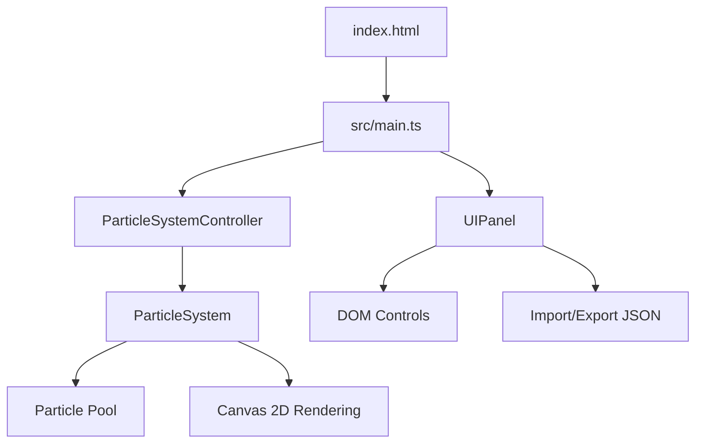

## 1. 架构设计



## 2. 技术描述

- **前端框架**：原生TypeScript（无React/Vue框架）
- **构建工具**：Vite@5
- **渲染引擎**：原生Canvas 2D API
- **依赖库**：
  - typescript：类型安全
  - vite@5：构建和开发服务器
  - lodash：工具函数库

## 3. 项目结构

```
├── package.json              # 项目依赖和脚本
├── vite.config.js            # Vite构建配置
├── tsconfig.json             # TypeScript配置
├── index.html                # 入口HTML
└── src/
    ├── main.ts               # 应用入口，初始化引擎和UI绑定
    ├── particleSystem.ts     # 粒子系统核心（Particle/ParticleSystem类）
    └── uiPanel.ts            # UI控制面板（DOM构建、事件绑定、导入导出）
```

## 4. 核心类定义

### 4.1 Particle 类
```typescript
interface Particle {
  x: number;
  y: number;
  vx: number;
  vy: number;
  life: number;
  maxLife: number;
  startSize: number;
  endSize: number;
  startColor: string;
  endColor: string;
  colorMidpoint: number;
  startOpacity: number;
}
```

### 4.2 ParticleSystem 类
```typescript
class ParticleSystem {
  addEmitter(params: EmitterParams): void;
  updateEmitterParams(params: Partial<EmitterParams>): void;
  reset(): void;
  start(): void;
  pause(): void;
  setEmitterPosition(x: number, y: number): void;
  exportConfig(): ParticleConfig;
  importConfig(config: ParticleConfig): void;
}
```

### 4.3 粒子配置结构
```typescript
interface ParticleConfig {
  name: string;
  emissionRate: number;
  lifetime: number;
  startVelocityX: number;
  startVelocityY: number;
  startSize: number;
  endSize: number;
  gravity: number;
  startColor: string;
  endColor: string;
  colorMidpoint: number;
}
```

## 5. 性能优化策略

1. **粒子池技术**：使用对象池复用粒子对象，避免频繁GC
2. **最大粒子限制**：限制最大粒子数为2000
3. **高效渲染**：使用Canvas 2D的批量绘制，减少状态切换
4. **requestAnimationFrame**：使用标准动画循环，与浏览器刷新率同步
5. **增量时间**：使用delta time确保不同帧率下的动画一致性
